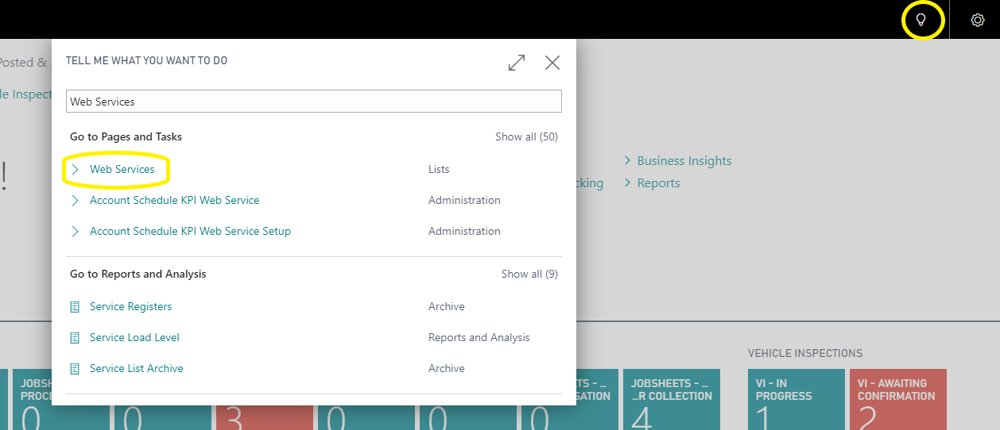
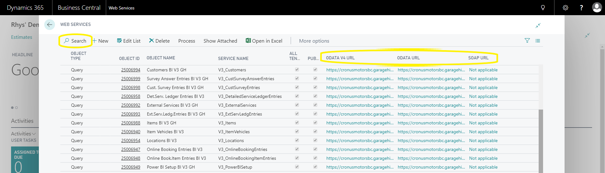

#   How to obtain OData feeds 

Search the light bulb for Web Services.

In this table you will find teh available web services, use the search function to find the desired service and you will find the feed URL on the right.

### Support Contact Details
* **Phone** - [**02031461164**](tel:02031461164)
* **Email** - [**help@garagehive.co.uk**](mailto:help@garagehive.co.uk)