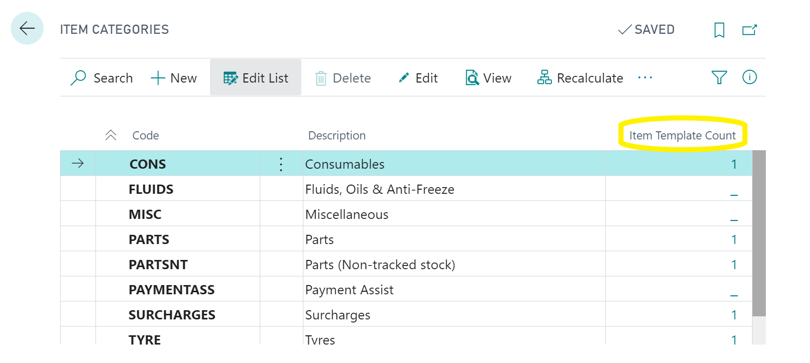
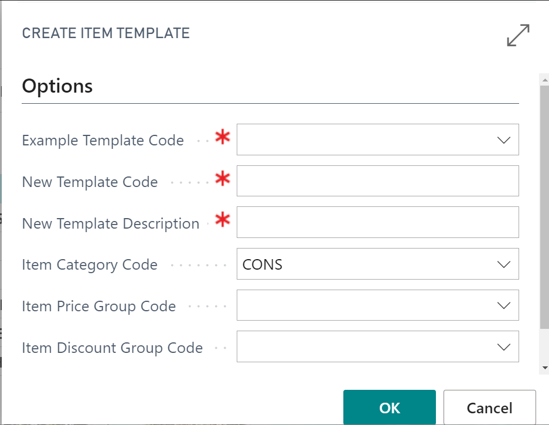
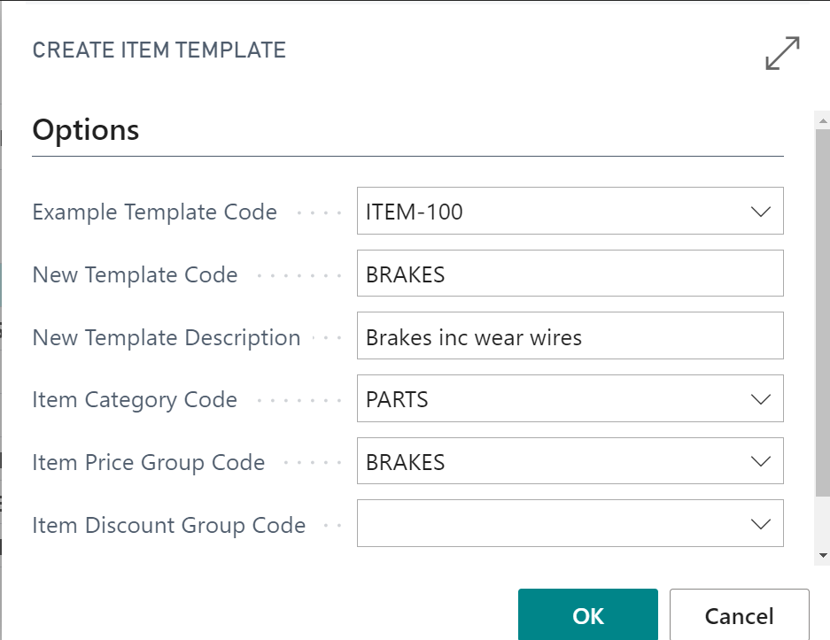

#   Create item card templates.



---

To create new item templates search for "Item Categories." 
Here you will see a column to the right "Item template count" this shows you any item templates are using this category already if you click on the value in this field the applicable templates will pop up. 

The idea here is that item categories can be kept concise while using varying templates that contain specific information to be used for markups and pricing.

---

---

To create a new template select "Create item template" at the top of the page and you will be presented with a list of options 

---

---

- choose an example template to copy basic setting form 
- Enter a new code for this new template 
- Give the new template a description 
- Select the appropriate category for the item
- Select or create any applicable price or discount groups that can later be used for markups and pricing.

---

---

Select ok, and a new template will be created. 

 #   See Also 

 [Create item Price/Discount groups and update items](/docs/item-price-discount-groups.html "Create item Price/Discount groups and update items") 
