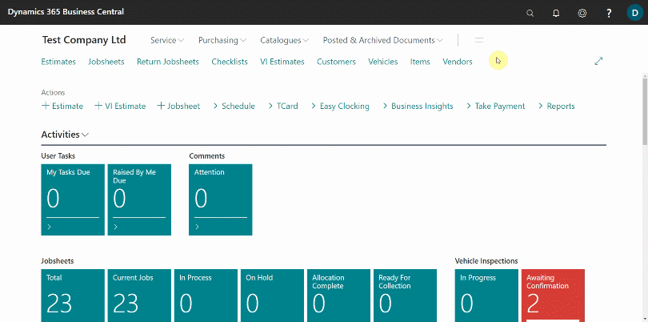
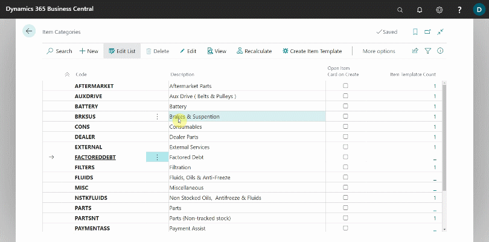
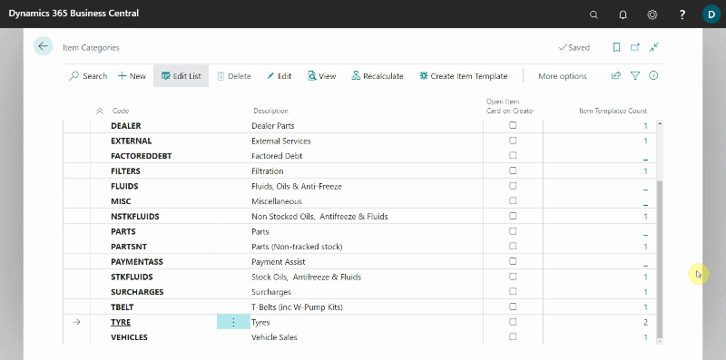

# Create Item Card Templates
To create new **Item Card Templates**:
1. In the top-right corner, choose the  icon, enter **Item Categories**, and select the related link. 
2. In the page that opens, you will see a column to the right **Item Template Count** this shows number of item templates using this category. If you click on the value in this field the applicable templates list will pop up.

   
   

   

3. From the menu bar, select **Create Item Template**, to create a new item template for the selected **Item Category**; the other option is to create a new **Item Category** by selecting **New** from the menu bar, and create **Item Templates** for the category.
4. From the pop-up window, when you click **Create Item Template**, select the **Example Template Code** (which should be a template related to the one you are creating).
5. Enter **New Template Code** and the **New Template Description**, for example **18TYRES** and **18 Tyres** respectively.
6. Select any applicable price or discount groups in the **Item Price Group Code** and **Item Discount Group Code**.
7. Click **OK** and a new **Item Template** will be created.

   

8. To view all the list of all **Item Templates**, in the top-right corner, choose the  icon, enter **Item Templates**, and select the related link.

   

### See Also 

[Video: How to create and sort item card templates](https://www.youtube.com/watch?v=mbS2QuaEagE){:target="_blank"} \
[Create item Price/Discount groups and update items](/docs/item-price-discount-groups.html "Create item Price/Discount groups and update items") 
