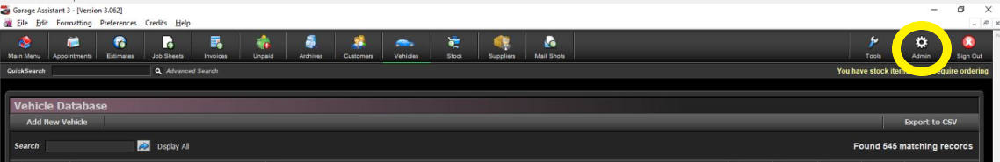
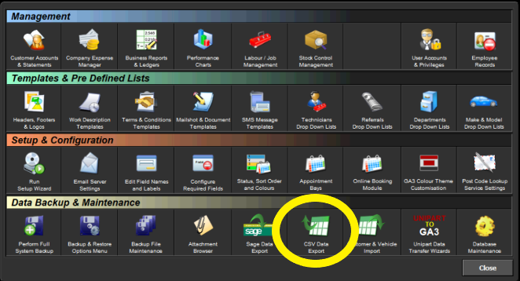
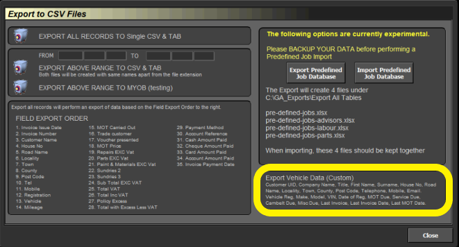

#   How to extract the required data 

Click on "Admin" at the top on the right .

Then select "CSV Data Export" ga3-export-data-export-vehicle-data.png

Then select "Export Vehicle Data" this will give us a list of vehicles and there owners. 

For vehicle history please talk to [**SWS Solutions (UK) Ltd**](https://www.sws-solutions.co.uk/contact.php){:target="_blank"}

### Support Contact Details
* **Phone** - [**02031461164**](tel:02031461164)
* **Email** - [**help@garagehive.co.uk**](mailto:help@garagehive.co.uk)