

## Business Central 2021 Release Wave 2 (BC 19)
This article outlines the improvements that come with Microsoft Dynamics 365 Business Central upgrades. Microsoft releases many updates, but in this article, we've listed improvements related to your regular operations in Garage Hive. You will discover that they make it easier and more comfortable for you to use the system. For reference to all the updates, refer to this [Microsoft article](https://learn.microsoft.com/en-us/dynamics365-release-plan/2021wave2/smb/dynamics365-business-central/planned-features).

1. **Use new templates with same flexibility as configuration templates**
   
   **Garage Hive Operation:** [Create item card templates](create-item-templates.html)
    

   **Feature Details**: You can now use the capabilities of configuration templates with the new templates for customers, vendors, and items. These include the ability to add any field and to save and apply templates from the customer, vendor, and item lists.

      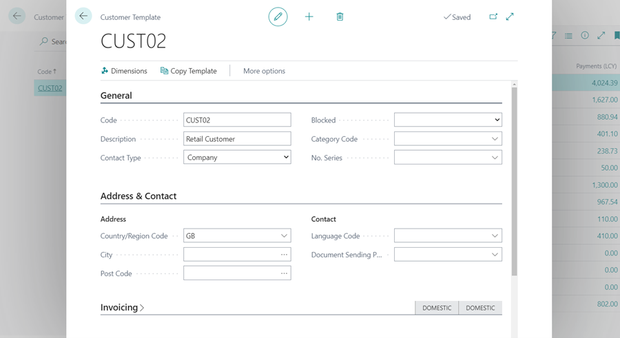

2. **Add non-inventory items on requisition and planning worksheets**
   
   **Garage Hive Operation:** [Re-ordering policies and requisition worksheet](garagehive-requisition-worksheet-items-to-order.html){:target="_blank"}
    

   **Feature Details**: You can process non-inventory lines in much the same way as other types of items. If you use requisition and planning worksheets as the starting point for purchase orders in your procurement process, you can manually enter lines for non-inventory items on the worksheets. Then, when you create your purchase orders, the non-inventory items will be included. This allows you to use the same procurement process for inventory and non-inventory items.

      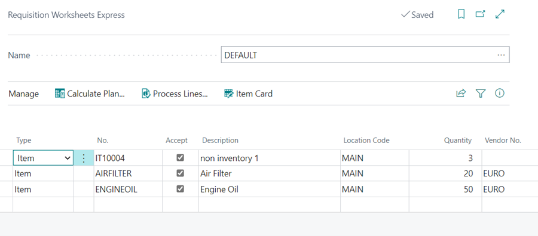

3. **Chart of Accounts Overview page**
    

   **Feature Details**: The Chart of Accounts page displays accounts in a hierarchical list that offers fast access to the key information for each account. However, the list is static, and if you have a lot of accounts you might have to do a bit of scrolling to view information for different accounts. If you just want a quick overview of the basics, such as net changes and balances, the Chart of Accounts Overview page is a useful alternative. The column layout on the page is now the same as you’ll find on the Chart of Accounts page (there are just fewer of them), so you won’t have to reorient yourself, and you can expand or collapse the hierarchical levels to condense the view.

      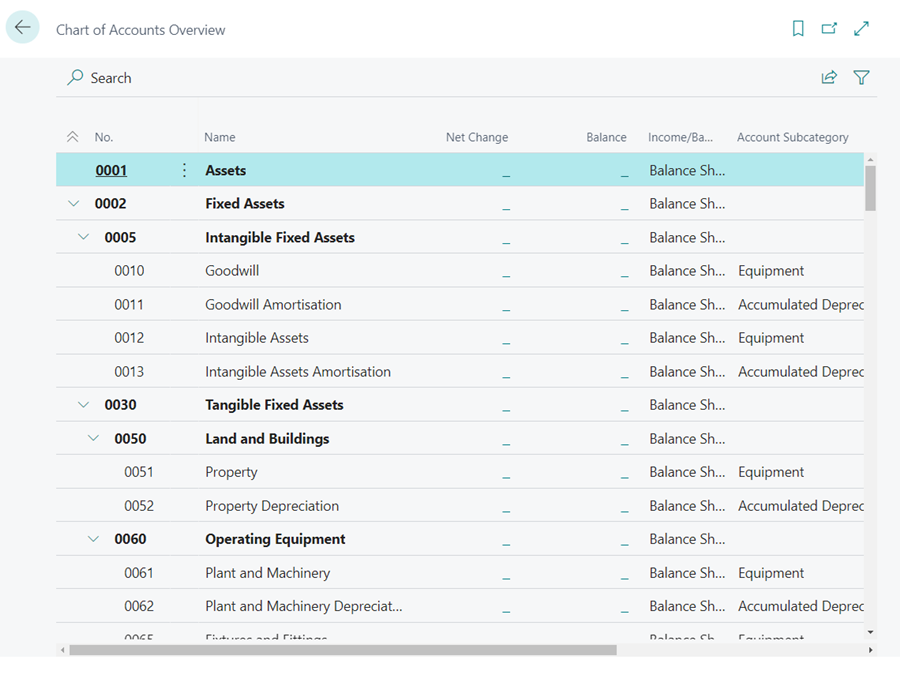
      
4. **Default line type in the sales and purchase documents**
    

   **Feature Details**: Sales and purchase documents can contain different types of lines, such as G/L Account, Item, Resource, or Fixed Asset. In this release, you can select the default line type that will be suggested when you create new documents. You can specify the default type for sales on the Sales & Receivables Setup page, and for purchases on the Purchase & Payables Setup page, in the Document Default Line Type field. Afterwards, the first line on the document will always use the default type that you specified, and you can start working with lines by selecting values in the No. field. Of course, you can change the type on the line if needed.

      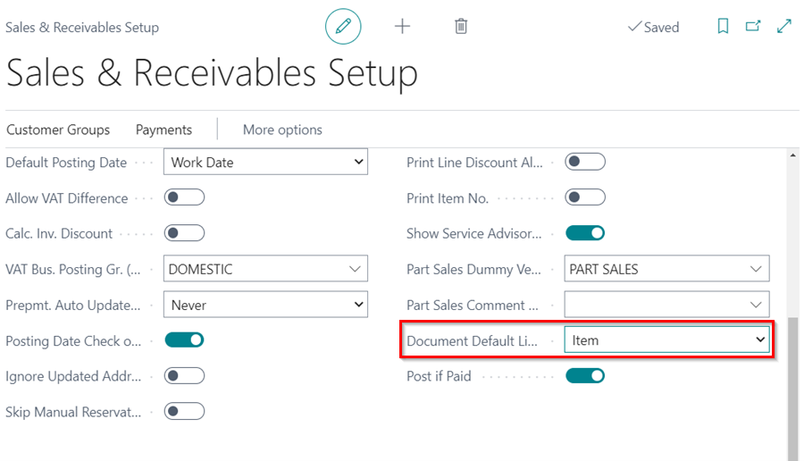

5. **More control over address information data entry**
    

   **Feature Details**: You can set the Require Country/Region Code in Address by selecting this field on the General Ledger Setup page. When this field is selected, because the address format is related to the selected Country/Region, changes to the Country/Region Code field on addresses for customers, contacts, or vendors will reset the values in other address fields.

      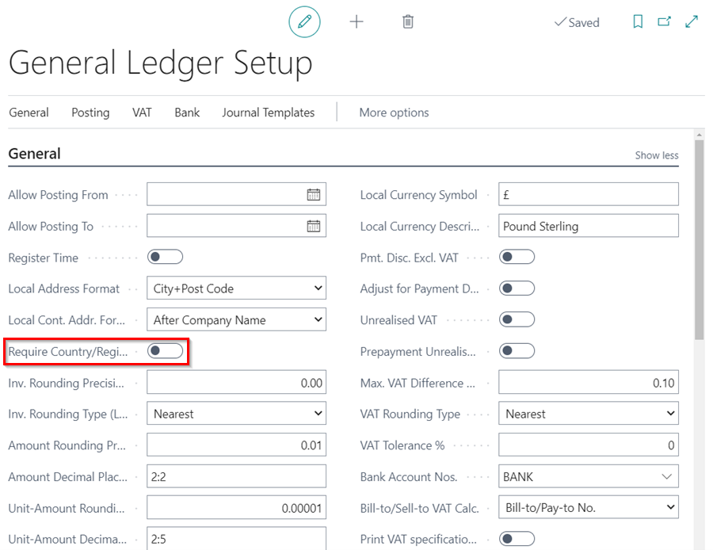

6. **Posting Preview can now show G/L and VAT entries in hierarchical view and is easily extensible**
    

   **Feature Details**: You can enable the new way of showing Posting Preview by choosing Extended in the Posting Preview Type field on the General Ledger Setup page. When the extended posting preview is turned on, you can choose to preview a posting using the **Preview Posting** action (or the Ctrl+Alt+F9 keyboard shortcut)—for example, on a payment journal. On the Posting Preview page, you can choose **Show Hierarchical View** to group the entries.

      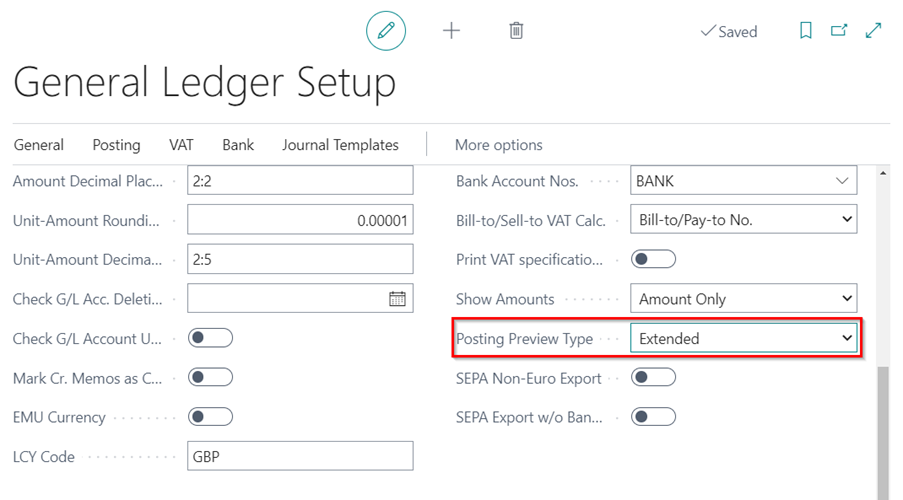

7. **Tour of Business Central to help users get to know the basics**
    

   **Feature Details**: With this release, we expand the use of educational tours so they can also include teaching tips that are defined by the platform to call out system controls, such as the top navigation bar as well as controls for sorting and filtering. These tours can provide an introduction to a better understanding of the home page. In all, users can more easily learn the basics of the Business Central user interface.

      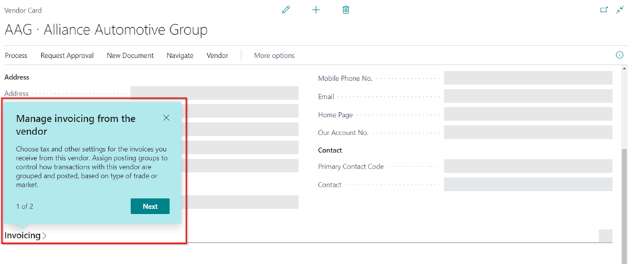

8. **Use multiple units of measure for items**
    

   **Feature Details**: Information about weights and volume are available in all sales documents and purchase documents (you can add the Unit Gross Weight, Unit Net Weight, Unit Volume, and Units per Part via personalization).

      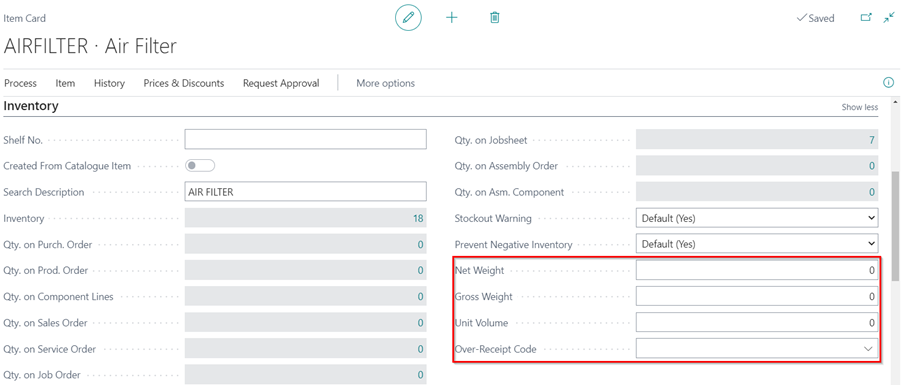

9. **Send mail from entities using Word templates as body or attachment**
    

   **Feature Details**: The Send Email action is now available on the Business Central entities that have an email address, such as customers, contacts, vendors, users, and bank accounts pages. You can now compose and send emails from any page that displays the entity.

      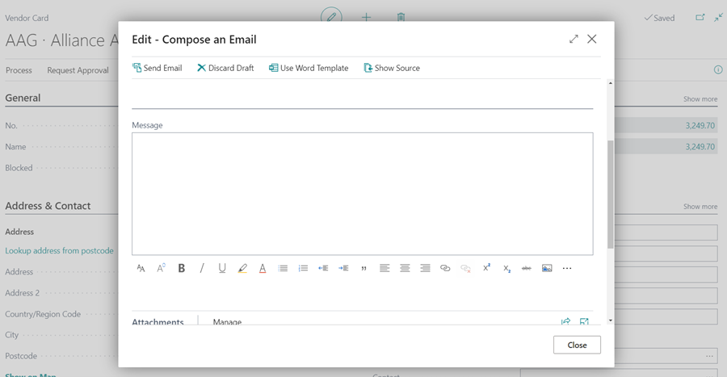

10. **Enhancements to working with Microsoft Excel**
    

   **Feature Details**:
   - A new home for Open in Excel and Edit in Excel: introduction of the Share icon and menu in which users will find the Open in Excel and Edit in Excel actions.
   
      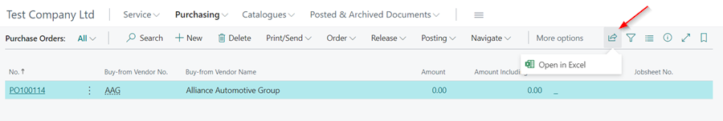

   - Downloading embedded lists to Excel (Open in Excel action): Lists that are embedded in a part on a page can now be exported to Excel.
   
      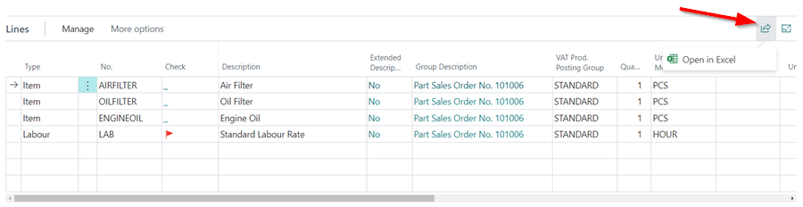

   - Exporting reports to Excel: For reports, you can now select to export the report data to Excel on the request page. The Excel file will only include the raw data and not the report layout.
   
      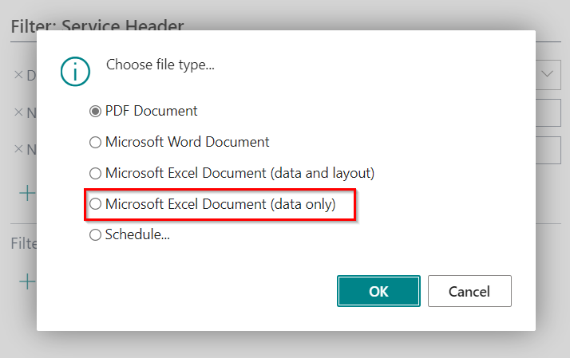

[Go back to top](#top)