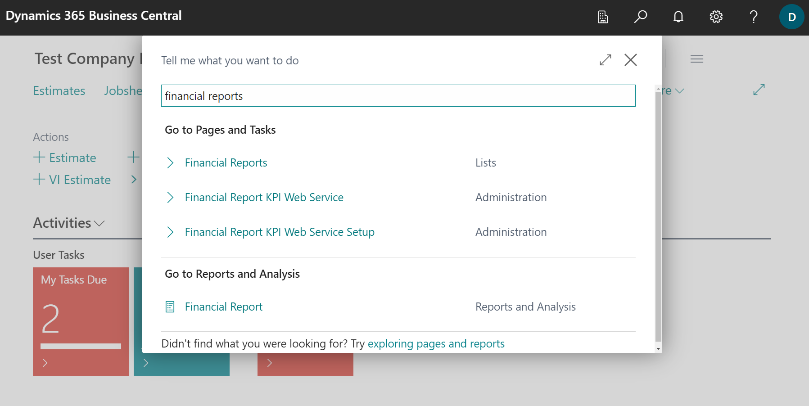
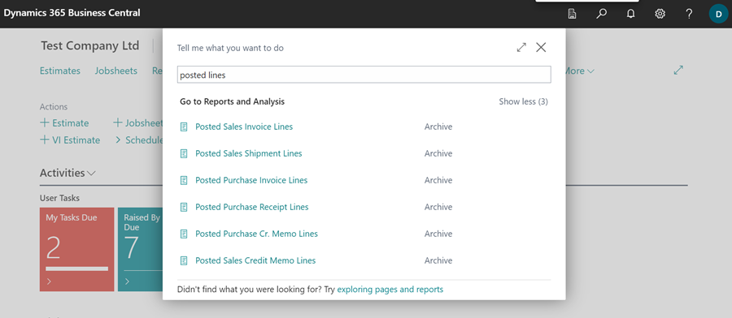
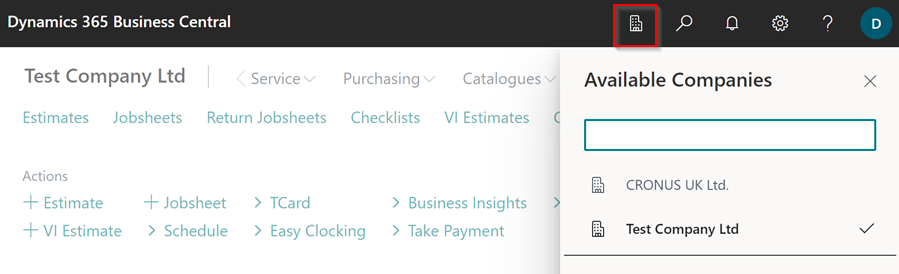

## Business Central 2022 Release Wave 2 (BC 21)
This article outlines the improvements that come with Microsoft Dynamics 365 Business Central upgrades. Microsoft releases many updates, but in this article, we've listed improvements related to your regular operations in Garage Hive. You will discover that they make it easier and more comfortable for you to use the system. For reference to all the updates, refer to this [Microsoft article](https://learn.microsoft.com/en-us/dynamics365-release-plan/2022wave2/smb/dynamics365-business-central/planned-features). 

1. **Financial reporting replaces account schedules**

   **Garage Hive Operation:** [Getting Started with Financial Reporting in Garage Hive](garagehive-financial-reporting.html){:target="_blank"}
    

   **Feature Details**: Account schedules have been renamed to financial reporting, which better reflects their purpose and functionality. Financial reporting allows users to create and customise financial reports based on general ledger data, such as income statements, balance sheets, cash flow statements, and more. Users can export financial reports to Excel or Word or use them as data sources for Power BI dashboards.

      

2. **Find posted and non-posted document lines in search**

   **Garage Hive Operation:** [Posted & Archived Documents](garagehive-posted-archived-documents.html){:target="_blank"}
    

   **Feature Details**: Pages with document lines are often used for specific analysis. Now you can be more productive by finding them through the in-product search field and bookmarking links to the documents on your home page for easy access to the original or a filtered view.

      

3. **Reverse payment reconciliation journal entries**

   **Garage Hive Operation:** [Working with Payment Reconcialiation Journals](garagehive-payment-reconciliation-journals.html){:target="_blank"}
    

   **Feature Details**: To simplify the reversal process when you have posted a bank reconciliation, we've added an assisted setup guide that helps you complete the process. The guide starts when you choose the Reverse action for a Posted Payment Reconciliation and will take you through a few steps:
      - Find the bank reconciliation that needs to be reversed. 
      - List the entries to unapply and reverse, and select actions on individual lines. 
      - Reverse the entries according the actions you've selected for the lines. 
  
  You can also manually reverse a regular payment reconciliation journal from the G/L Register page.

4. **Switch companies across environments**

   **Garage Hive Operation:** User Experience
    

   **Feature Details**: Switch company in the current browser tab or open the selected company in a new tab to multitask or compare data side by side.

      
   
5. **Scroll through more records in lists**

   **Garage Hive Operation:** User Experience
    

   **Feature Details**: Business Central has been updated with technical optimisations that reduce the memory footprint of loaded records. As a result, users can continue scrolling to load significantly more records in a list. This applies to all types of lists, such as the list of Items or Contacts, and includes worksheets, list parts, and list pages displayed as rows or tiles, on any form factor. 
   
   The maximum number of records that can be loaded remains subject to various conditions, including available memory on the client device, choice of browser, and other activity in Business Central. 

[Go back to top](#top)