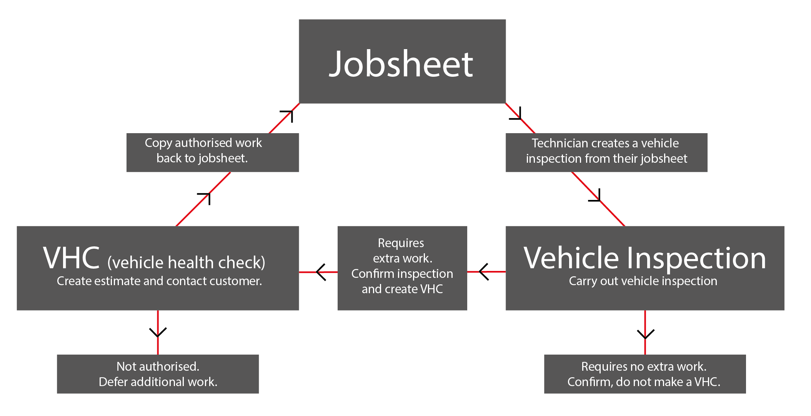
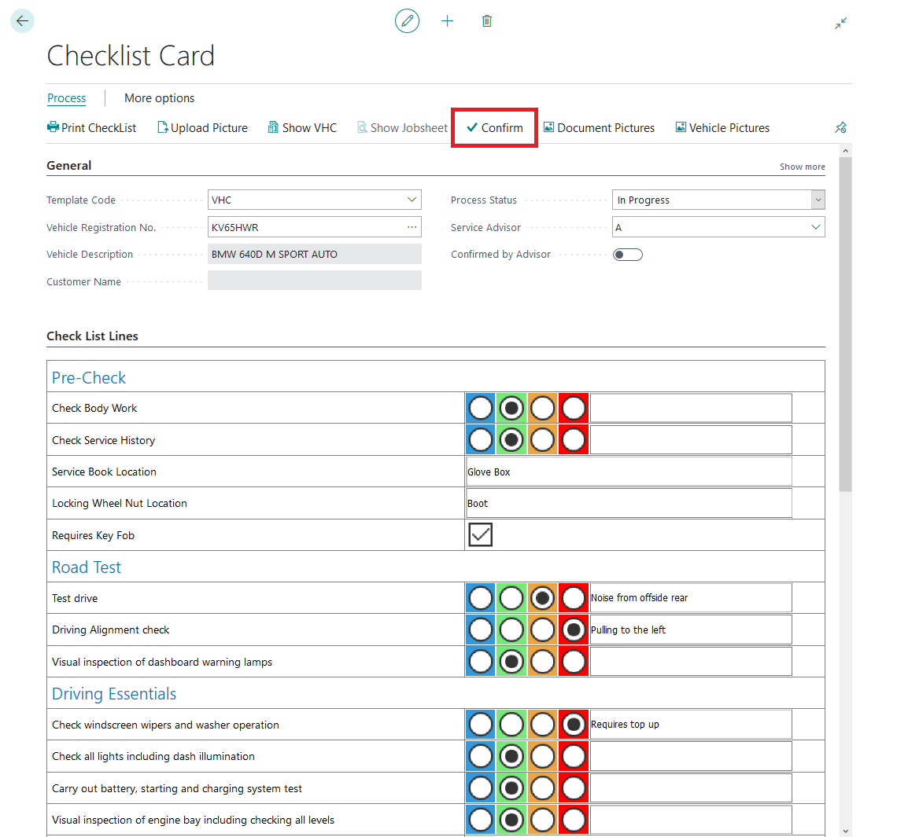
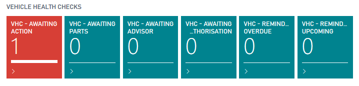
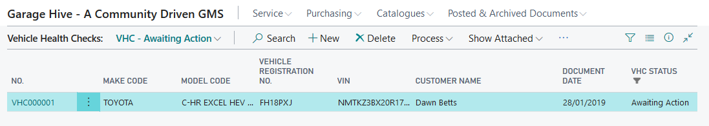
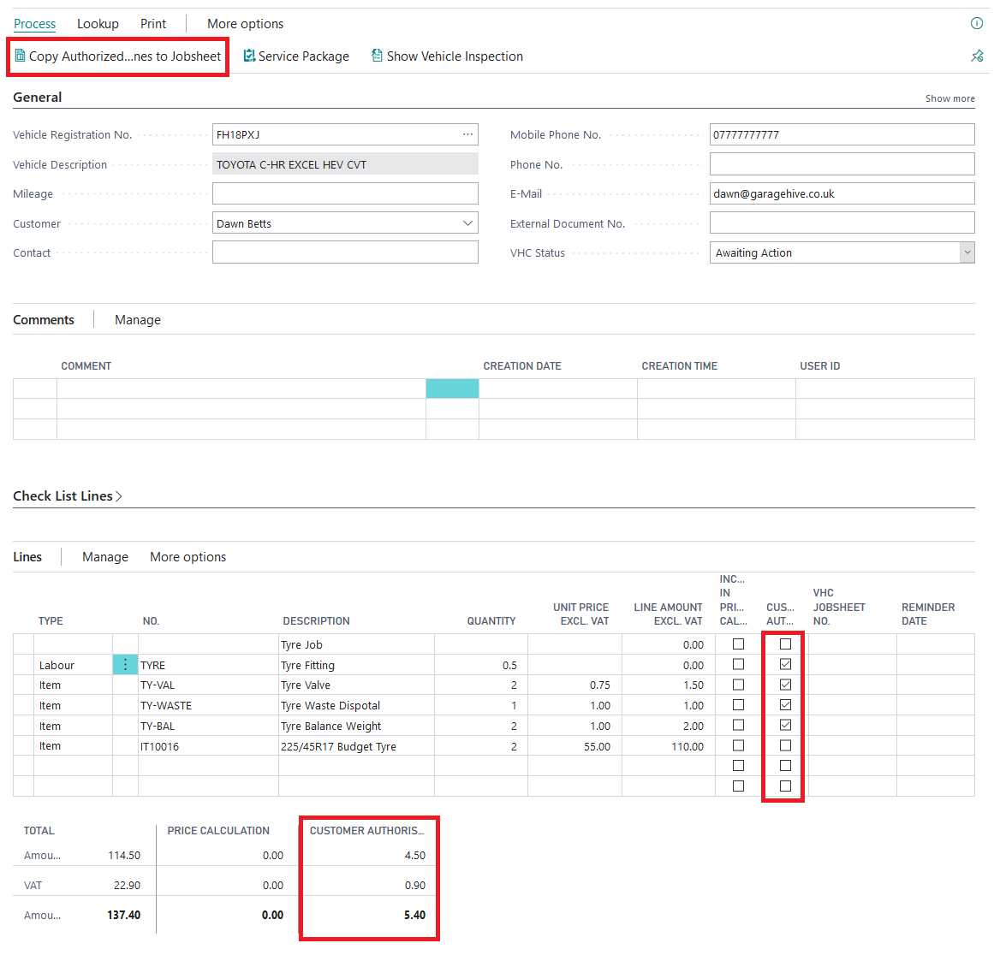
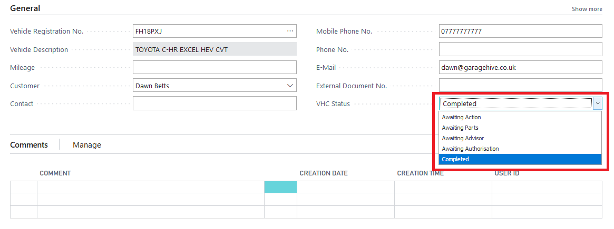

# How to use VHCs 

---
VHCs in Garage Hive offer the ability to manage and monitor your upsell, additional authorisation and estimates across all of your service staff. VHCs are created by confirming a [Vehicle Inspection](https://docs.garagehive.co.uk/docs/garagehive-technicians-vehicle-inspections.html "How to perform a Vehicle Inspection"). Once a VHC has been created you have several features designed to assist the user such as the price calculator, copying authorised lines to a [Jobsheet](https://docs.garagehive.co.uk/docs/garagehive-jobsheet-create.html "How to create a jobsheet") and the ability to defer work for a later date. 

The below flowchart explains the process from [Jobsheet](https://docs.garagehive.co.uk/docs/garagehive-jobsheet-create.html "How to create a jobsheet") -> [Vehicle Inspection](https://docs.garagehive.co.uk/docs/garagehive-technicians-vehicle-inspections.html "How to perform a Vehicle Inspection") -> VHC -> [Jobsheet](https://docs.garagehive.co.uk/docs/garagehive-jobsheet-create.html "How to create a jobsheet"). 

From the Advisors role centre you can see if any [Vehicle Inspections](https://docs.garagehive.co.uk/docs/garagehive-technicians-vehicle-inspections.html "How to perform a Vehicle Inspection") are in progress or awaiting confirmation, all [Vehicle Inspections](https://docs.garagehive.co.uk/docs/garagehive-technicians-vehicle-inspections.html "How to perform a Vehicle Inspection") require an Advisor to confirm them. Confirming a [Vehicle Inspection](https://docs.garagehive.co.uk/docs/garagehive-technicians-vehicle-inspections.html "How to perform a Vehicle Inspection") will present the advisor with an option of creating a VHC. 

Clicking on the VI - Awaiting Confirmation tile will present you with a list of [Vehicle Inspections](https://docs.garagehive.co.uk/docs/garagehive-technicians-vehicle-inspections.html "How to perform a Vehicle Inspection") awaiting confirmation. Simply select the [Vehicle Inspection](https://docs.garagehive.co.uk/docs/garagehive-technicians-vehicle-inspections.html "How to perform a Vehicle Inspection") you want to view and confirm.

Once you have opened the [Vehicle Inspection](https://docs.garagehive.co.uk/docs/garagehive-technicians-vehicle-inspections.html "How to perform a Vehicle Inspection") check that you are happy with the information and press the "Confirm" button in the action bar. You will be asked if you want to create a VHC. If the [Vehicle Inspection](https://docs.garagehive.co.uk/docs/garagehive-technicians-vehicle-inspections.html "How to perform a Vehicle Inspection") requires you to contact the customer to gain authorisation press confirm and press Yes to create a new VHC. If you confirm and press No the Vehicle Inspection will be archived and no VHC will be created. You can access historic [Vehicle Inspections](https://docs.garagehive.co.uk/docs/garagehive-technicians-vehicle-inspections.html "How to perform a Vehicle Inspection") at any time. 

After pressing Yes the VHC will be created, this VHC can either be accessed from the action bar of the [Vehicle Inspection](https://docs.garagehive.co.uk/docs/garagehive-technicians-vehicle-inspections.html "How to perform a Vehicle Inspection") or from the Service Advisor role centre using the tiles below. 

Each tile represents a different state of the VHC. 

* Awaiting Action (Yet to be actioned)
* Awaiting Parts (Actioned, awaiting parts information)
* Awaiting Advisor (VHC Estimate is populated, awaiting an Advisor to check it)
* Awaiting Authorisation (Awaiting customer to be contacted)

The VHC status can be changed within the document, the status will effect which tile the VHC will appear in - this can be used to great effect to manage your Service Advisors or office staff. 

Clicking on the tiles will show you a list of the VHCs with that status. 

Click on the VHC No. to open it. 

A VHC document is a combination of the [Vehicle Inspection](https://docs.garagehive.co.uk/docs/garagehive-technicians-vehicle-inspections.html "How to perform a Vehicle Inspection") and an estimate. You can view the [Vehicle Inspection](https://docs.garagehive.co.uk/docs/garagehive-technicians-vehicle-inspections.html "How to perform a Vehicle Inspection") from within the VHC by clicking on the FastTab "Check List Lines >". Using this information, you can generate an estimate of the work on the document lines. You can use [Service Packages](https://docs.garagehive.co.uk/docs/garagehive-service-packages.html "Service Packages") and Repair Times within a VHC document to assist with producing the estimate. 

If you contact the customer and gain authorisation for the additional work, tick the "Customer Authorised" box on the lines, then click "Copy Authorised lines to Jobsheet" in the action bar. This will copy all of the authorised lines back to the original Jobsheet. 

For any work not authorised, you can use the "Reminder Date" column to set a reminder on the system. Once the reminder is due, a tile on the Service Advisors homepage will populate with the VHC requiring a reminder. 

Once the document is complete, update the document status to "Completed". Completed VHCs are still accessible from a Jobsheet. 

# See Also
[How to setup Checklists](https://docs.garagehive.co.uk/docs/garagehive-checklist-how-to-create.html "How to setup Checklists in Garage Hive")

[How to perform a Vehicle Inspection](https://docs.garagehive.co.uk/docs/garagehive-technicians-vehicle-inspections.html "How to perform a Vehicle Inspection")
