

# How to use Vehicle Inspection Estimates (VIEs)
VIEs in Garage Hive allow you to manage and monitor your upsell, additional authorisation, and estimates across all of your service staff. VIEs are created by confirming a [Vehicle Inspection Checklist](/docs/garagehive-technicians-vehicle-inspections.html "How to Perform a Vehicle Inspection") or a **Quality Control Checklist**.

## In this article
1. [Understanding the Process from Jobsheet to VIE Back to Jobsheet](#Understanding-the-process-from-jobsheet-to-vie-back-to-jobsheet)
2. [Confirming a Checklist to a VIE](#confirming-a-checklist-to-a-vie)
3. [Different VIE Statuses](#different-vie-statuses)
4. [Adding Customer Authorisation and Copy the Authorised Lines to Jobsheet](#adding-customer-authorisation-and-copy-the-authorised-lines-to-jobsheet)
5. [How to Copy VIE Lines to an Estimate](#how-to-copy-vie-lines-to-an-estimate)

### Understanding the Process from Jobsheet to VIE Back to Jobsheet
To help you understand the process of creating a VIE from a Jobsheet, we've created the flowchart below, which shows all of the steps involved.

1. Once the Jobsheet is created, the technician creates a **Vehicle Inspection** linked to the Jobsheet and inspects the vehicle.
2. Depending on the outcome of the inspection, the vehicle may require additional work or not. If not, there is no need to create a VIE.
3. If yes, then the service advisor checks and confirms the vehicle inspection and creates a **Vehicle Inspection Estimate**.
4. The vehicle inspection estimate is filled out with the items and labour needed for the identified work, and the service advisor then shares the quotation with the customer **for authorisation**.
5. When the customer gives approval for the work to be done, the work that has been approved is **copied to the linked Jobsheet**, and the work that has not been approved is given a **reminder date** for future reference.

### Confirming a checklist to a VIE
To verify a checklist that has been completed by a technician:
1. On the checklist page, click **Home** and then **Confirm** from the menu bar.
2. To create a VIE, answer **Yes** to the prompt question that appears.

   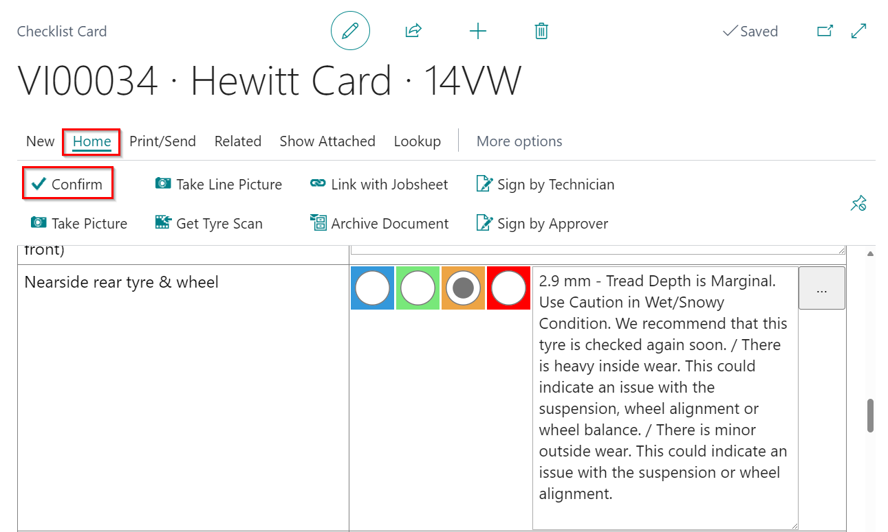

3. To auto-fill the **Service Advisor Code** when it is blank, search for **Service Mgt. Setup GH** in the top-right corner  icon.
   
   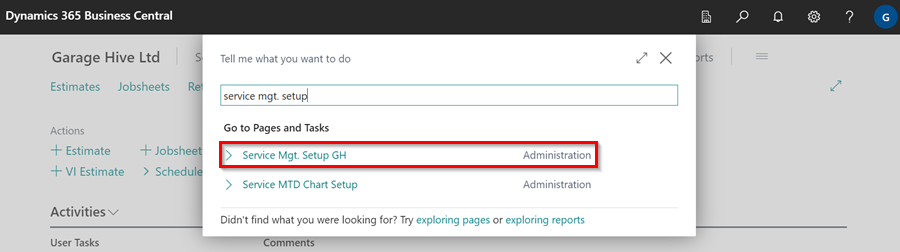

4. select **Yes** for **Auto-fill Service Advisor in VI Estimates** field in **General** FastTab, which now ensures that the **Service Advisor Code** is filled in after the vehicle inspection is confirmed.

   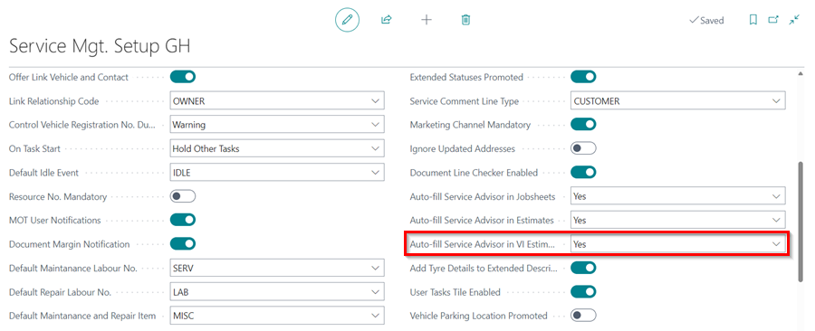



[Go back to top](#top)

### Different VIE statuses 
From the **Role Centre**, the VIE has the following statuses that it goes through:

* **Awaiting Action** tile - shows the number of VIEs that are created from completed checklists but have yet to be acted upon. 
* **Awaiting Parts** tile - shows the number of VIEs that have been added items and labour but are now waiting for the parts department to fill in the parts information.
* **Awaiting Advisor** - shows the number of completed VIEs that are awaiting confirmation and verification from the service advisor before being sent to the customer.
* **Awaiting Authorisation** - the number of completed VIEs that have been sent to the customer and are now awaiting approval from the customer.

The VIE status can be changed from the document as follows:
1. Click on the tile with the VIE you want to change the status.
2. Select the VIE from the list that appears by clicking on the **No.** of the VIE to open.
3. From the VIE's **General** FastTab, scroll to the **VIE Status** field and select the status to change to from the drop-down menu.

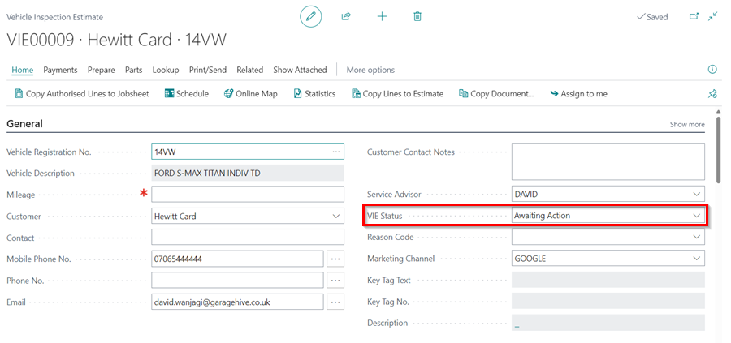

[Go back to top](#top)

### Add items and labour to the vehicle inspection estimate
After creating a VIE from the checklist, the status is **Awaiting Action**, to give the service advisor an alert to take action:
1. Click on the **Awaiting Action** tile to open the VIE list, and select the VIE to work on.
2. Add items and labour to the VIE according to the checks done.

   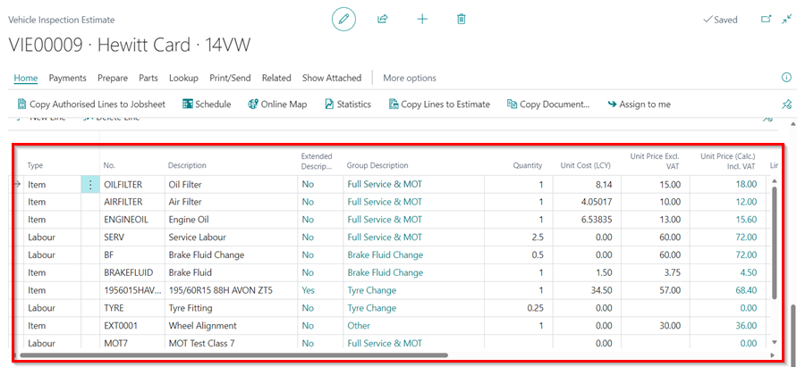

3. Change the **VIE Status** to **Awaiting Authorisation** from the customer, which moves it from the **Awaiting Action** to **Awaiting Authorisation** tile.

   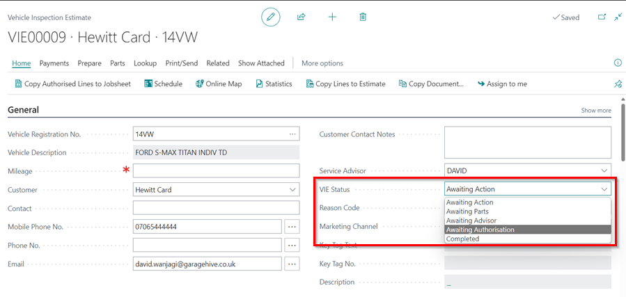

    

   

4. If you click on any amount under the **Totals Including VAT**, below the vehicle inspection estimate lines.
   
   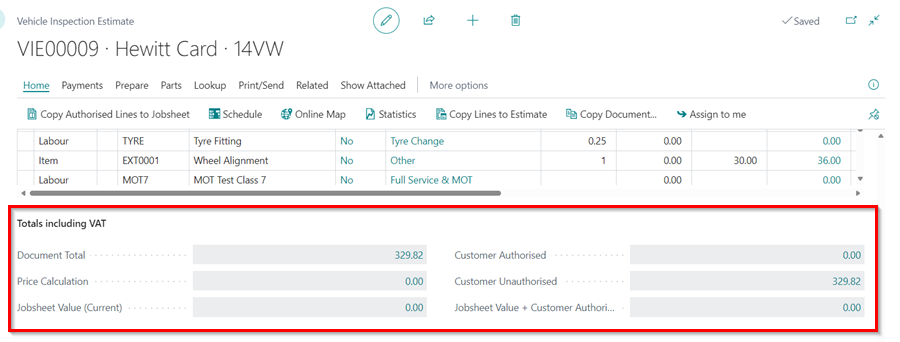

5.  A pop-up window appears which shows the **Document Total**, **Price Calculation**, **Jobsheet Value (Current)** totals, **Customer Authorised** totals, **Customer Unauthorised** totals and **Combined Total (Authorised)**.

   

[Go back to top](#top)

### Adding customer authorisation and copy the authorised lines to Jobsheet
You've already communicated with the customer and been advised on what work needs to be done at this point. The following step is to approve the document lines. There are two methods for authorising the document lines:
1. The first is from the document lines:
   * Scroll to the right on the document until you reach the **Customer Authorised** column. Tick all of the lines that the customer has approved.
   * From the menu bar, select **Home** and then **Copy Authorised Lines to Jobsheet**.

   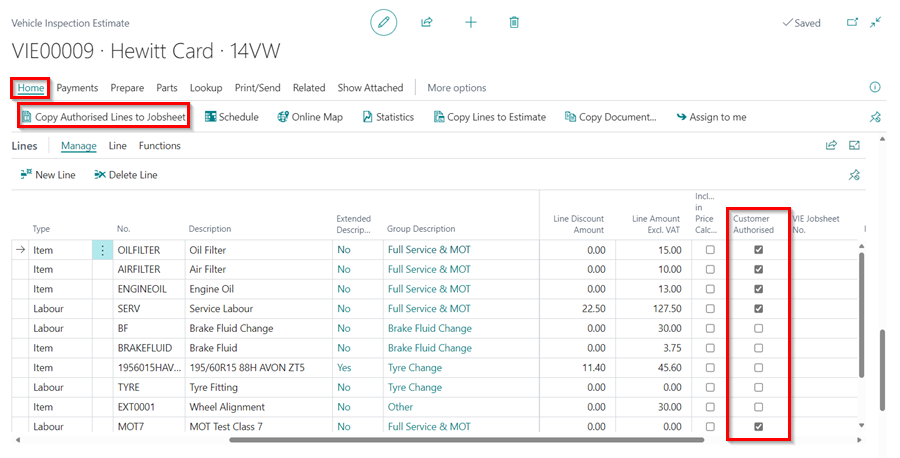

2. Alternatively, from the group items where the document lines have been added:
   * Scroll up to the section **Group Items** (see [Grouping document lines](garagehive-group-items-grouping-document-lines.html){:target="_blank"}), where the groups have already been created.
   * Select the group items that have been approved from the **Customer Authorised** column. When a group is checked, all document lines within that group are approved. A single document line that is already part of a group cannot be separately authorised.
   * From the menu bar, select **Home** and then **Copy Authorised Lines to Jobsheet**.
   * Select the document to copy to from the page that appears, then click **OK**.

      

   * You will be prompted, 'Do you want to copy comments related to the current VIE?' ** Select **Yes** to copy the comments to the Jobsheet.
         
      

   * Press the **Ctrl** key on your keyboard to select all of the comments to copy to the Jobsheet, then click **OK**.
   * This will add the selected lines and comments to the selected Jobsheet.
   
      



[Go back to top](#top)

### How to Copy VIE Lines to an Estimate
When you want to copy the lines from a VIE to an Estimate:
1. Open the VIE from which you want to copy the lines from. Click on **Process** then select **Copy Lines to Estimate** from the dropdown menu.

   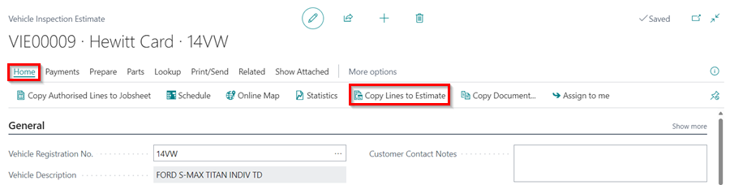

2. To include specific lines, tick the checkboxes in the **included** column next to each line you want to copy.
3. To select all lines simultaneously, use the **Set All Included** action located on the menu bar.

   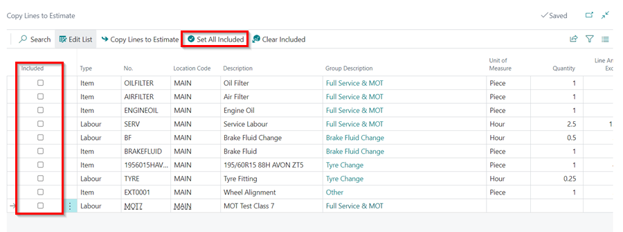

4. With your lines selected, proceed by clicking the **Copy Lines to Estimates** action on the menu bar.

   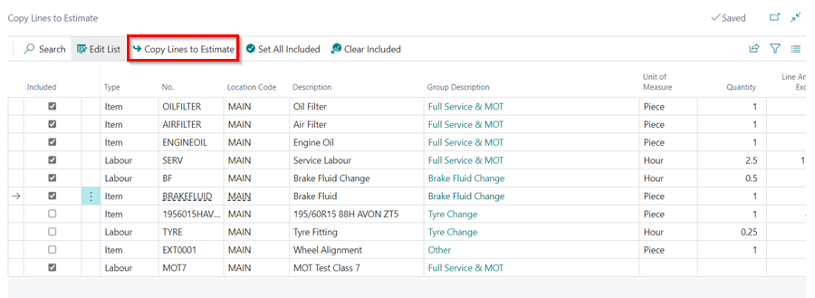

5. Once the lines are copied, a new estimate is automatically created. You can view and edit this estimate by going to the Estimates list.

[Go back to top](#top)

# See Also

[How to setup Checklists](garagehive-checklist-how-to-create.html "How to setup Checklists in Garage Hive"){:target="_blank"} \
[How to perform a Vehicle Inspection](/docs/garagehive-technicians-vehicle-inspections.html "How to perform a Vehicle Inspection"){:target="_blank"} \
[Setting reminder date for deffered work](/docs/garagehive-vhc-reminder-date.html){:target="_blank"}
