

# NAPA Auto Parts Integration With Garage Hive
NAPA Auto Parts integration allows you to link Garage Hive to the NAPA Auto Parts 360 website, where you can directly place an order for the parts that need to be ordered and transfer them to the Garage Hive system.

<video width="640" controls>
  <source src="https://assets.allianceautomotive.co.uk/m/3638a199fca4a773/original/Parts360-introduction-presentation-GARAGE-HIVE.mp4" type="video/mp4">
  Your browser does not support the video tag.
</video>

## In this article
1. [Request Registration as NAPA Auto Parts Customer](#request-registration-as-napa-auto-parts-customer)
2. [Linking NAPA Auto Parts to Garage Hive](#linking-napa-auto-parts-to-garage-hive)
3. [Ordering Parts from NAPA Auto Parts 360 through Garage Hive](#ordering-parts-from-napa-auto-parts-360-through-garage-hive)
4. [Transfer the NAPA Auto Parts 360 Basket to the Garage Hive](#transfer-the-napa-auto-parts-360-basket-to-the-garage-hive)
5. [Ordering Parts from the Purchase Order](#ordering-parts-from-the-purchase-order)
6. [Receiving Parts from the NAPA Auto Parts Invoice into the System](#receiving-parts-from-the-napa-auto-parts-invoice-into-the-system)

### Request Registration as NAPA Auto Parts Customer
To register as a NAPA Auto Parts customer, please complete the following form:

   > # NAPA Auto Parts Request Form: <ins>[New Digital Request.](https://www.napaautoparts.co.uk/new-digital-request){:target="_blank"}</ins>

### Linking NAPA Auto Parts to Garage Hive
To link NAPA Auto Parts to the Garage Hive System:
1. In the top-right corner, choose the  icon, enter **AAG Integrations**, and choose the related link.

   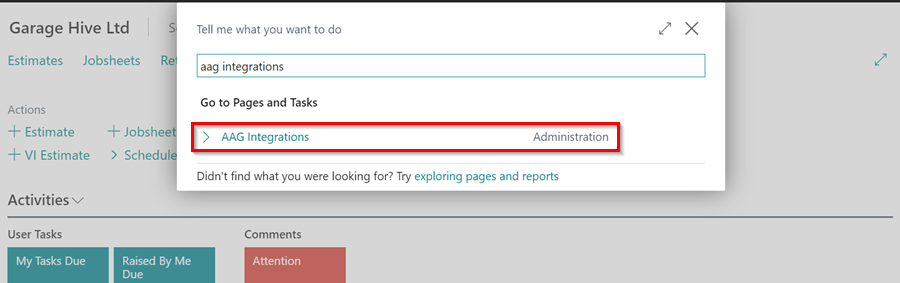

2. Select **New** to add the location to which you want to link NAPA Auto Parts.
   
   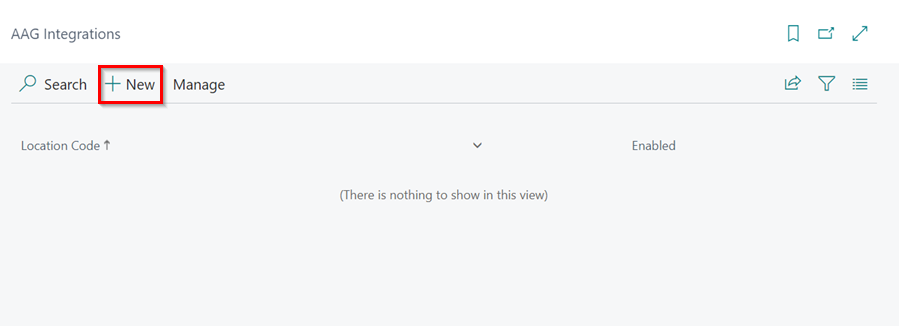
   
3. Select the **Location Code** and enter the **AAG Account Number** given by AAG. Enter your **Part 360 Username** and **Parts 360 Password** in the respective fields.
4. Set the **Placeholder Item Number** to **MISC** and select **AAG** as the vendor number. Then choose **Purchase Order Number** as the "Vendor Reference Format"; this option ensures that AAG will use the purchase order number to reference the order when it is shipped.

   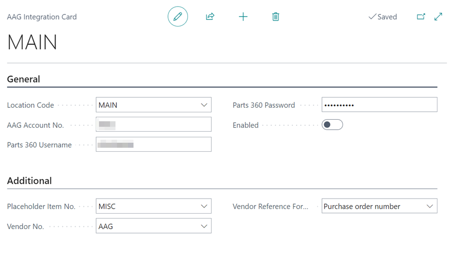

5. Slide the **Enable** slider to the right to enable the integration, and then exit the page.

   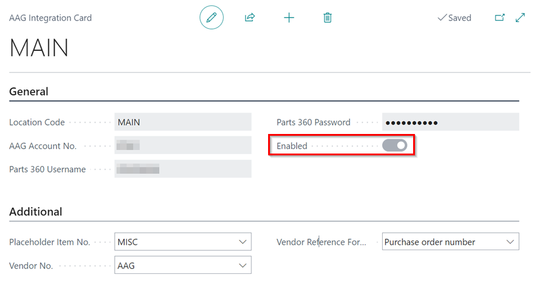

[Go back to top](#top)

### Ordering Parts from NAPA Auto Parts 360 through Garage Hive
To order parts from the NAPA Auto Parts 360 website:
1. Open the document (Jobsheet, Estimate, or VI Estimate) from which you want to order. Select **Parts** from the menu bar and then select **Open AAG Parts 360**.

   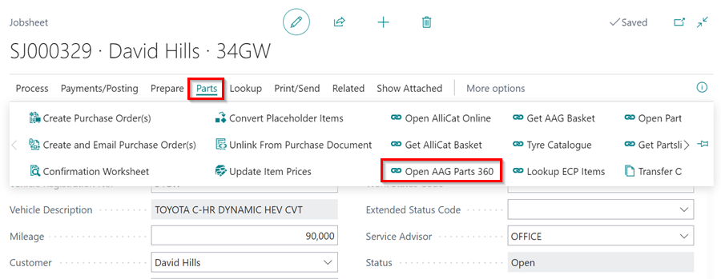

2. This action will open the NAPA Auto Parts 360 website. Once the page is open, choose the category for the parts you need.

   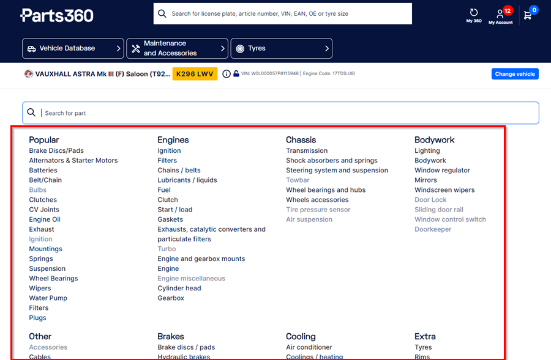

3. Scroll through the items in the category, and when you find the one you're looking for, click on the basket icon located on the right of the item. Repeat this process for all the items you want to order.

   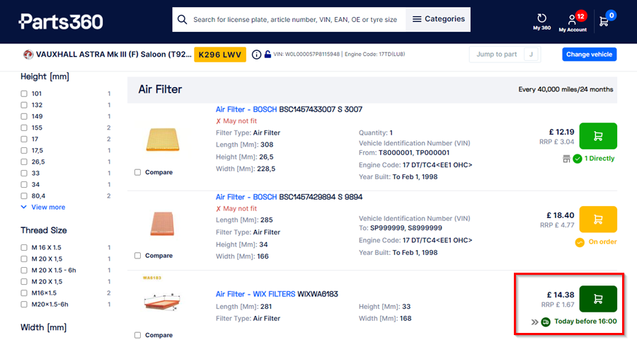

4. Once you've added the items to your basket, click on the basket icon in the top right corner to view the items you've added.

   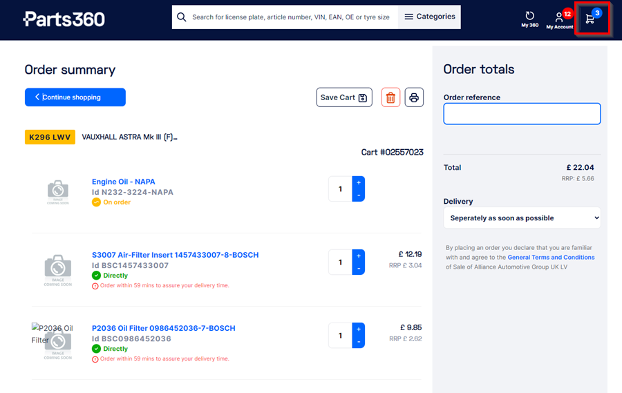

5. Return to the Garage Hive system and open the document to transfer the items you are ordering.

[Go back to top](#top)

### Transfer the NAPA Auto Parts 360 Basket to the Garage Hive
To transfer the items in your basket to Garage Hive and place an order:
1. Select **Parts** from the menu bar, followed by **Get AAG Basket**.

   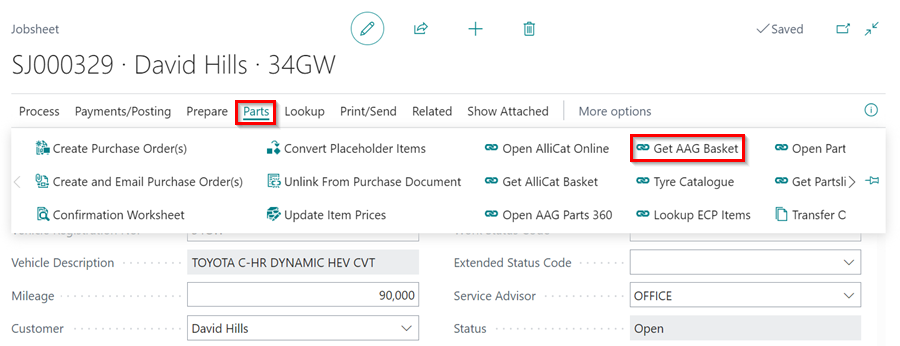

2. Select an item to add to the Jobsheet from the page that opens, then scroll to the right and click the **Action** column. You can add it as a **New line**, **New line to a group**, or **Update an existing line**. When you're finished, click **OK**.

   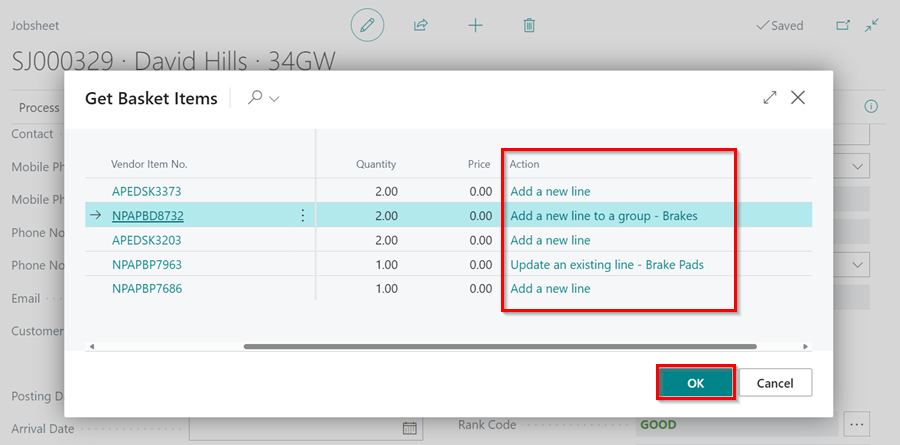

3. The **Description**, **Quantity**, and **Unit Cost** of the Item lines will be updated, but the **Item No.** will remain as **MISC**.
4. The Item lines will also be marked as **Purchase (Special)** with the **Vendor No.** and the **Vendor Item No.** added.

   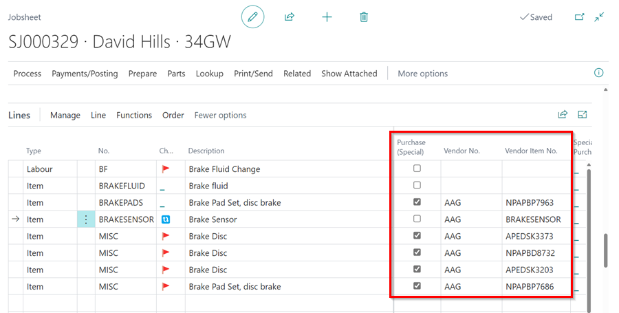

5. To create a purchase order for the items, from the menu bar select **Parts** and then **Create Purchase Order(s)**.

   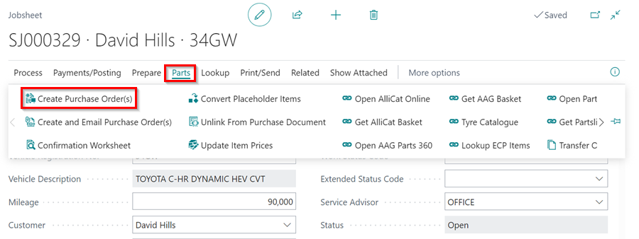

6.  In the pop-up notification, you have the option to select **Yes** and place an order from **AAG Parts 360** website which also creates a Purchase Order for the items, or **No** and simply create the Purchase Order.

   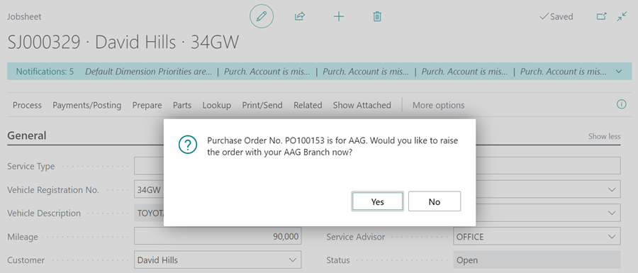

[Go back to top](#top)

### Ordering Parts from the Purchase Order
1. Open the **Purchase Order.**
2. To make an order through **AAG Parts 360 website**, select **Home** from the menu bar, followed by **AAG Order Parts**. The order will be placed, and more details will be received from NAPA Auto Parts.

   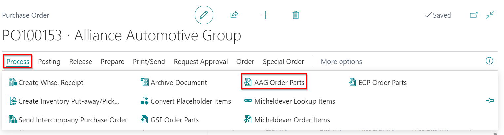

[Go back to top](#top)

### Receiving Parts from the NAPA Auto Parts Invoice into the System
When the items arrive, you may now convert the placeholder items to the actual item number. To do this, use the **Convert Placeholder Items** action, which is available in both the Purchase Order and the Jobsheet. Learn more [here](garagehive-creating-a-placeholder-item.html#convert-a-placeholder-item-to-the-vendor-item-number){:target="_blank"}.

- Purchase Order:

   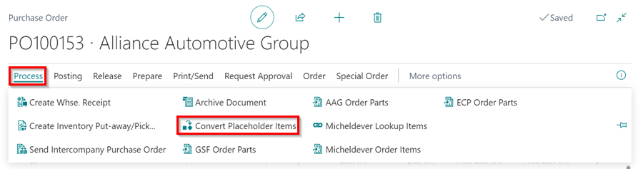

- Jobsheet:

   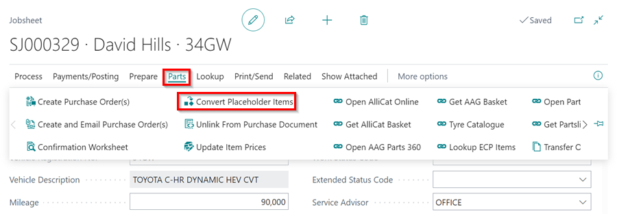

[Go back to top](#top)