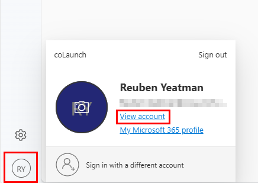

## Adding a New Authentication Method
1. Open [www.office.com](https://www.office.com){:target="_blank"} from any browser, and sign in to your account. Click on your profile picture in the bottom-left corner and select **View account**.

   

2. In the page that opens, select **Security Info** on the sidebar, and then select **Add sign-in method**.

   

3. In the pop-up window, select **Microsoft Authenticator**.

   

4. If you haven’t already, download the **Microsoft Authenticator App** on your phone. Click Next to continue. If you prefer a different authenticator app, select I want to use a different authenticator app and follow the instructions.

   

5. Open the **Microsoft Authenticator App** on your phone. Tap **Add account**, select **Work or School account**, then choose **Scan a QR Code**.

   

6. On your browser, click **Next** until a QR code appears. Use your phone to scan the QR code with the **Microsoft Authenticator App**.

   

   

7. Enter the code displayed in your browser into the **Microsoft Authenticator App** when prompted.

   

8. Once you've entered the correct code, your authenticator app will be successfully linked to your account.

   

[Go back to top](#top)
