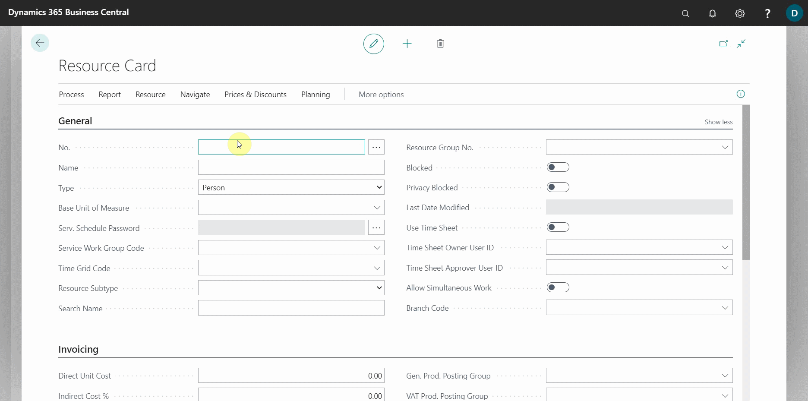
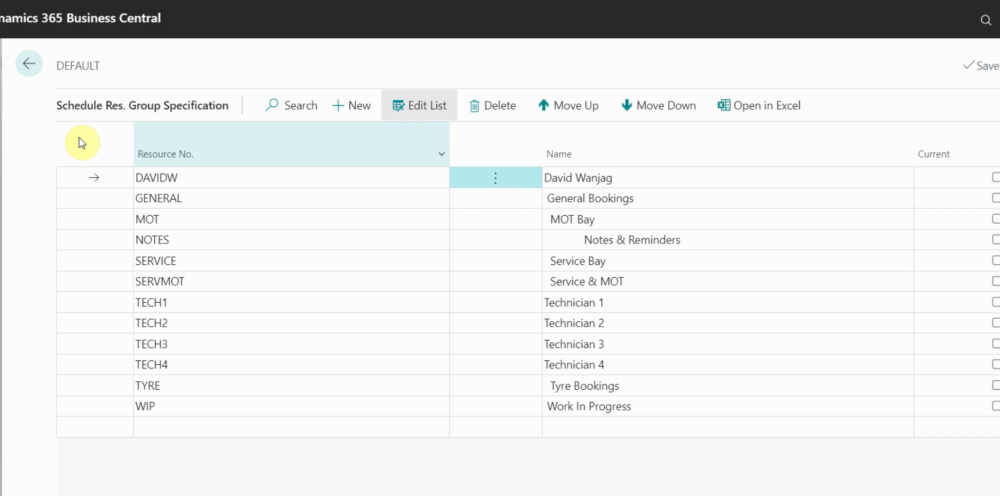

# Adding a Resource (Person or Machine) in Garage Hive
The resources can be set up to be a person or machine in Garage Hive, for example technicians for person resource and courtesy car for a machine resource and so on. Here is how to set up a resource in Garage Hive:
1. In the top-right corner, choose the search icon, enter **Resources**, and choose the related link.
2. From the **Resources** page, select the **New** from the actions bar, followed by **+New**.

   

3. In the **General** FastTab, add **No.** field as the number of the resource; you can add a shortcode to identity the resource, and then add the full name of the resource in the **Name** field.
4. Select **Type** field as either **Person** or **Machine**, and then scroll down to **Resource Subtype** and select the type of resource that you are adding; could be a **Tech**, **MOT Bay**, **General Ramp**, **Admin Staff**, **Tech Apprentice**, or **Courtesy Vehicle**. In this case we'll add a **Courtesy Vehicle**, which is a machine.

   

5. When done close the page, and the resource card will now be created.
6. To add the resource in a **Default Resource Group**, enter **Schedule Resource Groups** at the search icon, select **Default** Schedule group from the list, followed by **Specifications** in the actions bar.

   

7. Select **New** from the actions bar, and then select the added resource from the drop down list.

   

### **See Also**

[Understanding the schedule](garagehive-understanding-the-schedule.html) \
[Creating a booking from the schedule](/docs/garagehive-create-a-booking.html)