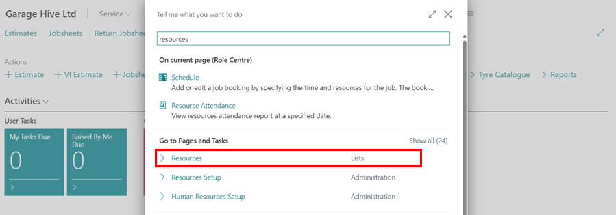
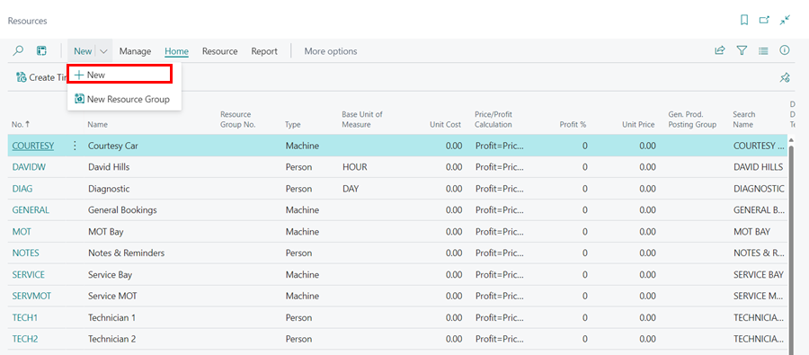
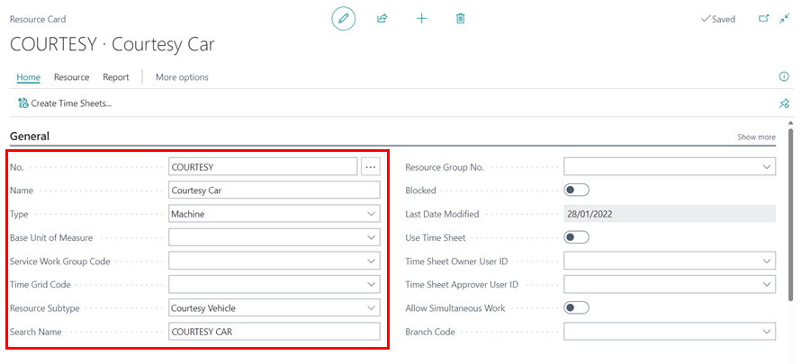
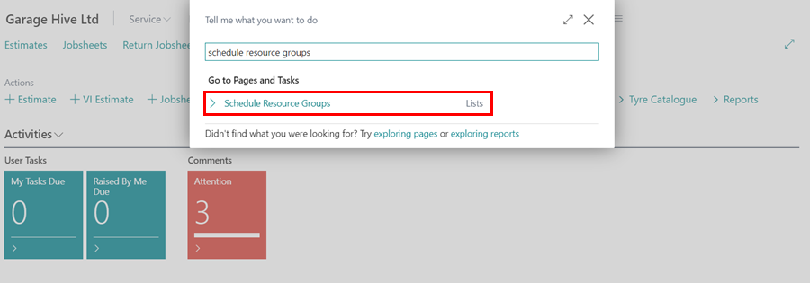
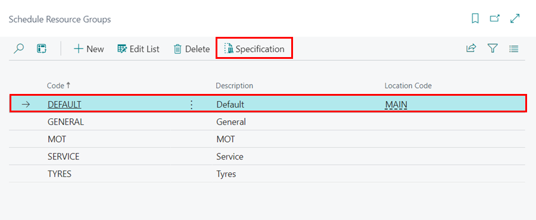
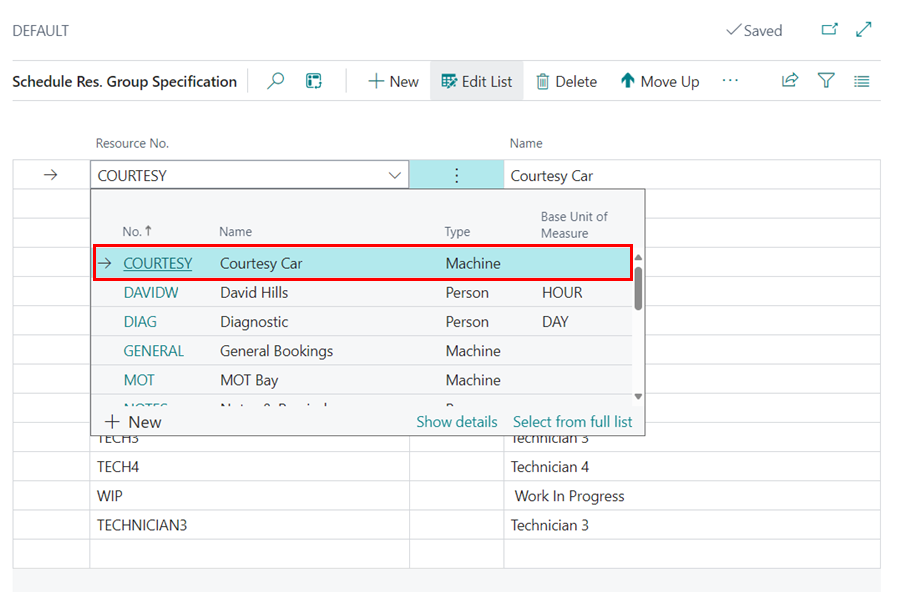

# Adding a Resource (Person or Machine) in Garage Hive
In Garage Hive, resources can be set up to be either a person or a machine, for example, technicians for a person resource, courtesy car for a machine resource,  type of bay (e.g Diagnostics Bay) for a machine resource and so on. Here's how to add a resource to Garage Hive:
1. In the top-right corner, choose the  icon, enter **Resources**, and choose the related link.

   

2. From the **Resources** page, select the **+New** option from the **New** split button dropdown menu.

   

3. In the **General** FastTab, enter the number of the resource in the **No.** field; you can enter a short form of the resource, and then enter the full name of the resource in the **Name** field.
4. Select the **Type** field as either **Person** or **Machine**, and then scroll down to **Resource Subtype** and select the type of resource that you are adding; this could be a **Tech**, **MOT Bay**, **General Ramp**, **Admin Staff**, **Tech Apprentice**, or **Courtesy Vehicle**. In this case, we'll use **Courtesy Vehicle**, which is a machine.
5. When done close the page, and the resource card will now be created.

   

6. To include the resource in the **Default Resource Group**, search for **Schedule Resource Groups**.

    

7. Select **Default** Schedule Group from the list, followed by **Specifications** in the menu bar.

   

8. Select **New** from the menu bar, and then select the newly added resource from the drop down list.

   

[Go back to top](#top)

### **See Also**

[Understanding the schedule](garagehive-understanding-the-schedule.html){:target="_blank"} \
[Creating a booking from the schedule](/docs/garagehive-create-a-booking.html){:target="_blank"}