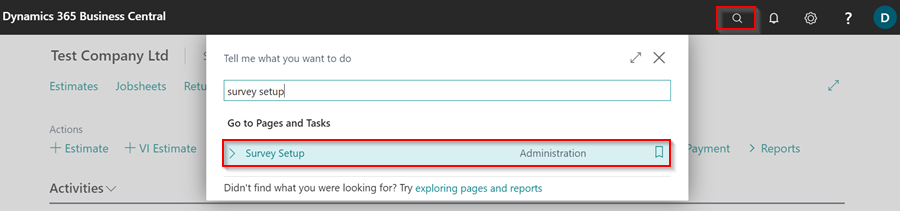
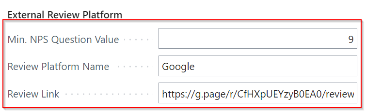
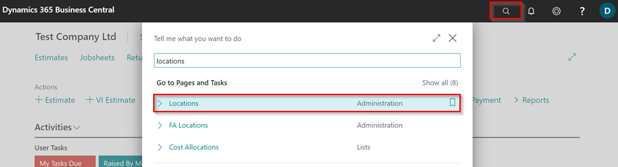
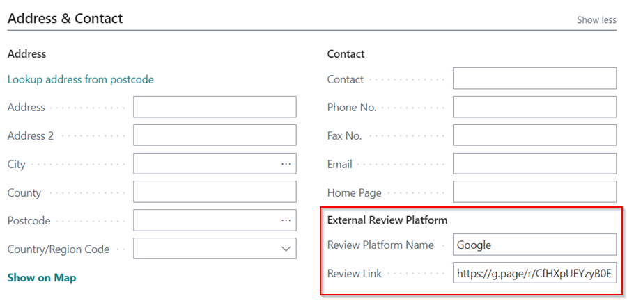
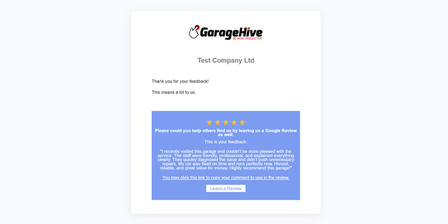

# Adding External Review Follow-up on Customer Surveys
Including an external review follow-up in a customer survey allows the garage to further engage customers who rate the business with a higher NPS score and are satisfied with the services to leave a review on your preferred external platform. At the end, you will increase your rating with better reviews.

## In this article
1. [External Review Follow Up Setup for Single Location](#External-review-follow-up-setup-single-location)
2. [External Review Follow Up Setup for Multi Location](#external-review-follow-up-setup-for-multi-location)
3. [How the External Review Link Appears to the Customer](#tyre-scanner-checklist-template)

### External Review Follow Up Setup for Single Location
1. In the top right corner, choose the  icon, enter **Survey Setup**, and select the related link.

   

2. Scroll down to the **External Review Platform** FastTab.
3. Enter the **Min. NPS Question Value**, which means that if the customer reviews the garage with this number or higher, a link to review the garage appears at the end of the survey.
4. In the **Review Platform Name** field, enter the name of the review platform, such as **Google**, **Trustpilot**, or any other that you use to gain public ratings.
5. Finally, add the **Review Link** for the platform, which will redirect the customer to the review page if they click on it.

   

6. The setup is now completed, and you can close the page.

[Go back to top](#top)

### External Review Follow Up Setup for Multi Location
1. When you have multiple locations for your business and need a different review platform and link for each, follow the steps above for setting up a single location, but the only field that is required is the **Min. NPS Question Value**. You can leave the **Review Platform Name** and **Review Link** fields blank.
2. Choose the  icon, enter **Locations**, and select the related link.

   

3. Select the location card to which you want to add a follow-up review link, and then add the **Review Platform Name** and the **Review Link** in the **External Review Platform** section under **Address and Contact** FastTab.

   

4. Repeat these steps for each location where you want to add a follow-up review link.



[Go back to top](#top)

### How the External Review Link Appears to the Customer
When the **External Review Follow Up Setup** is complete, the customer will have the option of reviewing your business after completing the **Net Promoter Score** survey, and the link will appear as follows.

   

[Go back to top](#top)
