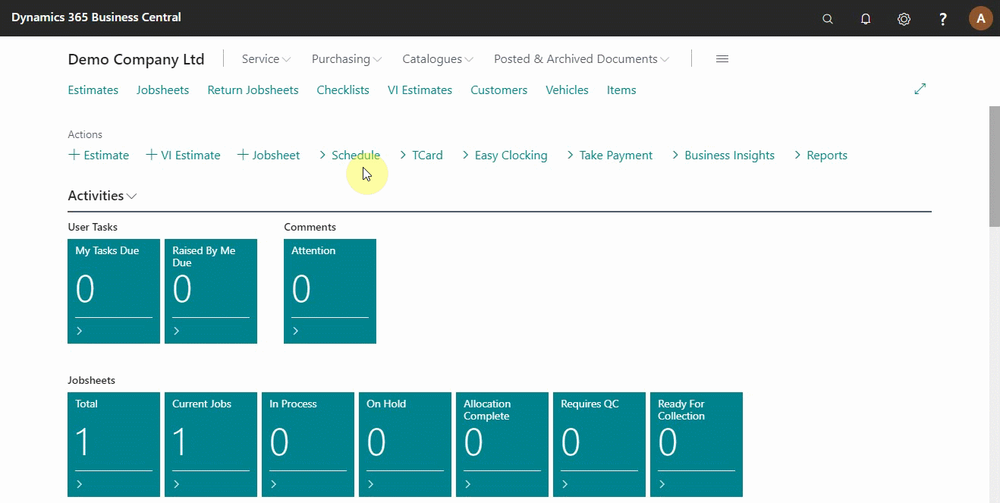

# Adding Items and Labour in a Jobsheet

When a booking is made and all information added, the next step is adding items and labour on the service document for the work done on the vehicle. In this article, we are going to look at the various ways of adding items and labour.

## In this article

1. [Open the jobsheet via the Schedule](#open-the-jobsheet-via-the-schedule)
2. [Adding items and labour in the jobsheet manually](#adding-items-and-labour-in-the-jobsheet-manually)
3. [Adding items and labour in the jobsheet using service packages](#adding-items-and-labour-in-the-jobsheet-using-service-packages)

### Open the jobsheet via the schedule
To open the jobsheet from the role centre, click on **Schedule** from the actions bar, right-click on the booking or jobsheet you want to access, select **Look Up** to open the jobsheet, and scroll down to the lines (see below).

> **Note:** 
>
> Avoid left-clicking to ensure you don’t open two jobsheets at the same time.

### Adding items and labour in the jobsheet manually
There are several ways to add the lines and labour in a jobsheet. One way is to do it manually. To do this, select the first line cell on the **Type column**, select item or labour on the drop-down menu, and press the tab button to move to the next cell. In the next cell, select the specific code,**No.**, used to identify the item or labour and add the **Quantity** and **Unit Price** (selling price) on the respective columns. The unit price can be updated manually or by use of the margin calculator (see below).

> **Note:**
>
> To move between cells, you can press the tab button or use the front and back arrows. 

### Adding items and labour in the jobsheet using service packages
The second method to add items and labour in a jobsheet is through service packages. Click on **Look Up** at the top-level navigation bar and select **Service Packages** on the submenus. From the list that appears, select a service package that applies to the vehicle on the jobsheet. The items and labour are automatically added to the jobsheet.

> **Tip:** 
>
> You can pin the navigation menu on top.

### **See Also**

[Video: How to add items and labour to a jobsheet](https://www.youtube.com/watch?v=ABnKqYB4f3A).