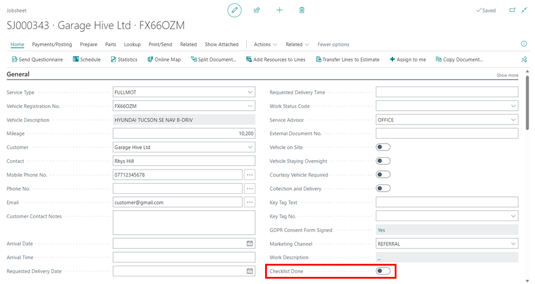

# Adding Optional Tiles and Custom Process in Garage Hive
Garage Hive offers several customisations to tailor the system according to your garage business's workflow. This includes adding tiles to the Role Centre and creating custom processes within the service document.

## In this article
1. [Adding Optional Tiles](#adding-optional-tiles)
2. [Adding Custom Processes](#adding-custom-processes)

### Adding Optional Tiles
There are several tiles in Garage Hive that are hidden by default from the **Role Centre**, which means they are not visible and cannot be used. These tiles are as listed below:
   * Jobsheet Work status **Await Parts**
   * Jobsheet Work status **Await Auth.**
   * **User Tasks** tile
   * **Document Attention** tile
   * **Jobsheet Complete** tile
   * **Current VI's** tile

To add these tiles in the **Role Centre**:
1. In the top-right corner, choose the  icon, enter **Service Mgt. Setup GH**, and select the related link.
2. There are several settings that may be changed on the page that opens, including the addition of the tiles. To add work status tiles, go to the work status fields and type in the corresponding **Status Code**, for example, **AWAITPARTS** for the **AWAIT. PARTS** tile.

   

3. To add the **User Tasks**, **Document Attention**, **Jobsheet Complete**, and **Current VI's** tiles to the **Role Centre**, simply slide the slider on the right-hand side column of the under the **General** FastTab.

   

4. The tiles will be ready for use after you refresh the **Role Centre**.

[Go back to top](#top)

### Adding Custom Processes
On the other hand, you have the option to add **Custom Processes** to your service document based on your specific needs. For instance, you can include a custom slider called **Checklist Done** in your service document to enable it when the checklist is complete. Here is how to add the custom processes:
1. In the top-right corner, choose the  icon, enter **Service Mgt. Setup GH**, and select the related link.

   

2. Under the **General** FastTab, Scroll down to the bottom of the right-hand column, where you will find the **Custom Process Flag Name 1** and **Custom Process Flag Name 2** fields. In these fields, type in the name of the process you wish to add. For instance, in this case, we'll use **Checklist Done**. You may choose to customise both fields or just one.

   

3. To refresh the system, sign out and then sign back in again.
4. The **Custom Process** slider will appear in your service document, under the **General** FastTab.

   

[Go back to top](#top)