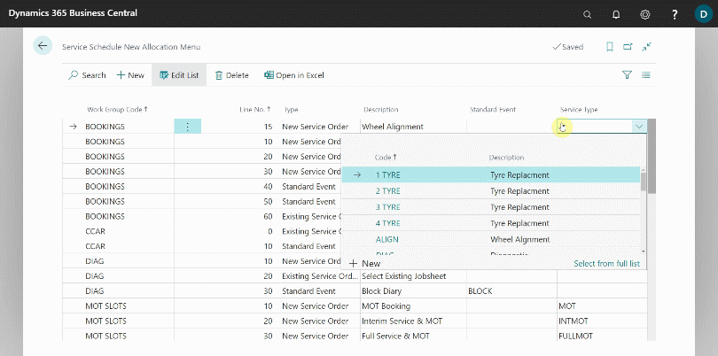

# Adding New Options in the Schedule Allocation Menu

When you book an allocation in the schedule, the following menu appears, giving you options to choose from:

   

Garage Hive allows you to add and customise a new option to have a service package, so that when you add the allocation and create a jobsheet, the service package is automatically added.

To add a new option:
1. In the top-right corner, choose the  icon, enter **Service Schedule New Allocation Menu**, and select the related link.
2. Select **New** from the menu bar in the **Service Schedule New Allocation Menu** page.

   

3. Under the **Work Group Code** field, you can choose from the available **Service Work Groups** based on the type of allocation you're adding; in this case, we'll create one for **Bookings**.
4. In the **Line No.** field, enter a number based on how you want the new allocation to appear in the list, from top to bottom; if you want the new allocation to appear higher on the list, enter a lower number, and vice versa.
5. Choose the type of allocation you want: **New Service Order**, **Standard Event**, or **Existing Service Order**.
6. Fill in the **Description** field with a description of the new allocation; in this case, we're creating a **Wheel Alignment** allocation.
7. If the **Type** field is not set to **Standard Event**, leave the **Standard Event** field blank.

   

8. Finally, assign the new allocation to a **Service Type**. **Service Type** are customised to your preferences and the jobs you perform. You can link a service type with a **Service Package** so that it is automatically added to the jobsheet when booking. Learn more about [How to Create Service Packages](garagehive-service-packages.html){:target="_blank"} and [Adding Service Packages Automatically](garagehive-automatically-adding-service-packages.html){:target="_blank"}.

   

9.  When you make a booking and choose the new allocation, the jobsheet will be created with the selected **Service Type** and, if applicable, the linked **Service Package** will be added automatically once the **Vehicle Reg.** and **Customer** have been applied.

   

[Go back to top](#top)

### **See Also**

[Understanding the Schedule](garagehive-understanding-the-schedule.html){:target="_blank"}
[Creating a booking from the Schedule](garagehive-create-a-booking.html){:target="_blank"}
[How to Create Service Packages in Garage Hive](garagehive-service-packages.html){:target="_blank"}
[Adding Service Packages Automatically](garagehive-automatically-adding-service-packages.html){:target="_blank"}
[Automatically Adding Courtesy Car and Collection and Delivery Service Packages](garagehive-service-package-automatically-adding-courtesy-car-and-collection-and-delivery-service-packages.html){:target="_blank"}