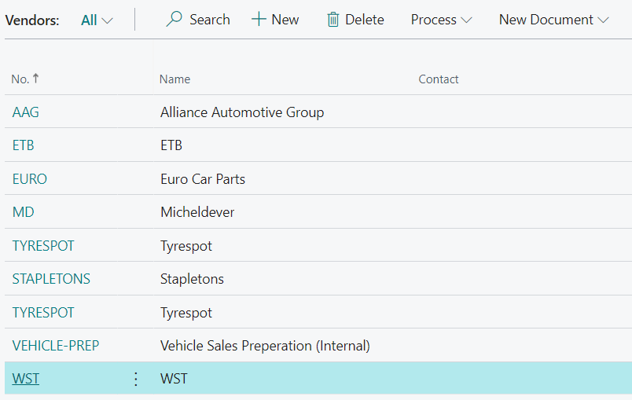
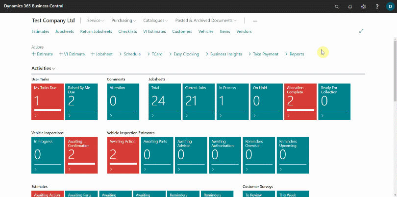

# How to Use Advance Tire Lookup Feature in Garage Hive

The **Advanced Tire Lookup** feature in Garage Hive enables the availability of a list of stock tyres in the system from tire vendors/suppliers. This allows garages that trade in tires to look up tires in the system when they need to buy new tires for selling.

The stock file can be fully integrated into the system from the suppliers list, or it can be imported into the system for the following suppliers:
1. Micheldever (MD)
2. ETB
3. We Sell Tyres (WST)
4. Tyrespot
5. Stapletons

In this article we'll use a stock file obtained from **WST** Supplier. To use the **Advanced Tire Lookup** feature:
1. Ensure that vendors are added to the system with the vendor's code; for example, if we are importing a stock file for **WST**, the **Vendor No.** should be **WST**, and so on.

   

2. In the top-right corner, choose the search icon, enter **Import WST Catalogue Items**, and select the related link. If you have a stock file from another of the above-mentioned suppliers, enter **Import+ Supplier Name + Catalogue Items**, for example, **Import MD Catalogue Items**.
3. Click **Choose**, then select the stock file to import from your device, and then click **Open** to import the file.

   

4. After the import is completed, the tire stock will be available in the catalogue items. To view them, search for **Catalogue Items**.

   

5. To add a tire to a Jobsheet, open the Jobsheet and select the line to which the tire will be added. Enter the tire size in the format **T1956015** and press the **Tab** key.
6. The **Advanced Tire Lookup** page will open, displaying a list of all available tires in the specified size. This excludes any additional **Catalogue Items** added to the system. Select the tire you need from the list.
7. Click **OK** to add the tire to the Jobsheet. A tire item will be created in the system and added to the Jobsheet.

