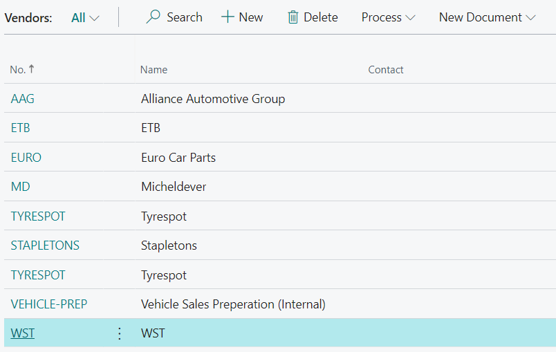
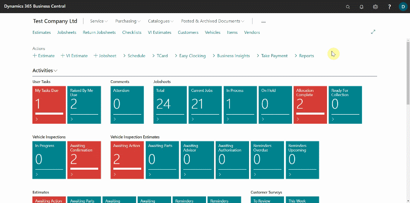
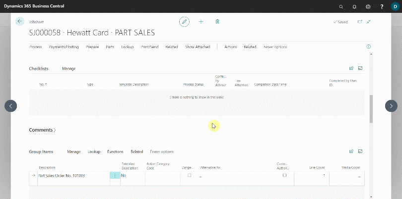

# How to Use Advance Tyre Lookup Feature in Garage Hive

The **Advanced Tyre Lookup** feature in Garage Hive enables the availability of a list of stock tyres in the system from tyre vendors/suppliers. This allows garages that trade in tyres to look up tyres in the system when they need to buy new tyres for selling.

The stock file can be fully integrated into the system from the suppliers list, or it can be imported into the system for the following suppliers:
1. Micheldever (MD)
2. ETB
3. We Sell Tyres (WST)
4. Tyrespot
5. Stapletons

In this article we'll use a stock file obtained from **WST** Supplier. To use the **Advanced Tyre Lookup** feature:
1. Ensure that vendors are added to the system with the vendor's code; for example, if we are importing a stock file for **WST**, the **Vendor No.** should be **WST**, and so on.

   

2. In the top-right corner, choose the search icon, enter **Import WST Catalogue Items**, and select the related link. If you have a stock file from another of the above-mentioned suppliers, enter **Import+ Supplier Name + Catalogue Items**, for example, **Import MD Catalogue Items**.
3. Click **Choose**, then select the stock file to import from your device, and then click **Open** to import the file.

   

4. After the import is completed, the tyre stock will be available in the catalogue items. To view them, search for **Catalogue Items**.

   

5. To add a tyre to a Jobsheet, open the Jobsheet and select the line to which the tyre will be added. Enter the tyre size in the format **T1956015** and press the **Tab** key.
6. The **Advanced Tyre Lookup** page will open, displaying a list of all available tyres in the specified size. This excludes any additional **Catalogue Items** added to the system. Select the tyre you need from the list.
7. Click **OK** to add the tyre to the Jobsheet. A tyre item will be created in the system and added to the Jobsheet.

