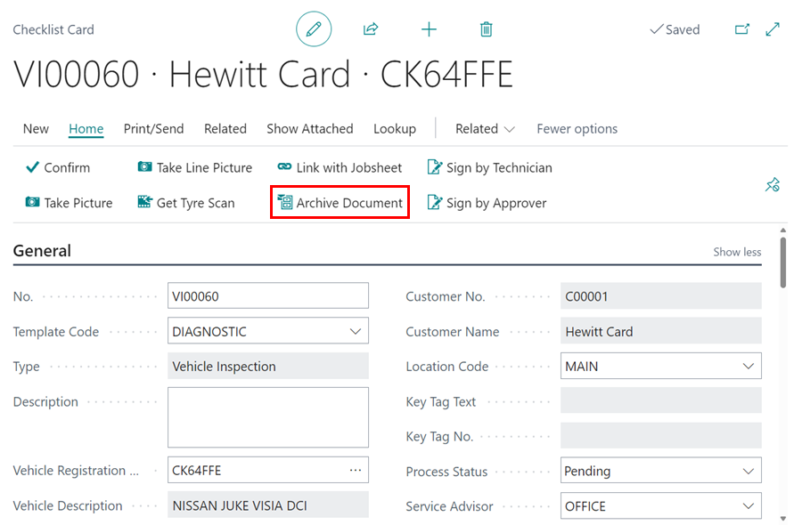
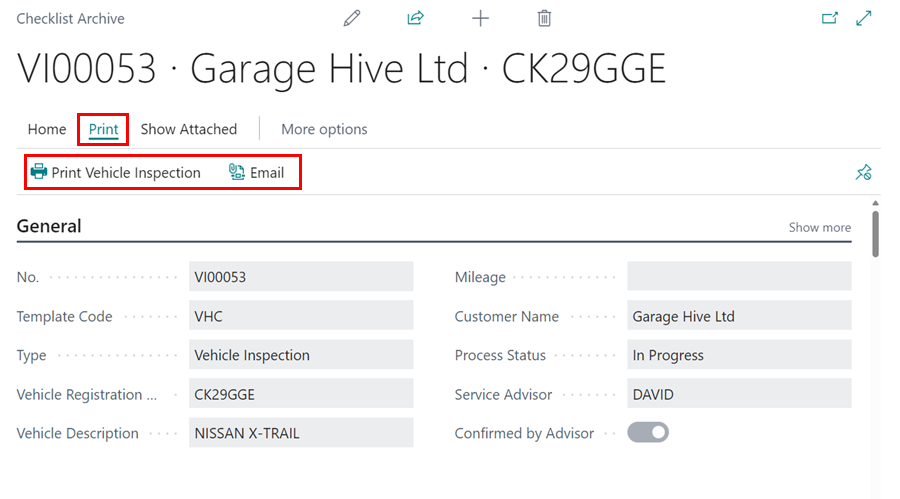

# Archived Documents 
You can archive purchase orders, estimates, jobsheets, and checklists, if you want to save a copy of a document for later use.

## Types of Archived Documents

### Archived Estimates and Vehicle Inspection Estimates
   - An **Estimate** or **Vehicle Inspection Estimate** is archived when deleted or published online.
   - Archived estimates can be copied to other documents using the [**Copy Document**](garagehive-copydocument.html){:target="_blank"} function.
   - To access the Archived Estimates and VI Estimates, select **Posted & Archived  Documents** in the Role Centre, and select either **Archived Estimates** or **Archived VI Estimates**.

      

   - If the original document still exists and hasn't been deleted, you can restore an archived **Estimate** or **Vehicle Inspection Estimate** using the **Restore** action. 

      

[Go back to top](#top)

### Archived Jobsheets and Return Jobsheets
   - A **Jobsheet** or **Return Jobsheet** can be archived by deleting it, publishing it online (for Jobsheet) or by using the **Archive Document** action under **Functions** in **Actions** menu in the menu bar, and it can be archived multiple times, saving different **Archived Versions**.

      
      
   - To access the Archived Jobsheets or Archived Return Jobsheets, select **Posted & Archived  Documents** from the Role Centre, and select either **Archived Jobsheets** or **Archived Return Jobsheets**.

      

   - An archived Jobsheet can be copied to another document using [**Copy Document**](garagehive-copydocument.html){:target="_blank"} function.
   - If the original document is still available and hasn't been posted or deleted, you can restore an archived Jobsheet or Return Jobsheet using the **Restore** action.

      

[Go back to top](#top)

### Archived Checklists
   - A **Checklist** can be archived by deleting it, publishing it online by selecting the **Archive Document** action from the **Home** menu, and it can be archived multiple times, saving different **Archived Versions**.

      

   - To access the Archived Checklists, select **Posted & Archived  Documents** from the Role Centre, and select **Archived Checklists**.

      

   - Archived checklists can be printed or emailed by choosing the **Print** menu on the menu bar, then selecting **Print Vehicle Inspection** or **Email**.

      

[Go back to top](#top)

### Archived Purchase Orders
   - A **Purchases Order** can be archived by using the **Archive Document** action, and it can be archived multiple times, saving different **Archived Versions**.

      

   - To access the Archived Purchase Orders, select **Posted & Archived  Documents** from the Role Centre, and select **Archived Purchase Orders**.

      

   - You can print an archived purchase order by selecting **Home** from the menu bar, followed by **Print**.

      

[Go back to top](#top)

 

### **See Also**
[How to access posted and archived documents](https://www.youtube.com/watch?v=mFmimPCl9ns){:target="_blank"}

