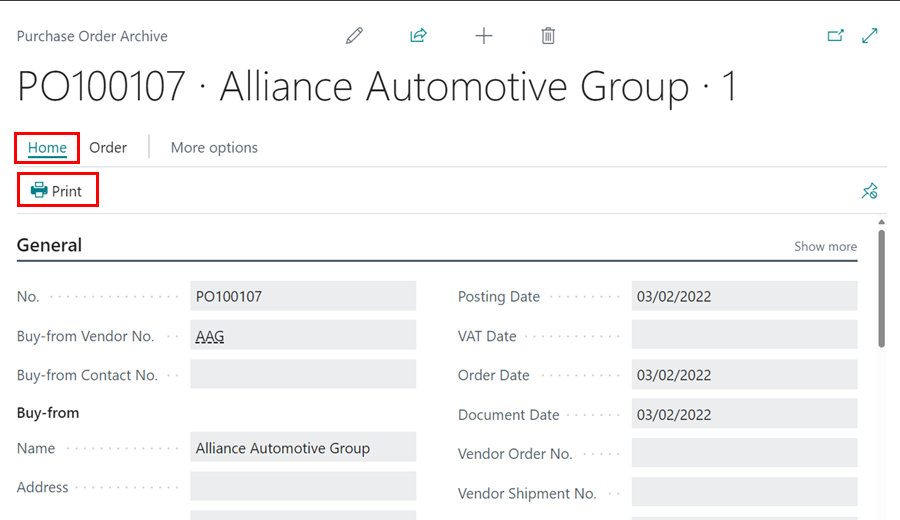

# Archived Documents 
You can archive purchase orders, estimates, jobsheets, checklists, and so on if you want to save a copy of a document for later use.

### Types of Archived Documents
1. Archived **Estimates** and **Vehicle Inspection Estimates**:
   - An **Estimate** or a **Vehicle Inspection Estimate** is archived when you delete it.
   - An archived estimate can be copied to another document using [**Copy Document**](garagehive-copydocument.html) function.
   - Using the **Restore** action from the archived document, you can restore the archived **Estimate** or **Vehicle Inspection Estimate**, where the original still exists and it's not posted.

      

2. Archived **Jobsheets** and **Return Jobsheets**:
   - A **Jobsheet** or **Return Jobsheet** can be archived by deleting it or by using the **Archive Document** action, and it can be archived multiple times, saving different **Archived Versions**.

      
      
   - An archived jobsheet can be copied to another document using [**Copy Document**](garagehive-copydocument.html) function.
   - Using the **Restore** action from the archived document, you can restore the archived **Jobsheet** or **Return Jobsheet**, where the original still exists and it's not posted.

3. Archived **Checklists**:
   - A **Checklist** can be archived by deleting it or by using the **Archive Document** action, and it can be archived multiple times, saving different **Archived Versions**.

      

   - You can print or email an archived checklist by selecting **Print** menu from the actions bar, followed by **Print Vehicle Inspection** or **Email** actions.

      

4. Archived **Purchase Orders**:
   - A **Purchases Order** can be archived by using the **Archive Document** action, and it can be archived multiple times, saving different **Archived Versions**.

      

   - You can print an archived purchase order by selecting **Related** from the actions bar, followed by **Version**, and then **Print**.

      

 

### **See Also**
[How to access posted and archived documents](https://www.youtube.com/watch?v=mFmimPCl9ns)

