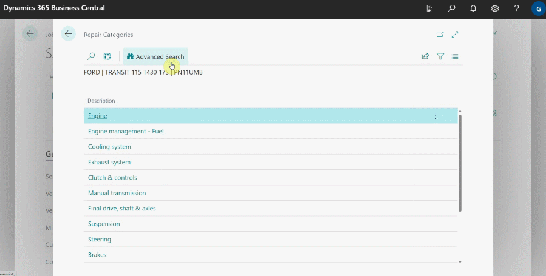

# Checking and Adding Repair Time in the Document

Repair times in Garage Hive are the number of hours estimated to repair parts of a vehicle based on the model and make of the vehicle. This aids in estimating and understanding the type of work required while repairing the vehicle. Here's how to get to the repair times:
1. Open the document (can be a Jobsheet, Estimate, or Vehicle Inspection Estimate) with the vehicle for which you want to check the repair times, and then click on **Lookup** and select **Repair Times** from the menu bar.

   

2. The window that opens displays a list of the vehicle's various mechanisms, from which you can select the mechanism that you are working on repairing. The information guides you step by step based on where the parts are located in the vehicle.

   

3. After selecting the exact parts and mechanism that you require, a description of the work involved as well as the time required to repair the part(s) is provided. You can now choose what to include in the **Include** column and select **Add Lines to Document** from the menu bar. Each labour description is added a **Group** with the respective document lines under it.

   

4. On the other hand, you can use the **Advanced Search** to look up a key word related to the repairs that need to be done. Select **Repair Times** from the **Lookup** menu. Select **Advanced Search** on the **Repair Categories** page and type the keyword, for example, pads, into the **Search** field.

   

### **See Also**

[Viewing and adding servicing intervals data](garagehive-autodata-viewing-and-adding-servicing-intervals.html){:target="_blank"} \
[Checking vehicle lubricant's data](garagehive-autodata-checking-vehicle-lubricant-data.html){:target="_blank"} \
[Checking vehicle engine oil data](garagehive-autodata-viewing-vehicle-engine-oil-data.html){:target="_blank"} \
[Checking and adding servicing intervals and repair times using engine code](garagehive-autodata-checking-servicing-intervals-and-adding-repair-times-using-engine-code.html){:target="_blank"} \
[How to use timing belt intervals](garagehive-timing-belt-intervals-how-to-use-timing-belt-intervals.html){:target="_blank"} \
[Autodata labour time adjustments](garagehive-autodata-labour-time-adjustment.html){:target="_blank"} \
[Autodata Seamless Integration](garagehive-autodata-seamless-integration.html){:target="_blank"} \
[Viewing the Tyre Pressure Monitoring System (TPMS) Test](garagehive-autodata-tpms.html){:target="_blank"} \
[Viewing the Service Indicator Reset Data](garagehive-autodata-service-indicators.html)
