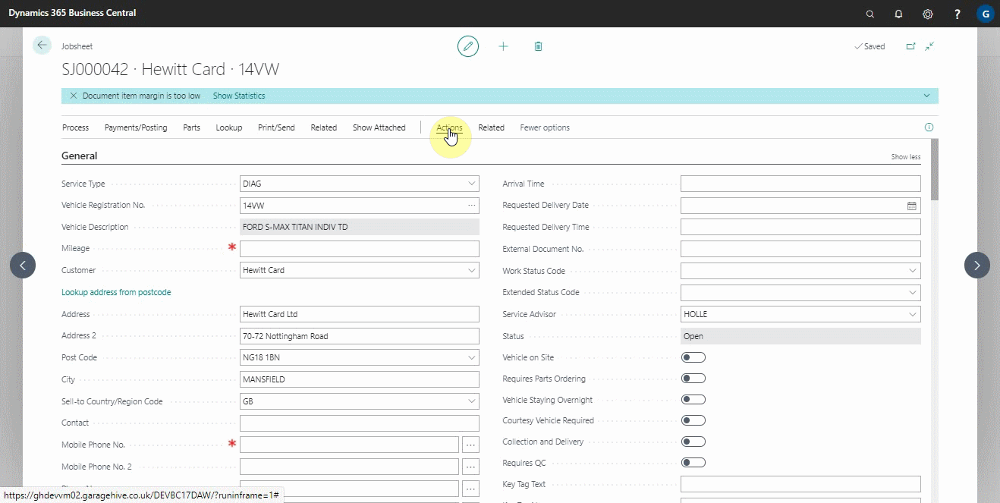
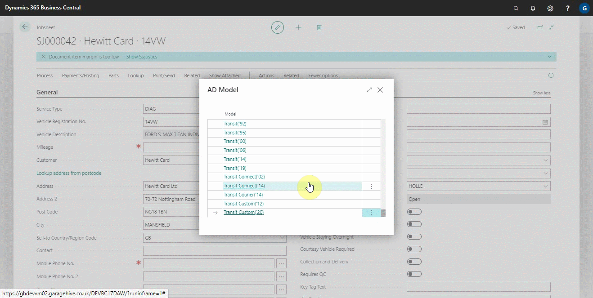

# Checking Servicing Intervals and Adding Repair Times Using Engine Code

If, on the other hand, you need to add specific servicing intervals and repair times in a jobsheet using the vehicle's engine code, you can check the details from the jobsheet using the engine code.

To check this, select **Actions** from the actions bar, then **Lookup** from the submenus, and then click on either **Service Schedules by Engine Code** for servicing intervals or **Repair Times by Engine Code** for repair times, depending on what you're looking for.

   

Choose the **Model** of the vehicle from the window that appears, followed by the **Engine Code** and the **Repair Categories** for repair times or **Maintenance** for service schedules. We'll use repair times in this case.

   

After selecting the **Repair Categories**, select the lines to include in the **Include** column, and then click the **Add Lines to Document** button in the actions bar.

   

### **See Also**

[Adding repair times](garagehive-autodata-adding-repair-times.html) \
[Checking vehicle lubricant's data](garagehive-autodata-checking-vehicle-lubricant-data.html) \
[Checking vehicle engine oil data](garagehive-autodata-viewing-vehicle-engine-oil-data.html) \
[Viewing and adding servicing intervals data](garagehive-autodata-viewing-and-adding-servicing-intervals.html)
[How to use timing belt intervals](garagehive-timing-belt-intervals-how-to-use-timing-belt-intervals.html)