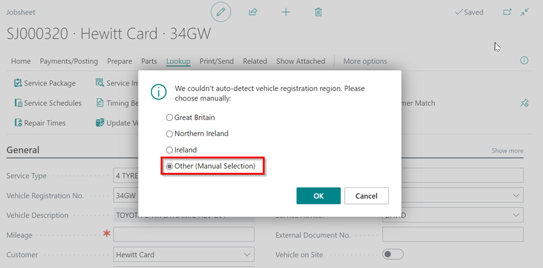
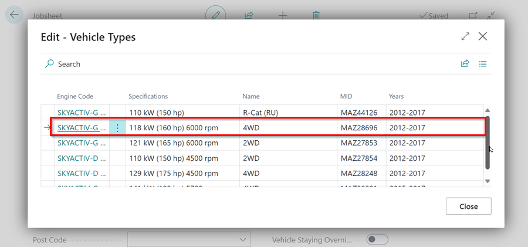

# Searching for Vehicle, Checking Servicing Intervals and Adding Repair Times Using Engine Code

If you need to search for a vehicle, add specific servicing intervals or repair times in a document (Jobsheet, Estimate and VI Estimate) using the vehicle's engine code, here are the instructions to follow.

## In this article
1. [Search Vehicle by Engine Code](#search-vehicle-by-engine-code)
2. [Add Servicing Intervals by Engine Code](#add-servicing-intervals-by-engine-code)
3. [Add Repair Times by Engine Code](#add-repair-times-by-engine-code)
4. [Manual Selection of the Vehicle](#manual-selection-of-the-vehicle)

### Search Vehicle by Engine Code
To search a vehicle using by Engine Code: 
1. Select **Actions** from the menu bar(if not visible click on **More Options**), then **Lookup** from the submenus, and then click on **Search Vehicle By Engine Code (Autodata)**.

   

2. Enter the Engine Code in the pop-up window that appears.

   

3. Select the vehicle and click **OK**.

   

[Go back to top](#top)

### Add Servicing Intervals by Engine Code
To add Servicing Intervals using the Engine Code: 
1. Select **Actions** from the menu bar(if not visible click on **More Options**), then **Lookup** from the submenus, and then click on **Search Vehicle By Engine Code (Autodata)**.

   

2. When the pop-up window opens, confirm the vehicle details by clicking **Yes**. If the details don't match, click **No** and select the correct vehicle.

   

3. In the next pop-up windows, select what matches the vehicle.

   

4. Select the lines to include in the **Include** column, and then click the **Add Lines to Document** button in the menu bar.

   

[Go back to top](#top)

### Add Repair Times by Engine Code
To add Repair Times using the Engine Code: 
1. Select **Actions** from the menu bar(if not visible click on **More Options**), then **Lookup** from the submenus, and then click on **Search Vehicle By Engine Code (Autodata)**.

   

2. When the pop-up window opens, confirm the vehicle details by clicking **Yes**. If the details don't match, click **No** and select the correct vehicle.

   

3. In the next pop-up windows, select what matches the vehicle and the Repair Times for the vehicle.

   

4. After selecting the **Repair Categories**, select the lines to include in the **Include** column, and then click the **Add Lines to Document** button in the menu bar.

   

[Go back to top](#top)

### Manual Selection of the Vehicle
Manual selection can be used to get data from Autodata for any vehicle and is not specific to any market. To view and add the data using manual selection:
1. If the vehicle registration is not automatically detected, a pop-up window will appear. Select **Other** and then click **OK** to choose the vehicle make and model from Autodata.

   

2. In the window that opens, search for the **Model** of the vehicle and click on the **Description** to select it.

   

3. After that, you should select the **Vehicle Type** based on the **Engine Code** of the vehicle in the next window that opens.

   

4. Then, select the appropriate option for the vehicle.

   

5. Finally, follow the steps from step number 3 in the [auto selection part](#auto-selection-of-service-intervals-data-from-autodata) to complete the process.

[Go back to top](#top)

### **See Also**

[Adding repair times](garagehive-autodata-adding-repair-times.html){:target="_blank"} \
[Checking vehicle lubricant's data](garagehive-autodata-checking-vehicle-lubricant-data.html){:target="_blank"} \
[Checking vehicle engine oil data](garagehive-autodata-viewing-vehicle-engine-oil-data.html){:target="_blank"} \
[Viewing and adding servicing intervals data](garagehive-autodata-viewing-and-adding-servicing-intervals.html){:target="_blank"} \
[How to use timing belt intervals](garagehive-timing-belt-intervals-how-to-use-timing-belt-intervals.html){:target="_blank"} \
[Autodata labour time adjustments](garagehive-autodata-labour-time-adjustment.html){:target="_blank"} \
[Autodata Seamless Integration](garagehive-autodata-seamless-integration.html){:target="_blank"} \
[Viewing the Tyre Pressure Monitoring System (TPMS) Test](garagehive-autodata-tpms.html){:target="_blank"} \
[Viewing the Service Indicator Reset Data](garagehive-autodata-service-indicators.html)
