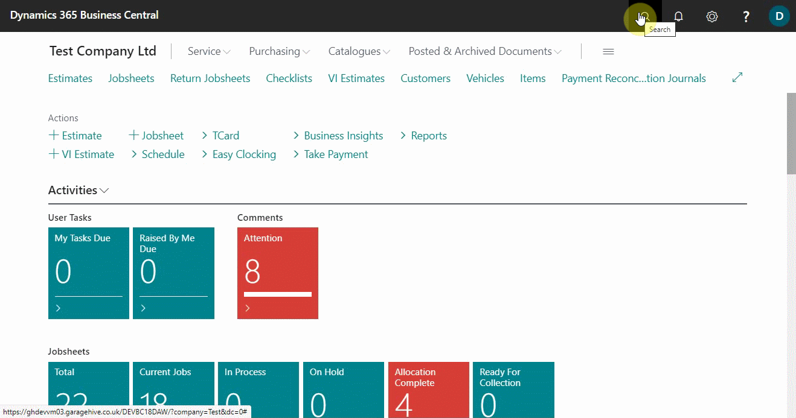
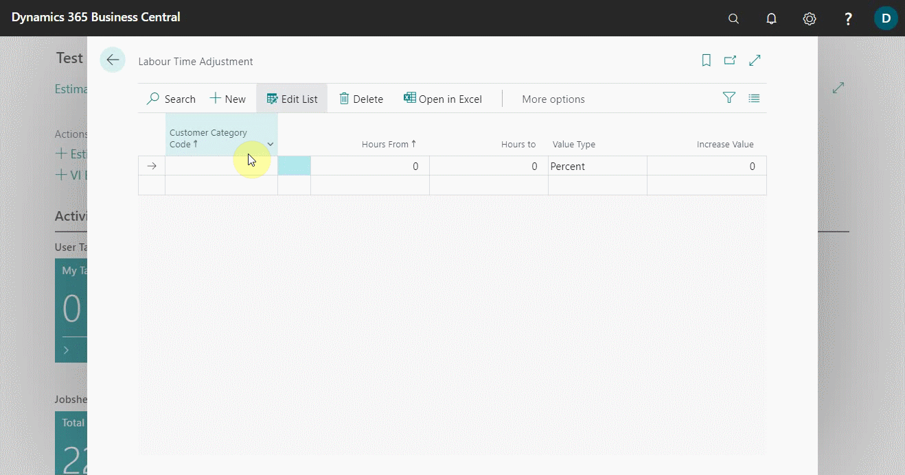
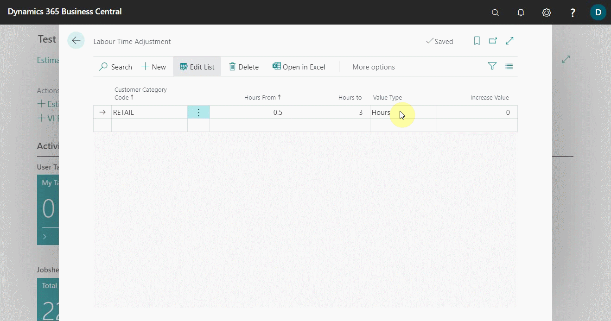
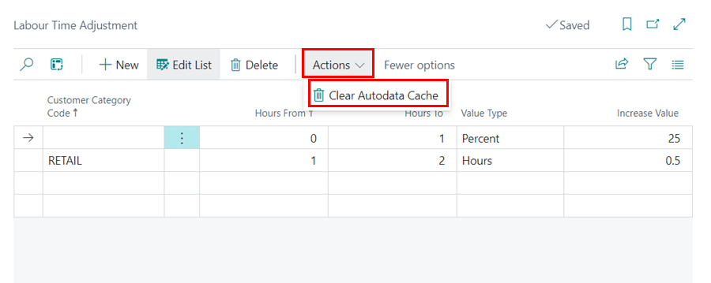

# Autodata Labour Time Adjustment

Autodata Labour Time Adjustment is a feature that ensures that the actual time it takes to complete a job is captured when labour times are pulled from Autodata. The goal is to ensure that the garage does not undercharge for labour hours. Here's how you can change the time:
1. In the top-right corner, choose the search icon, enter **Labour Time Adjustment**, and select the related link.

   

2. Select the group of customers in the **Customer Category Code** field to adjust the labour times when the data is pulled from autodata. If you want to introduce the adjustment to all customers, leave this field blank.
3. In the **Hours From** and **Hours To** fields, you define the range of job hours to which the time adjustment should apply. For example, you could specify that jobs with hours ranging from **0.5** to **3** should receive a 30% increase, and so on. To apply to all jobs with any hours, enter a **Zero** in these fields.

   

4. Set the **Value Type** field to be either **Percent** to increase the labour time by a specific percentage, or **Hours** to increase the labour time by a certain number of hours.
5. Then, in the **Increase Value** field, enter the value of the **Percentage** or **Hours**.

   



 

### **See Also**

[Viewing and adding servicing intervals data](garagehive-autodata-viewing-and-adding-servicing-intervals.html) \
[Adding repair times](garagehive-autodata-adding-repair-times.html) \
[Checking vehicle lubricant's data](garagehive-autodata-checking-vehicle-lubricant-data.html) \
[Checking vehicle engine oil data](garagehive-autodata-viewing-vehicle-engine-oil-data.html) \
[Checking and adding servicing intervals and repair times using engine code](garagehive-autodata-checking-servicing-intervals-and-adding-repair-times-using-engine-code.html) \
[How to use timing belt intervals](garagehive-timing-belt-intervals-how-to-use-timing-belt-intervals.html)
