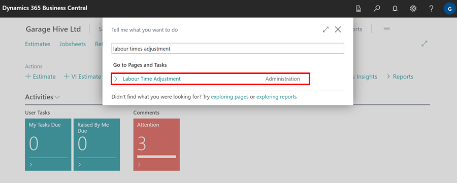
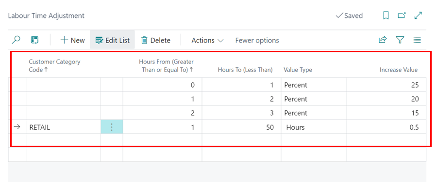
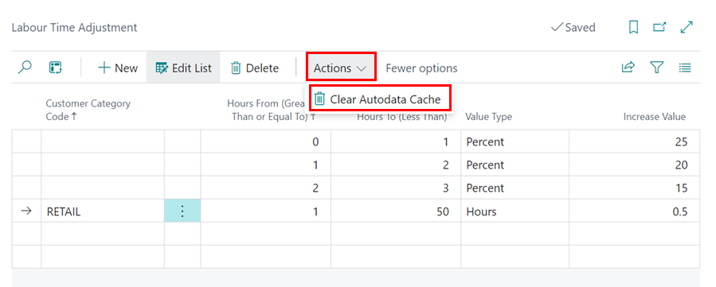

# Autodata Labour Time Adjustment

**Autodata Labour Time Adjustment** is a feature designed to ensure that the actual time spent on a job is accurately reflected when pulling labour times from Autodata. This helps prevent undercharging for labour hours in the garage. Here’s how you can adjust the labour time:
1. In the top-right corner, choose the  icon, enter **Labour Time Adjustment**, and select the related link.

   

2. In the **Customer Category Code** field, choose the customer group for which you want to adjust labour times when pulling data from Autodata. If you want the adjustment to apply to all customers, leave this field blank.
3. Use the **Hours From (Greater Than or Equal To)** and **Hours To (Less Than)** fields to define the range of job hours that should receive the time adjustment. For example, if you want jobs taking between **0** and **1** hours to have a **25%** increase, specify this range. This means any job lasting from **0** to **0.999** hours will be increased by **25%**. 
4. To apply the adjustment to all jobs, regardless of hours, enter 0 in these fields.
5. In the **Value Type** field, select either **Percent** to increase labour time by a percentage, or Hours to increase it by a specific number of hours.
6. Enter the desired **Percentage** or **Hours** in the **Increase Value** field.

   

7. Some Autodata repair times might be cached in the system. To ensure your changes take effect immediately, consider clearing the Autodata cache. To do this, go to the **Labour Time Adjustment** page, click on **More Options**, select **Actions**, and then choose **Clear Autodata Cache**.

   

[Go back to top](#top)

 

### **See Also**

[Viewing and adding servicing intervals data](garagehive-autodata-viewing-and-adding-servicing-intervals.html){:target="_blank"} \
[Adding repair times](garagehive-autodata-adding-repair-times.html){:target="_blank"} \
[Checking vehicle lubricant's data](garagehive-autodata-checking-vehicle-lubricant-data.html){:target="_blank"} \
[Checking vehicle engine oil data](garagehive-autodata-viewing-vehicle-engine-oil-data.html){:target="_blank"} \
[Checking and adding servicing intervals and repair times using engine code](garagehive-autodata-checking-servicing-intervals-and-adding-repair-times-using-engine-code.html){:target="_blank"} \
[How to use timing belt intervals](garagehive-timing-belt-intervals-how-to-use-timing-belt-intervals.html){:target="_blank"} \
[Autodata Seamless Integration](garagehive-autodata-seamless-integration.html){:target="_blank"} \
[Viewing the Tyre Pressure Monitoring System (TPMS) Test](garagehive-autodata-tpms.html){:target="_blank"} \
[Viewing the Service Indicator Reset Data](garagehive-autodata-service-indicators.html)
