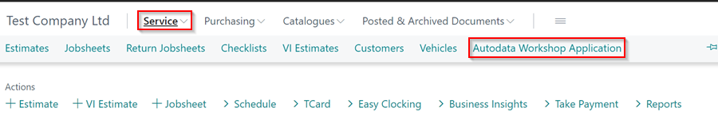
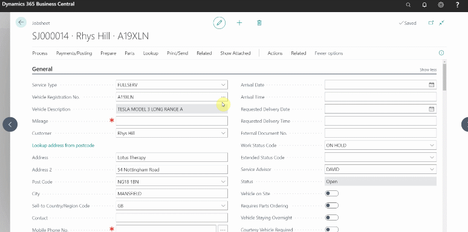
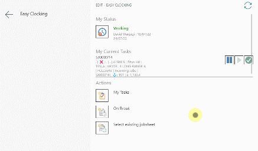
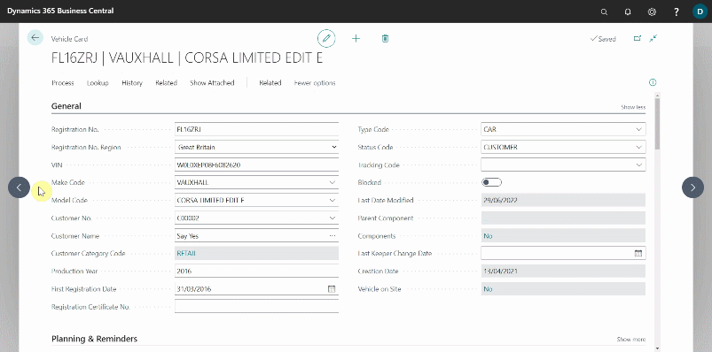

# Autodata Seamless Integration in Garage Hive

**Autodata Seamless Integration**, which can be accessed from the Role Centre or via the Jobsheets, Estimates, and Vehicle Inspection Estimates, is a feature in Garage Hive that allows the user to directly access technical information for the vehicle from the **Autodata Website**, such as vehicle service, repair, and diagnostics. Here's how to access it:

1. From the Role Centre, select **Service** from the navigation menu followed by **Autodata Workshop Application**.

   

2. To access it from the document that you are working in as the **Service Advisor**, which may be an **Estimate**, **Jobsheet** or **Vehicle Inspection Estimate**, select **Lookup** from the menu bar, and then **Autodata Workshop Application**. This launches a new browser tab, and filters the vehicle details for the vehicle in the document that you are viewing.
3. You can now access all the vehicle's technical information on the **Autodata Website.**

   

4. If you are logged in as a **Technician**, you need to **Open Jobsheet** you are working on and select **Lookup** from the ellipsis (...) menu, followed by **Autodata Workshop Application**. This takes you to the **Autodata Website.**

   

5. When working from the **Vehicle** card, select **Lookup** from the menu bar, followed by **Autodata Workshop Application**.

   

[Go back to top](#top)

 

### **See Also**

[Viewing and adding servicing intervals data](garagehive-autodata-viewing-and-adding-servicing-intervals.html){:target="_blank"} \
[Adding repair times](garagehive-autodata-adding-repair-times.html){:target="_blank"} \
[Checking vehicle lubricant's data](garagehive-autodata-checking-vehicle-lubricant-data.html){:target="_blank"} \
[Autodata labour time adjustments](garagehive-autodata-labour-time-adjustment.html){:target="_blank"} \
[Checking vehicle engine oil data](garagehive-autodata-viewing-vehicle-engine-oil-data.html){:target="_blank"} \
[Checking and adding servicing intervals and repair times using engine code](garagehive-autodata-checking-servicing-intervals-and-adding-repair-times-using-engine-code.html){:target="_blank"} \
[How to use timing belt intervals](garagehive-timing-belt-intervals-how-to-use-timing-belt-intervals.html){:target="_blank"} \
[Viewing the Tyre Pressure Monitoring System (TPMS) Test](garagehive-autodata-tpms.html){:target="_blank"} \
[Viewing the Service Indicator Reset Data](garagehive-autodata-service-indicators.html)

