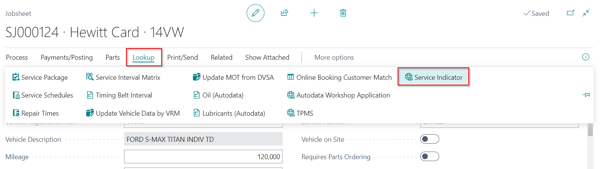
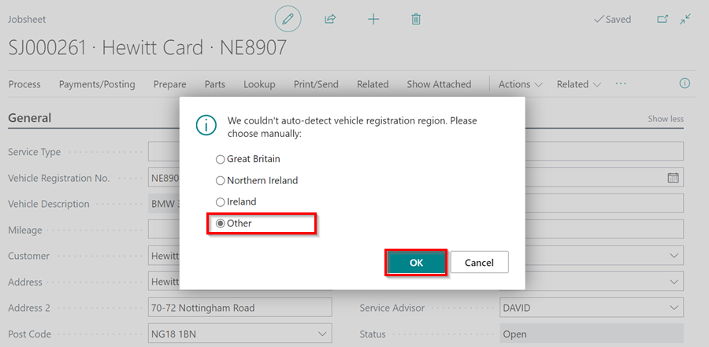
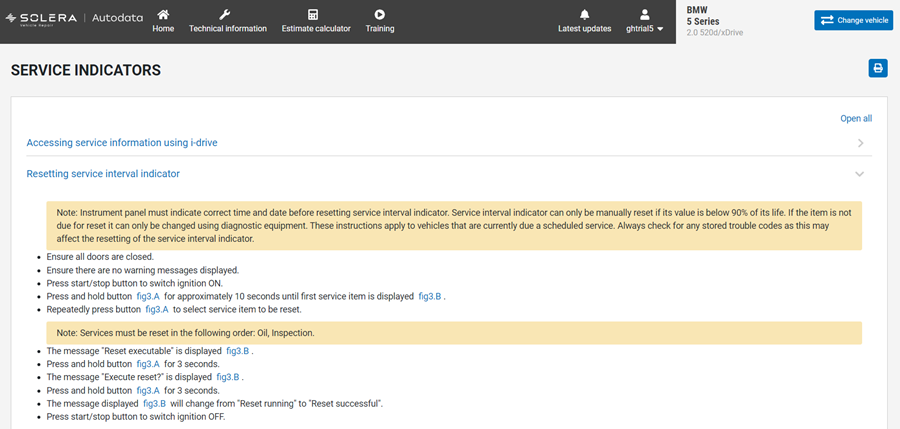

## Viewing the Service Indicator Reset Data
The **Service Indicator** exists to let the motorist know when the vehicle need general maintenance, after which they have to be reset to normal. The Autodata integration in Garage Hive allows you to view the **Service Indicators** reset data directly from a document, such as a Jobsheet or Checklist.
1. To view the **Service Indicators** reset data from a document, go to the menu bar and select **Lookup**, then **Service Indicators**.

   

2. If the vehicle registration is not auto-detected, select **Other**, and click **OK** to choose the **Make** and **Model** of the vehicle from Autodata.

   

3. The **Service Indicators** reset data page in the **Autodata Workshop Application** for the vehicle specified in the document, is opened.

   
   

[Go back to top](#top)

### **See Also**

[Viewing and adding servicing intervals data](garagehive-autodata-viewing-and-adding-servicing-intervals.html){:target="_blank"} \
[Checking vehicle lubricant's data](garagehive-autodata-checking-vehicle-lubricant-data.html){:target="_blank"} \
[Checking vehicle engine oil data](garagehive-autodata-viewing-vehicle-engine-oil-data.html){:target="_blank"} \
[Adding Repair Times in the Document](garagehive-autodata-adding-repair-times.html){:target="_blank"} \
[Checking and adding servicing intervals and repair times using engine code](garagehive-autodata-checking-servicing-intervals-and-adding-repair-times-using-engine-code.html){:target="_blank"} \
[How to use timing belt intervals](garagehive-timing-belt-intervals-how-to-use-timing-belt-intervals.html){:target="_blank"} \
[Autodata labour time adjustments](garagehive-autodata-labour-time-adjustment.html){:target="_blank"} \
[Autodata Seamless Integration](garagehive-autodata-seamless-integration.html){:target="_blank"} \
[Viewing the Tyre Pressure Monitoring System (TPMS) Test](garagehive-autodata-tpms.html){:target="_blank"}
