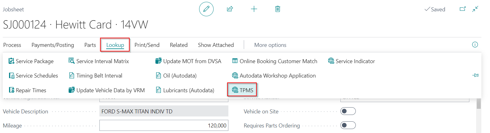
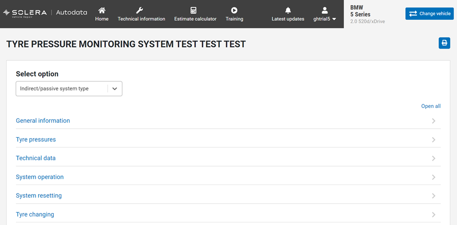

## Viewing the Tyre Pressure Monitoring System (TPMS) Test
The purpose of a **Tyre Pressure Monitoring System (TPMS)** is to warn the motorist if one or more tyres are significantly under-inflated, potentially resulting in unsafe driving conditions. The Autodata integration in Garage Hive allows you to view the TPMS test directly from a document, such as a Jobsheet or Checklist.
1. To view the **TPMS** test from a document, go to the menu bar and select **Lookup**, then **TPMS**.

   

2. This opens the **TPMS** test page in the **Autodata Workshop Application** for the vehicle specified in the document.

   
   

### **See Also**

[Viewing and adding servicing intervals data](garagehive-autodata-viewing-and-adding-servicing-intervals.html){:target="_blank"} \
[Checking vehicle lubricant's data](garagehive-autodata-checking-vehicle-lubricant-data.html){:target="_blank"} \
[Checking vehicle engine oil data](garagehive-autodata-viewing-vehicle-engine-oil-data.html){:target="_blank"} \
[Adding Repair Times in the Document](garagehive-autodata-adding-repair-times.html){:target="_blank"} \
[Checking and adding servicing intervals and repair times using engine code](garagehive-autodata-checking-servicing-intervals-and-adding-repair-times-using-engine-code.html){:target="_blank"} \
[How to use timing belt intervals](garagehive-timing-belt-intervals-how-to-use-timing-belt-intervals.html){:target="_blank"} \
[Autodata labour time adjustments](garagehive-autodata-labour-time-adjustment.html){:target="_blank"} \
[Autodata Seamless Integration](garagehive-autodata-seamless-integration.html){:target="_blank"} \
[Viewing the Service Indicator Reset Data](garagehive-autodata-service-indicators.html)
