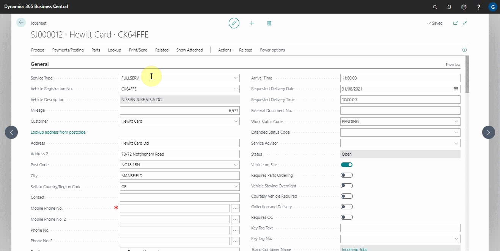
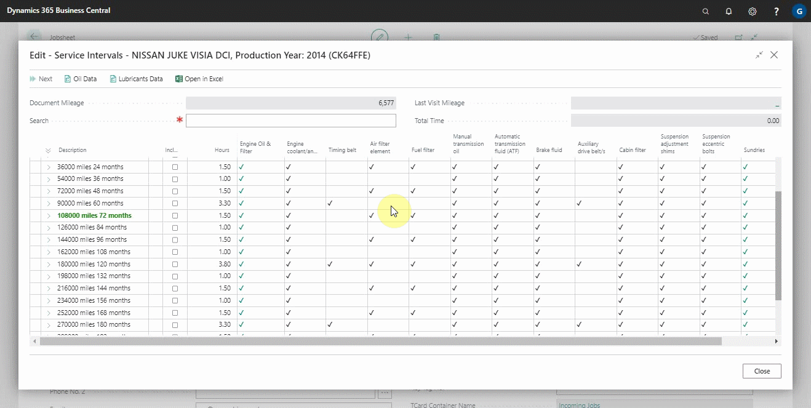
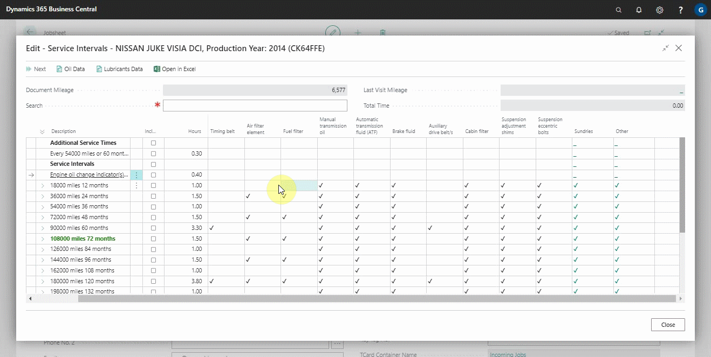
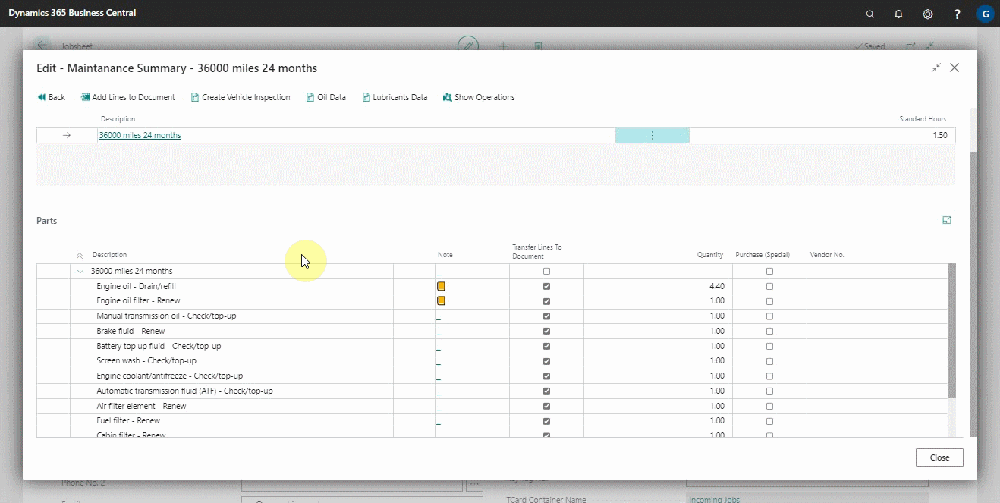
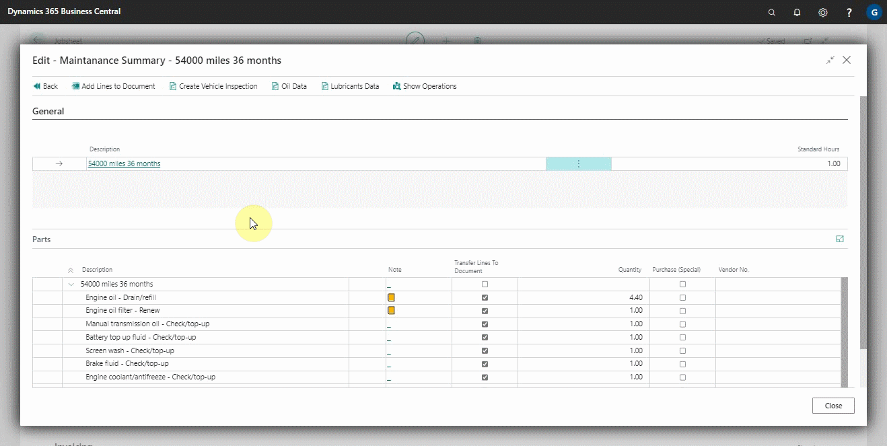

# Viewing and Adding Servicing Intervals Data

Servicing intervals are the number of months or miles between services for the vehicle, whichever comes first. The autodata integration provides most of the data required for vehicle servicing. To view and add the data:
1. Open the jobsheet for the vehicle for which you want to check the servicing intervals, and then click on **Lookup** and select **Service Interval Matrix** from the actions bar.

   

2. The servicing intervals are displayed in a grid format in the window that opens, with the miles and months on the left and the items to be changed at the top. The tick at the intersection of the items to be changed column and the miles and months intervals row indicates what needs to be changed at what interval.

   

3. From here, you could select what needs to be changed to add it to the document by clicking on the column **Include** along the interval that the vehicle is at, and then clicking **Next** from the actions bar.

   

4. In the next window, by clicking on the **Transfer Lines to Document** checkbox, you can remove some lines to add to the document (if you don't want to change everything indicated). Then, to add the lines to the document, click **Add Lines to Document**. The lines are added and put in a group under the heading of the **Interval Change**.

   

5. Another option is to create a vehicle inspection by clicking on **Create Vehicle Inspection** from the actions bar. This initiates the process of confirming everything and creating a quotation for the customer.

   

### **See Also**

[Adding repair times](garagehive-autodata-adding-repair-times.html) \
[Checking vehicle lubricant's data](garagehive-autodata-checking-vehicle-lubricant-data.html) \
[Checking vehicle engine oil data](garagehive-autodata-viewing-vehicle-engine-oil-data.html) \
[Checking and adding servicing intervals and repair times using engine code](garagehive-autodata-checking-servicing-intervals-and-adding-repair-times-using-engine-code.html) \
[How to use timing belt intervals](garagehive-timing-belt-intervals-how-to-use-timing-belt-intervals.html) \
[Autodata labour time adjustments](garagehive-autodata-labour-time-adjustment.html) \
[Autodata Seamless Integration](garagehive-autodata-seamless-integration.html)
