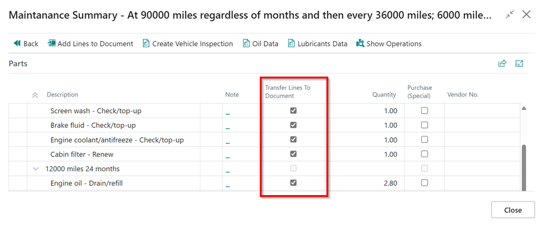
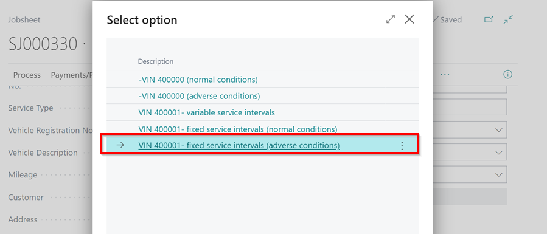

# Viewing and Adding Servicing Intervals Data

Servicing intervals are the recommended number of months or miles between vehicle services, whichever comes first. Autodata integration provides necessary data for vehicle servicing.

## In this article
1. [Auto Selection of the Vehicle](#auto-selection-of-the-vehicle)
2. [Manual Selection of the Vehicle](#manual-selection-of-the-vehicle)

### Auto Selection of the Vehicle
Auto selection from Autodata, is available for the Great Britain, Northern Ireland and Ireland Markets. To view and add the data:
1. Open the document (can be a Jobsheet, Estimate, or Vehicle Inspection Estimate) for the vehicle and click on **Lookup** followed by **Service Interval Matrix** in the menu bar.

   

2. When the pop-up window opens, confirm the vehicle details by clicking **Yes**. If the details don't match, click **No** and select the correct vehicle.

   

3. The service intervals are presented in a grid format with miles and months on the left and items to be changed at the top. A tick at the intersection indicates what needs to be changed and when it needs to be changed.
4. Click the tick box in the **Include** column to select the items that need to be added to the document. Then, click **Next** from the menu bar.

   

5. In the next window, you can deselect the **Transfer Lines to Document** checkbox to exclude some lines from the transfer (if you don't want to include everything).
6. The **Create Vehicle Inspection** option is available only when accessed through a Jobsheet; it is not available when working from an estimate.

   

7. Click **Add Lines to Document** in the menu bar to add lines to the document. The lines will be grouped under the **Interval Change** heading.

   

8. Another option is to create a vehicle inspection by clicking on **Create Vehicle Inspection** from the menu bar. This initiates the process of confirming everything and creating a quotation for the customer.

   

[Go back to top](#top)

### Manual Selection of the Vehicle
Manual selection can be used to get data from Autodata for any vehicle and is not specific to any market. To view and add the data using manual selection:
1. If the vehicle registration is not automatically detected, a pop-up window will appear. Select **Other** and then click **OK** to choose the vehicle make and model from Autodata.

   

2. In the window that opens, search for the **Model** of the vehicle and click on the **Description** to select it.

   

3. After that, you should select the **Vehicle Type** based on the **Engine Code** of the vehicle in the next window that opens.

   

4. Then, select the appropriate option for the vehicle.

   

5. Finally, follow the steps from step number 3 in the [auto selection part](#auto-selection-of-service-intervals-data-from-autodata) to complete the process.

[Go back to top](#top)

### **See Also**

[Adding repair times](garagehive-autodata-adding-repair-times.html){:target="_blank"} \
[Checking vehicle lubricant's data](garagehive-autodata-checking-vehicle-lubricant-data.html){:target="_blank"} \
[Checking vehicle engine oil data](garagehive-autodata-viewing-vehicle-engine-oil-data.html){:target="_blank"} \
[Checking and adding servicing intervals and repair times using engine code](garagehive-autodata-checking-servicing-intervals-and-adding-repair-times-using-engine-code.html){:target="_blank"} \
[How to use timing belt intervals](garagehive-timing-belt-intervals-how-to-use-timing-belt-intervals.html){:target="_blank"} \
[Autodata labour time adjustments](garagehive-autodata-labour-time-adjustment.html){:target="_blank"} \
[Autodata Seamless Integration](garagehive-autodata-seamless-integration.html){:target="_blank"} \
[Viewing the Tyre Pressure Monitoring System (TPMS) Test](garagehive-autodata-tpms.html){:target="_blank"}
