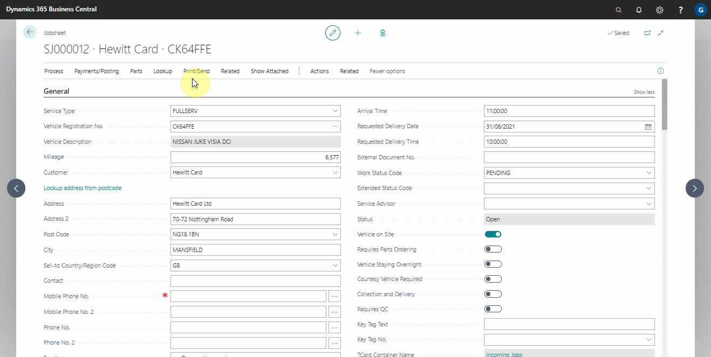

# Viewing Vehicle Engine Oil's Data

In this action, the autodata provides the engine oil data that is required before refilling or changing the oil.

Select **Lookup** and then **Oil(Autodata)** from the actions bar to access the engine oil data.

### **See Also**

[Viewing and adding servicing intervals data](garagehive-autodata-viewing-and-adding-servicing-intervals.html) \
[Checking vehicle lubricant's data](garagehive-autodata-checking-vehicle-lubricant-data.html) \
[Adding repair times](garagehive-autodata-adding-repair-times.html) \
[Checking and adding servicing intervals and repair times using engine code](garagehive-autodata-checking-servicing-intervals-and-adding-repair-times-using-engine-code.html) \
[How to use timing belt intervals](garagehive-timing-belt-intervals-how-to-use-timing-belt-intervals.html) \
[Autodata labour time adjustments](garagehive-autodata-labour-time-adjustment.html)
