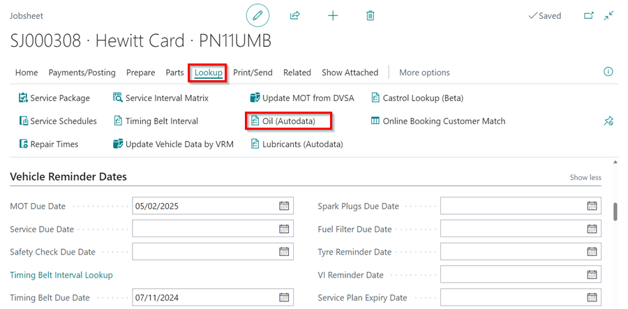

## In this article
1. [Auto Selection of Vehicle Engine Oil Data From Autodata](#auto-selection-of-vehicle-engine-oil-data-from-autodata)
2. [Manual Selection of Vehicle Engine Oil Data From Autodata](#manual-selection-of-vehicle-engine-oil-data-from-autodata)

### Auto Selection of Vehicle Engine Oil Data From Autodata
In this action, the autodata provides the engine oil data that is required before refilling or changing the oil.

1. Select **Lookup** and then **Oil(Autodata)** from the menu bar.

   

2. When the pop-up window opens, confirm the vehicle details by clicking **Yes**. If the details don't match, click **No** and select the correct vehicle.

   

3. The lubricants and Capacities data will be displayed.

   

[Go back to top](#top)

### Manual Selection of Vehicle Engine Oil Data From Autodata
Manual selection can be used to get data from Autodata for any vehicle and is not specific to any market. To view and add the data using manual selection:
1. If the vehicle registration is not automatically detected, a pop-up window will appear. Select **Other** and then click **OK** to choose the vehicle make and model from Autodata.

   

2. In the window that opens, search for the **Model** of the vehicle and click on the **Description** to select it.

   

3. After that, you should select the **Vehicle Type** based on the **Engine Code** of the vehicle in the next window that opens.

   

4. Then, select the appropriate option depending on the **VIN** of the vehicle.

   

[Go back to top](#top)

### **See Also**

[Viewing and adding servicing intervals data](garagehive-autodata-viewing-and-adding-servicing-intervals.html){:target="_blank"} \
[Checking vehicle lubricant's data](garagehive-autodata-checking-vehicle-lubricant-data.html){:target="_blank"} \
[Adding repair times](garagehive-autodata-adding-repair-times.html){:target="_blank"} \
[Checking and adding servicing intervals and repair times using engine code](garagehive-autodata-checking-servicing-intervals-and-adding-repair-times-using-engine-code.html){:target="_blank"} \
[How to use timing belt intervals](garagehive-timing-belt-intervals-how-to-use-timing-belt-intervals.html){:target="_blank"} \
[Autodata labour time adjustments](garagehive-autodata-labour-time-adjustment.html){:target="_blank"} \
[Autodata Seamless Integration](garagehive-autodata-seamless-integration.html){:target="_blank"} \
[Viewing the Tyre Pressure Monitoring System (TPMS) Test](garagehive-autodata-tpms.html){:target="_blank"}
