

# Automatic Price, Markup, and Discount Calculations 

When you need to use a specific price, markup, or discount for a particular product, Garage Hive provides the possibility to do so, and even set specific filters, such as location, vehicle make, and vehicle age. These prices, markups, and discounts supersede the standard prices available in an item or labour card.
There are three statuses available for managing your setup:
   - **Draft:** Use this status when editing and refining your pricing lines.
   - **Active:** Select this when you're ready to implement the prices.
   - **Inactive:** Use this to disable and archive any outdated pricing lines.

     

## In this article
1. [Automatic Sales Prices Calculations](#automatic-sales-prices-calculations)
2. [Automatic Sales Markups Calculations](#automatic-sales-markups-calculations)
3. [Automatic Sales Discounts Calculations](#automatic-sales-discounts-calculations)

### Automatic Sales Prices Calculations
To specify sales price for specific product(s):
1. In the top-right corner, choose the  icon, enter **Sales Prices V16**, and choose the related link. V16 is an abbreviation for Version 16, which was the version when this feature was released.

   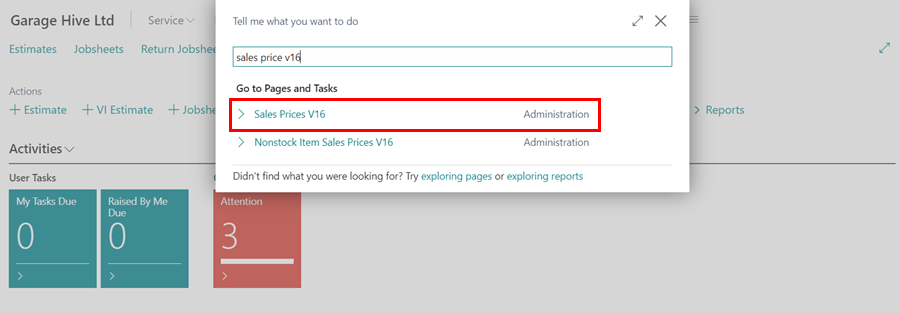

1. Choose **Draft** status when editing the lines.
1. On the lines, specify the **Applies-to Type**, and **Applies-to No.** which defines who the price should apply to.
1. Then add the **Product Type**, and the **Product No.** which determines what product the price should apply to. 
1. In this case, we'll set the **Applies-to Type** as **All Customers** (no need to add **Applies-to No.** as all customers customers are covered), **Product Type** as **Labour**, and the **Product No.** as **LAB- Standard Labour Rate**.
1. There are several filters that you can use, to be more specific when applying the prices. You can specify the **Location Code**, **Make Code** or **Primary Make Code** for the price.

   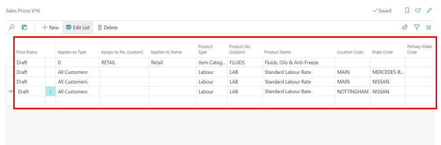

1. You can also use the **Minimum Vehicle Age** and **Maximum Vehicle Age** to filter on how to apply the price according to the age of the vehicle. The vehicle age is calculated from the **Vehicle First Registration Date** field in the **Vehicle** card.
1. Add the **Starting Date** and **Ending Date** for the price, which means the price will only be valid for the specified period (this is optional).
1. Enter the **Unit of Measure Code** (if you use **Product Type** as **Item** or **Resource**) for the **Product No.** you selected (where applicable), followed by the **Minimum Quantity** to apply the price and the **Unit Price** to use.
1. You can also specify other fields such as **Allow Line Disc.**, which means that this price can be used with the discount in the document lines, **Price Includes VAT**, which means that the price includes VAT.

   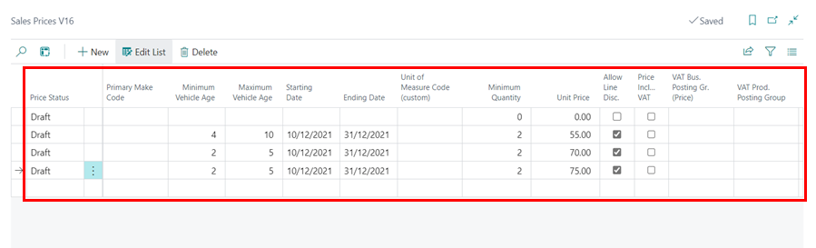

1. When done editing, make the status to be **Active** from the first column.

   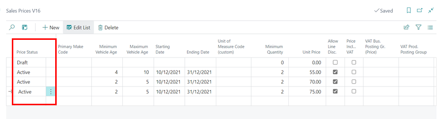

1. The prices set up will now be active for use.

[Go back to top](#top)

### Automatic Sales Markups Calculations
To specify sales markup for specific product(s):
1. In the top-right corner, choose the  icon, enter **Sales Markups V16**, and choose the related link.

   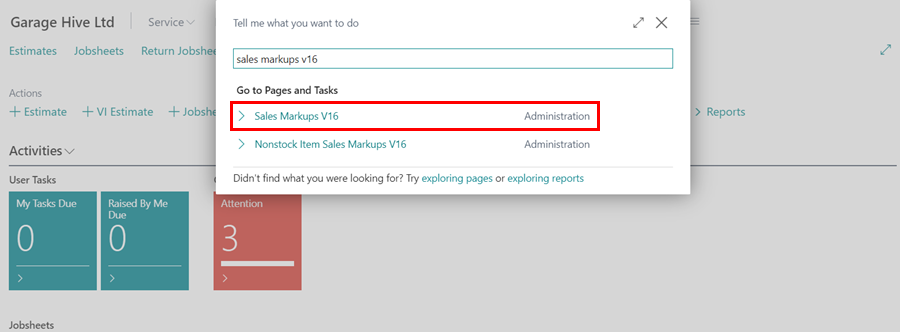

1. Choose **Draft** status when editing the lines. 
1. On the lines, specify the **Applies-to Type**, and **Applies-to No.** which defines who the markup should apply to.
1. Next, specify the **Product Type** and **Product No.** to define which product the markup will apply to.
   * For this example, set the **Applies-to Type** to **All Customers**, **Product Type** to **Item Category**, and **Product No.** to **Filters - Filtration**.
1. To refine the markup application, you can use additional filters such as **Location Code**, **Make Code**, or **Primary Make** Code.

   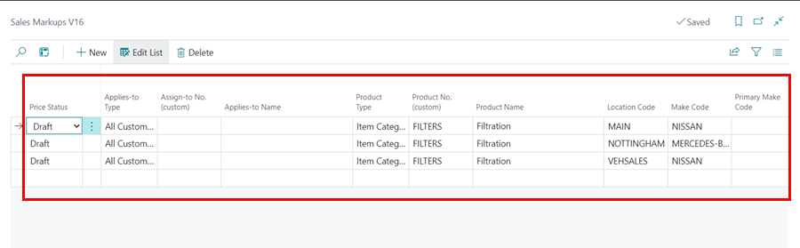

1. You can also use the **Minimum Vehicle Age** and **Maximum Vehicle Age** to filter on how to apply the price according to the age of the vehicle. The vehicle age is calculated from the **Vehicle First Registration Date** field in the **Vehicle** card.
1. Add the **Starting Date** and **Ending Date** for the markup, which means the markup will only be valid for the specified period (this is optional).

   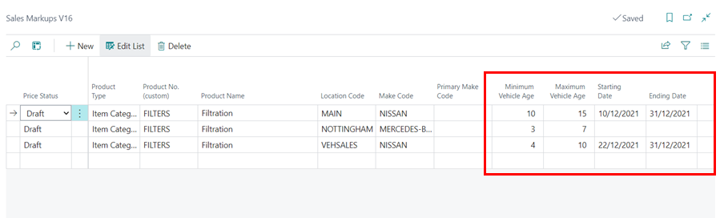

1. You can also specify **Minimum Quantity**, **Minimum Unit Cost**, and **Maximum Unit Cost** to control when the markup applies. For example, if the first tier is 1 to 10 with a 20% markup, the next tier should start at 10.01 to 20 with a 15% markup, rather than 1 to 10 at 20% and 11 to 20 at 15%.
1. Choose the **Markup Type** (either **Amount** or **Percent**) and set the **Markup Base** to either **Unit Cost** (based on related purchase item ledger entries or the Item card) or Unit Cost in Document (based on the document line).
1. Specify the **Markup Value** depending on the **Markup Type** you used. In this case, we'll use a **30% markup value for unit cost**.
1. You can also adjust settings like **Minimum Markup Amount** (to ensure the markup doesn’t fall below a certain value) and **Allow Line Discount** (to allow a discount on the line after applying the markup).
1. If you want the **Prices including VAT** to be rounded to the nearest whole number, enable the **Round Up Prices Incl. VAT** option.

   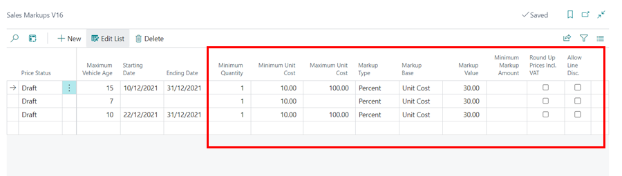

1. Finally, change the status in the first column to **Active** to activate the markup.

   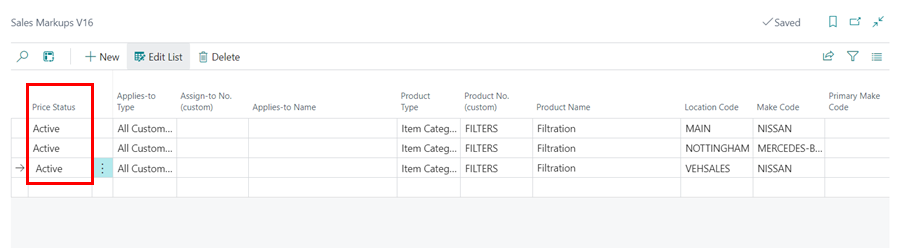

1. The sales markups are now active and will be applied according to the settings you've set.

[Go back to top](#top)

### Automatic sales discounts calculations
To specify sales markup for specific item(s) or labour(s):
1. In the top-right corner, choose the  icon, enter **Sales Discounts V16**, and choose the related link.

   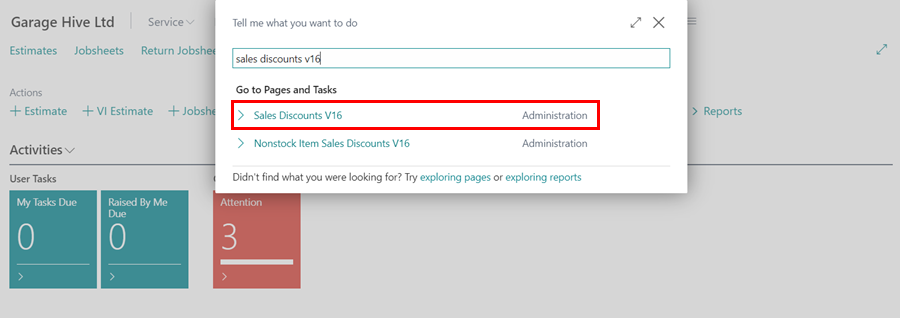

1. Choose **Draft** status when editing the lines. 
1. On the lines, specify the **Applies-to Type**, and **Applies-to No.** which defines who the discounts should apply to.
1. Then add the **Product Type**, and the **Product No.** which determines what product the discounts should apply to. 
1. In this case, we'll set the **Applies-to Type** as **Customer Category**, **Applies-to No.** as **Retail**, **Product Type** as **Item Category**, and the **Product No.** as **Fluids - Fluids, Oils & Anti-Freeze**.
1. There are several filters that you can use, to be more specific of how to apply the discounts. You can specify the **Location Code**, **Make Code** or **Primary Make Code** for the markup.

   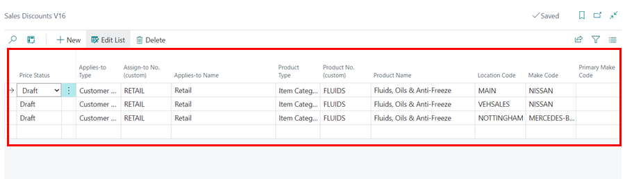

1. You can also use the **Minimum Vehicle Age** and **Maximum Vehicle Age** to filter on how to apply the price according to the age of the vehicle. The vehicle age is calculated from the **Vehicle First Registration Date** field in the **Vehicle** card.
1. Add the **Starting Date** and **Ending Date** for the discount, which means the discount will only be valid for the specified period (this is optional).
1. Enter the **Unit of Measure Code** (if need be), and the **Line Discount %** to offer, in percentage.

   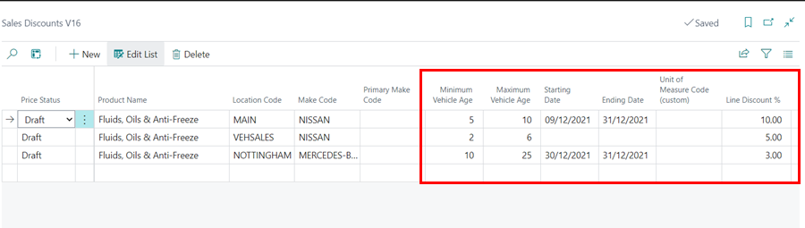

1. Set the status to **Active** in the first column.

   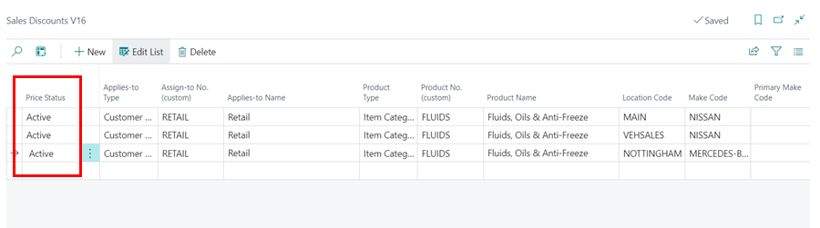

2. The sales discounts are now active and will be applied according to the settings you've set.

 



[Go back to top](#top)