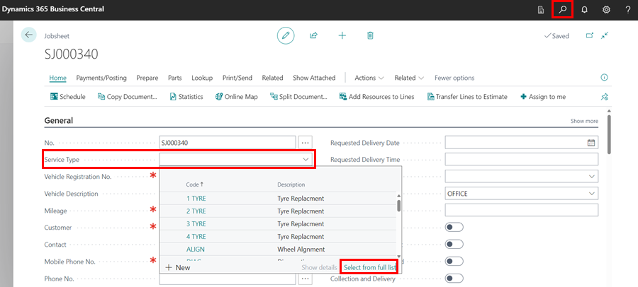
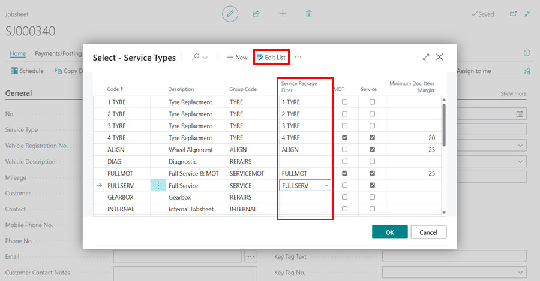
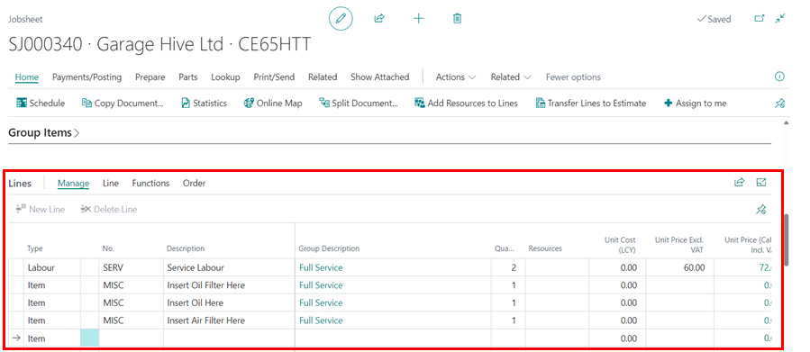
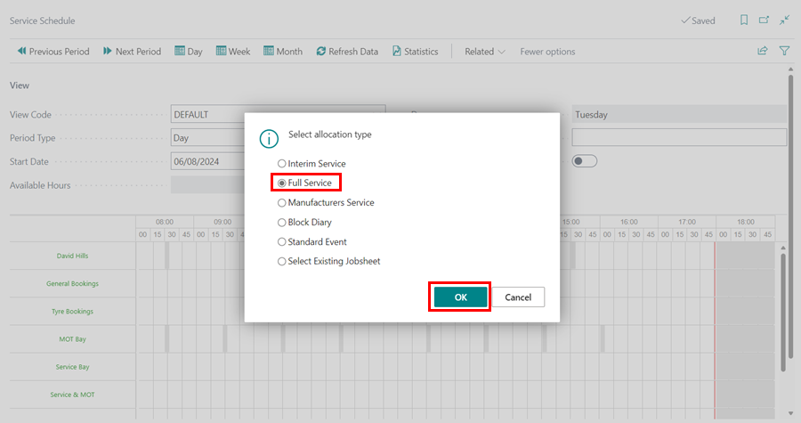

# Adding Service Packages Automatically 

To automatically apply service packages in Jobsheets, link Service Types with Service Packages. Here's how to do it:
1. To access the **Service Types** list from an open Jobsheet, choose the **Service Type** field and click **See Full List**, or search for **Service Types** using the  icon.

   

2. Select **Edit List** from the menu bar, then choose the **Service Type** you want to link with a **Service Package**. Fill out the **Service Package Filter** Column with the service package, and click **OK**.

   

3. When you create a new Jobsheet, add a **Service Type** that is linked to a **Service Package**, and choose the relevant **Vehicle** for the Jobsheet, the **Service Package** lines will automatically be inserted into the document lines.

   

4. This also applies when booking from the **Schedule**. If you book a **Service Type** that is linked to a **Service Package**, the **Service Package** will be added automatically.

   

[Go back to top](#top)

### **See Also**

[Video: automatically insert Service Packages to documents in Garage Hive](https://youtu.be/6y-c47xIYfE){:target="_blank"} \
[How to create Service Packages in Garage Hive](garagehive-service-packages.html){:target="_blank"} \
[Service Packages conditions](service-package-conditions.html){:target="_blank"} \
[Automatically adding Courtesy Car and Collection and Delivery Service Packages](garagehive-service-package-automatically-adding-courtesy-car-and-collection-and-delivery-service-packages.html){:target="_blank"} \
[Setting up online booking "Service Packages"](garagehive-onlinebooking-service-packages.html){:target="_blank"}
