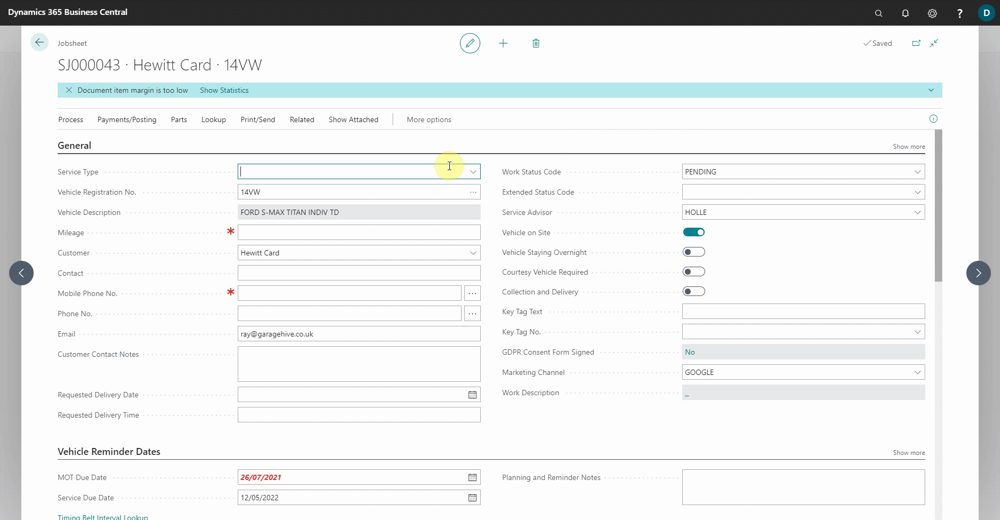
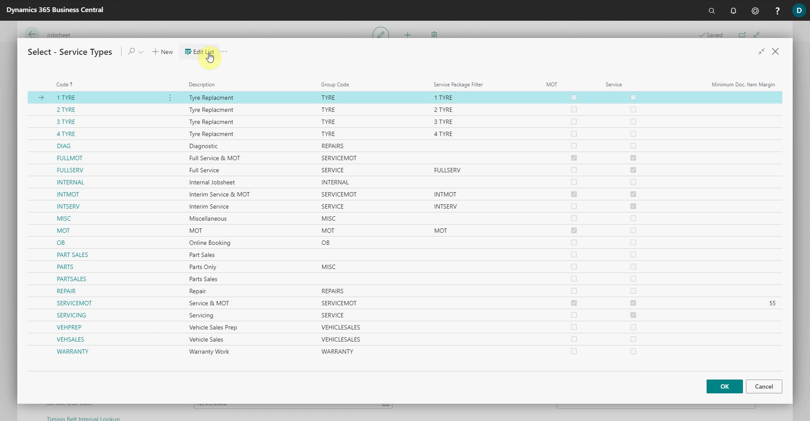
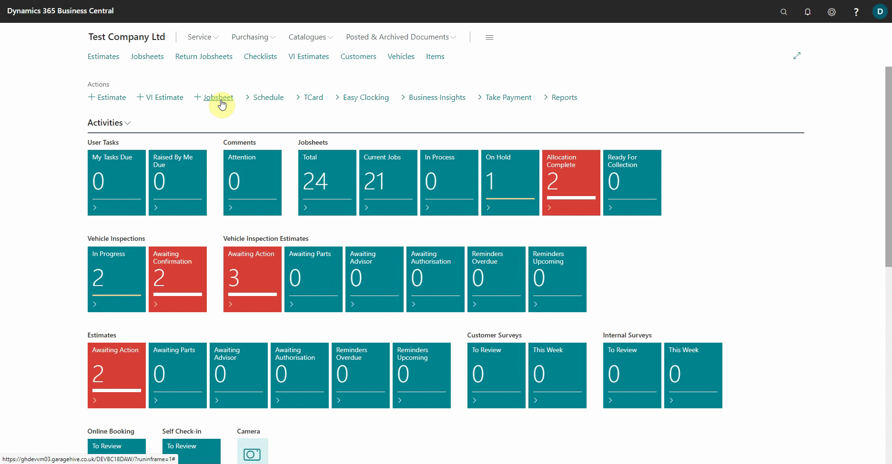

# Adding Service Packages Automatically 

To begin automatically applying service packages in jobsheets, link **Service Types** with **Service Packages**. Here's how to do it:
1. To access the **Service Types** list from an open jobsheet, choose the **Service Type** field and click **See Full List**, or search for **Service Types** using the search icon.

   

2. Select **Edit List** from the actions bar, and then select the **Service Type** you want to link with a **Service Package**. Fill out the **Service Package Filter** Column with the service package. To save, click the back arrow or **OK**.

   

3. When you create a new jobsheet, add a **Service Type** that is linked to a **Service Package**, and choose the relevant **Vehicle** for the jobsheet, the **Service Package** lines will automatically be inserted into the document lines.

   

4. This also applies when booking from the **Schedule**. You can book a **Service Type** is linked to a **Service Package**, and the **Service Package** will be added automatically.

   

### **See Also**

[Video: automatically insert Service Packages to documents in Garage Hive](https://youtu.be/6y-c47xIYfE&:target="_blank") \
[How to create Service Packages in Garage Hive](garagehive-service-packages.html) \
[Service Packages conditions](service-package-conditions.html) \
[Automatically adding Courtesy Car and Collection and Delivery Service Packages](garagehive-service-package-automatically-adding-courtesy-car-and-collection-and-delivery-service-packages.html) \
[Setting up online booking "Service Packages"](garagehive-onlinebooking-service-packages.html)
