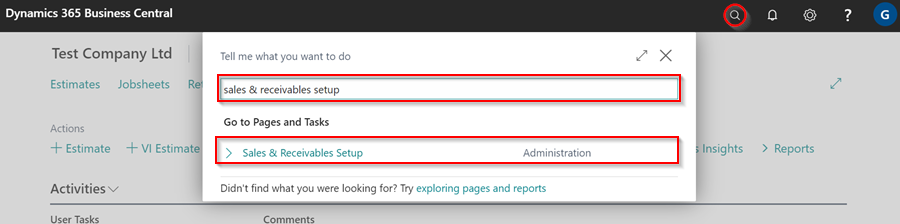
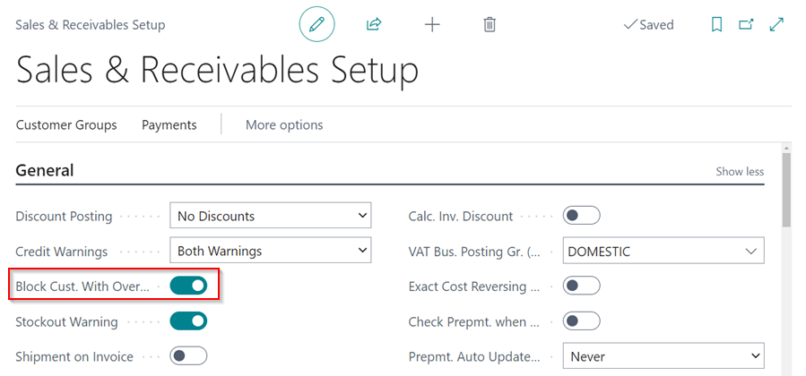
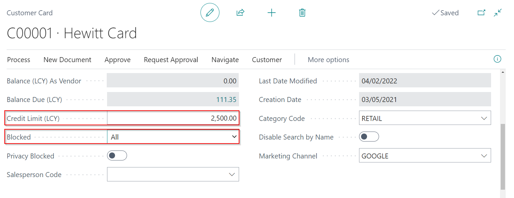

### How to Automatically Block Customers Who Have Exceeded Their Credit Limit
Automatically blocking customers who have exceeded their credit limit ensures that no documents are created or posted for them until the balance owed goes below the credit limit set. Here's how to set up automatic customer blocking:
1. In the top right corner, choose the  icon, enter **Sales & receivables Setup**, and select the related link.

   

2. Select the **Block Cust. With Overdue Cred. Limit** slider on the **Sales & Receivables Setup** page to enable the automatic blocking of customers who have exceeded their credit limit.

   

3. On the **Customer Cards**, ensure that the **Credit Limit** is set, and select **All** in the **Blocked** field to ensure that no transactions will take place for the customer if the credit limit is exceeded.

   

