

# How to Create and Edit Users in Azure Active Directory (AAD) and Reset Password
**Azure Active Directory (AAD)** is a cloud-based identity and access management service. AAD enables user authentication and single sign-on, allowing users to access Dynamics 365 using their Azure AD credentials and seamlessly navigate to other Microsoft services.

More information about how to add the **AAD authentication email** to Garage Hive can be found [here](https://docs.garagehive.co.uk/docs/garagehive-user-management.html#add-authentication-email-with-azure-active-directory-aad){:target="_blank"}.

## In this article
1. [Creating a New User](#creating-a-new-user)
2. [Edit an Existing User](#edit-an-existing-user)
3. [Reset Password for a User](#reset-password-for-a-user)

### Creating a New User
1. To log-in to **Azure Active Directory Admin Portal**, search for **User Management** in the top right corner.

   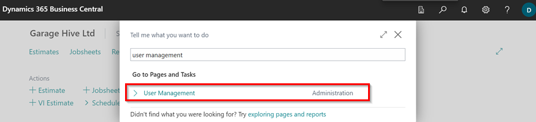

2. Click on **Microsoft 365 Admin Centre** from the menu bar. Only an **Admin** can access this link. 

    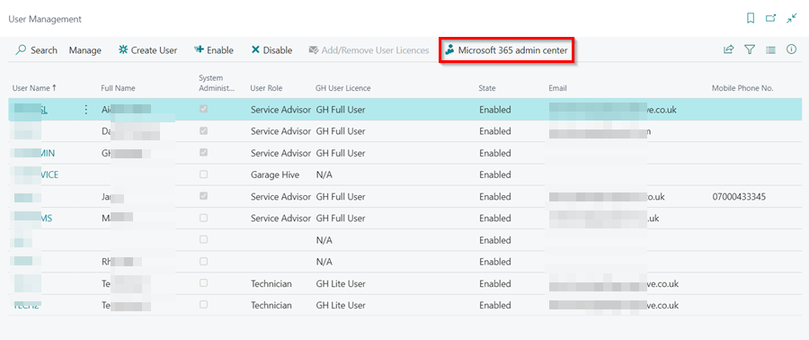

3. The **Microsoft Admin Portal** is opened. Select **Add User**.

   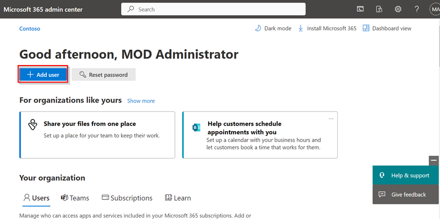

4. Enter the **Name**, **Display Name** and **Username** of the new user.

   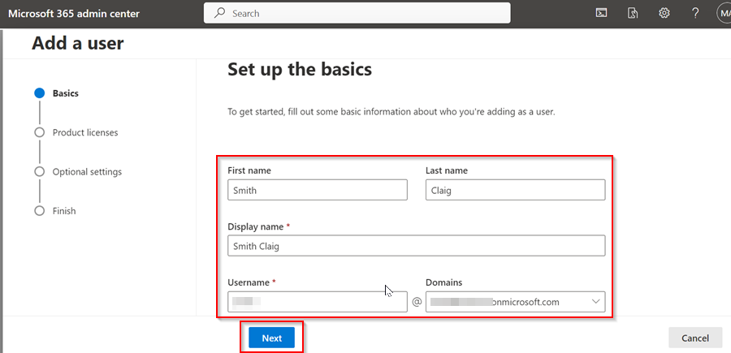

5. Select the **Automatically Create a Password** checkbox to generate a password for the user, the **Require this user to change their password when they first sign in** checkbox to prompt the user to create a new password when they first login, or the **Send password in the email upon completion** checkbox to send the user's password in the email specified. Click **Next**.

   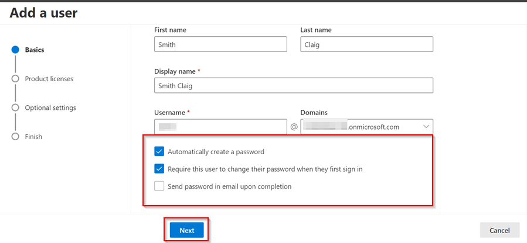

6. On the following page, select the user's **Location** and then **Create user without product licence**. This is recommended because the user is only used for authentication in Garage Hive. Click **Next**.

   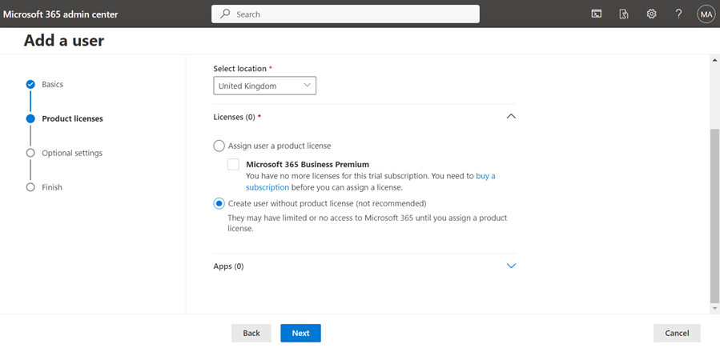

7. Enter the **Profile Info** for the user; this is optional and can be skipped.

   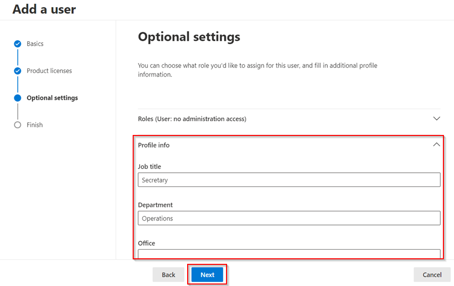

8. If you want to give the user access to the **Admin Centre**, go to **Roles** and then select **Admin center access**. Then, from the list, you can assign the suitable admin access. Give users only the access they need by assigning the least-permissive role; this is optional and can be skipped. Click **Next**.

   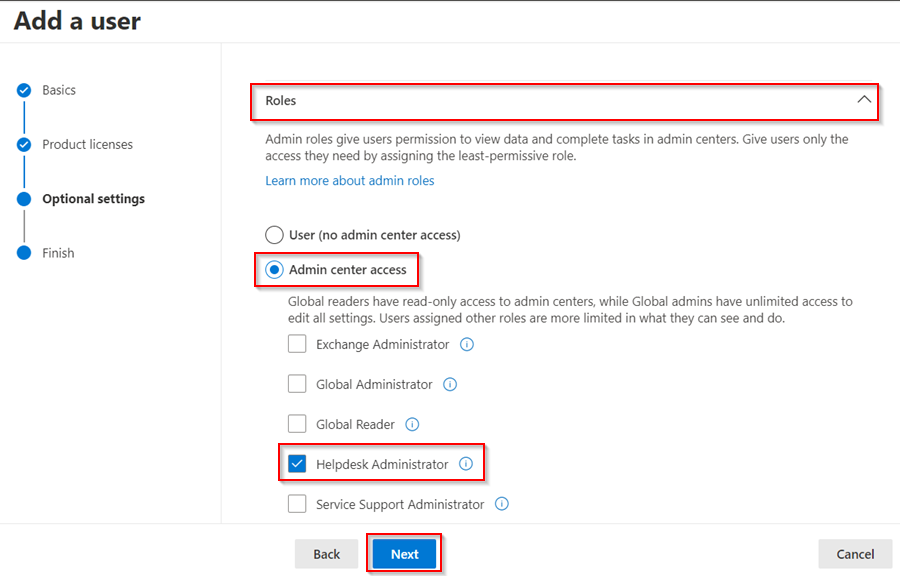

9.  Review the information you've entered on the next page, and if you want to change something, click **Edit** next to it. Click **Finish Adding** to add the new user.

   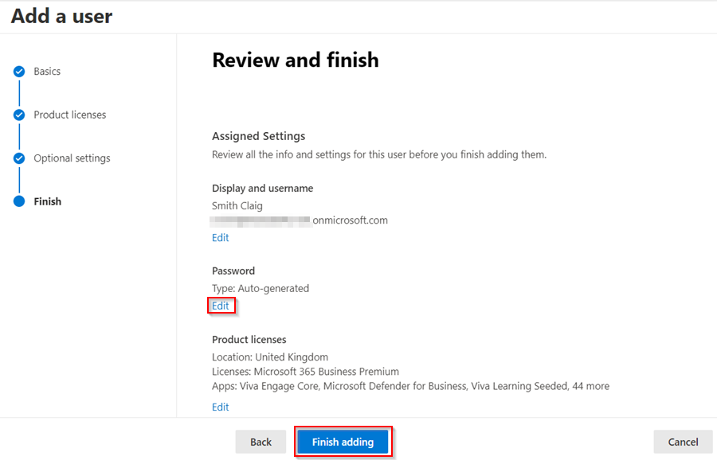

10. The user has been added. Share the **User Details** with the user so that they can login. To close the page, click **Close**.

   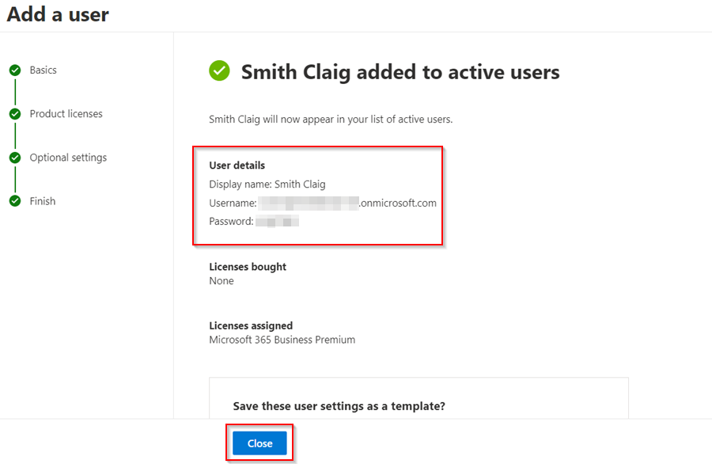

[Go back to top](#top)

### Edit an Existing User
To edit an existing user:
1. Log-in to **Azure Active Directory Admin Portal** using this **[link](http://admin.microsoft.com){:target="_blank"}** (Admin rights needed to access this link), and select **Users** under **Your Organization** section, and click on the user that you want to edit. A pop-up window appears on the right side.

   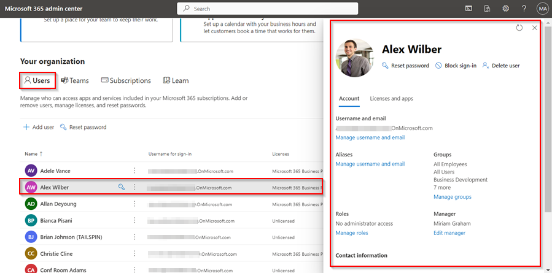

2. Select the option under the section you want to edit from the pop-up window. For example, if you want to change the user **Role**, go to the **Roles** section and select **Manage Roles**.

   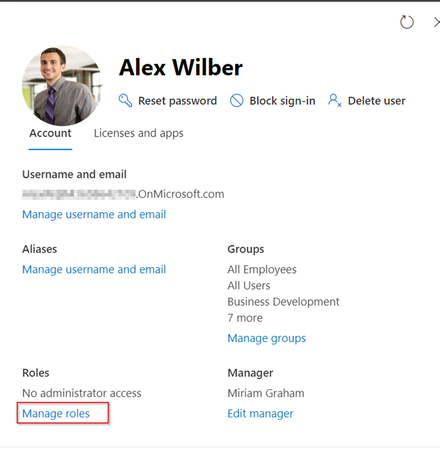

3. You can do the same for either of the other sections.

[Go back to top](#top)

### Reset Password for a User
To reset a password for a user:
1. Log in to the **Azure Active Directory Admin Portal** by clicking on this **[link](http://admin.microsoft.com){:target="_blank"}** (Admin rights needed to access this link), and then click on **Reset Password**. Select the user or users whose passwords you want to reset from the pop-up window that appears on the right.

   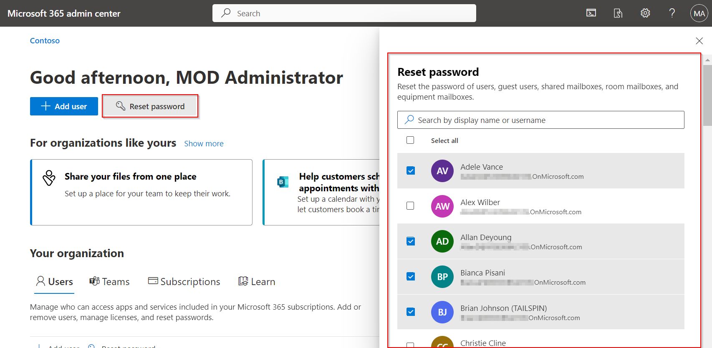

2. After selecting the users, scroll down and click on **Select** to select the users that you want to reset the password.

   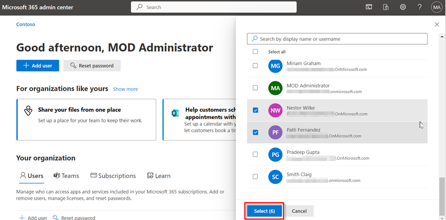

3. Select the **Automatically Create a Password** checkbox to generate a password for the user, the **Require these users to change their password when they first sign in** checkbox to prompt the user to create a new password when they first login, or the **Email the sign-in info to me** checkbox to send the user's sign-in details to your email. Click **Reset Password**.

   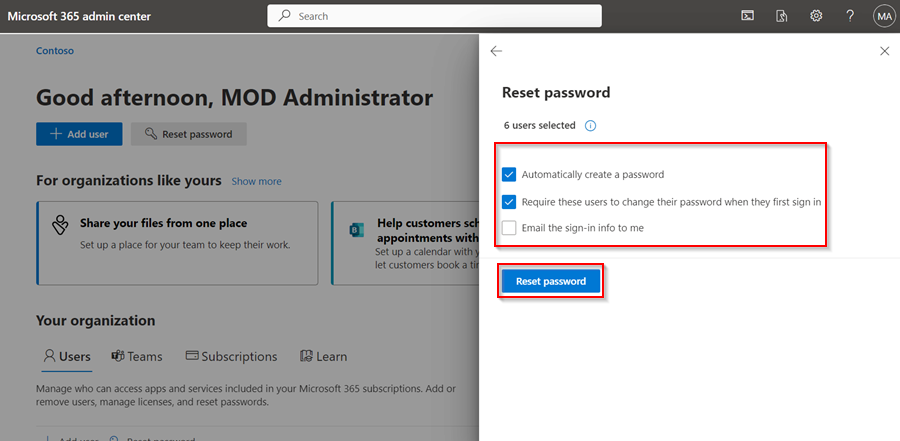

4. The passwords will be reset.

[Go back to top](#top)
