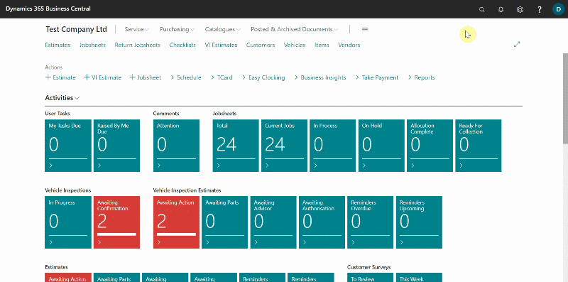
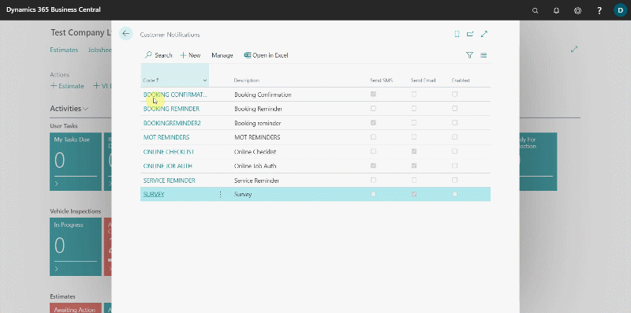
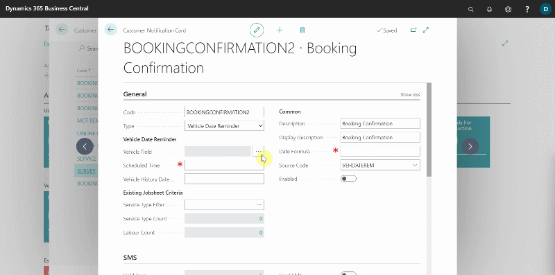
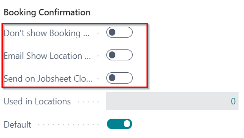
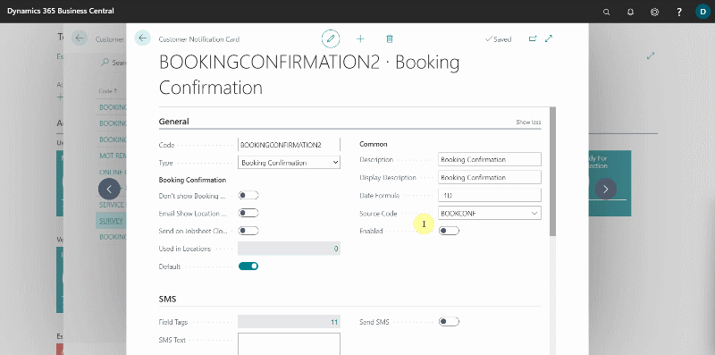
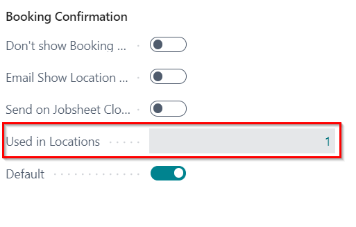
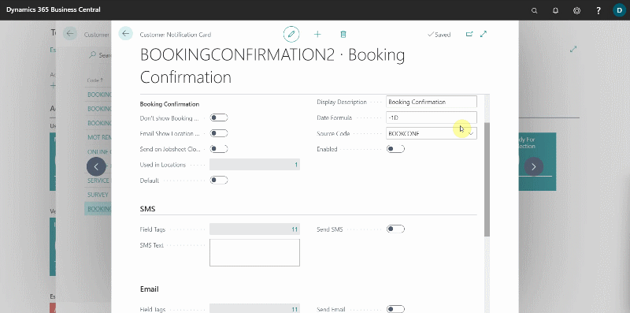
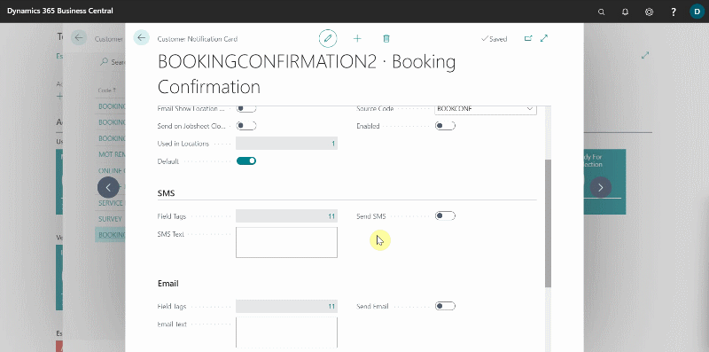
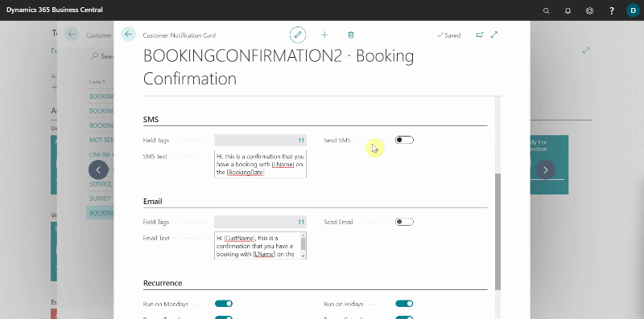
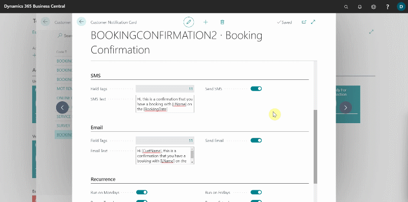

## In this article
1. [How to set up booking confirmation](#how-to-set-up-booking-confirmation)
2. [Writing a message template](#writing-a-message-template)
3. [Previewing and verifying message template](#previewing-and-verifying-message-template)
4. [Enabling notification and setting recurrence](#enabling-notification-and-setting-recurrence)
5. [Viewing sent notification messages](#viewing-sent-notification-messages)

### How to set up booking confirmation
To set up the booking reminder:
1. In the top right corner, choose the  icon, enter **Customer Notifications**, and select the related link.
2. The window that appears displays a list of all the customer notifications that have been previously set up.

   

3. You can modify existing **Booking Confirmation** or create a new one. We'll create a new one to help you understand booking confirmations better.
4. To create a new notification, click **+New**.
5. From the **General** FastTab, begin by assigning a code to the customer notification in order to identify it in the system. In this case, we'll set up an **Booking Confirmation**. So, we'll enter **BOOKINGCONFIRMATION2** in the field **Code**.
6. Add the **Description** field as well, which also populates the **Display Description** field but can be changed. **Display Description** is what the customer sees when the notification is sent.

   

7. The next step is to add the **Type** of notification to the system; in this case, select **Booking Confirmation** from the available options.
8. In the field **Date Formula**, enter the number of days (D), weeks(W), or months(M), preceded by a **negative sign**, for which the notification should be sent from the system before the due date. It is recommended that the notifications is sent right after the booking has been made; so we'll add **-1D**.
9. Select the **Source Code** as **Booking Confirmation**.

   

10. **Don't Show Booking Time** field: when enabled the booking confirmation email doesn't include the time in the **Booking Date/Time** field.
11. **Email Show Location Info** field: when enabled the booking confirmation email uses company name, address, picture, contact details from **Location Info** and not from the **Company Info**.
12. **Send on Jobsheet Close** field: when enabled the booking confirmation notification is sent after closing the jobsheet.

   

13. To set which location to apply to the **Booking Confirmation**, search for **Locations** in the top right corner  icon, and select the related link.
14. Open the location to apply, and under **General** FastTab select the **Code** for the booking confirmation to use in the **Booking Confirmation Notif. Code** field.

   

15. The number of locations using the **Booking Confirmation** will be indicated in the **Used in Locations**. 

   

16. The **Default** slider indicates whether the **Booking Confirmation** is the default. To change the **Default** booking confirmation, search for **Service Mgt. Setup GH** in the top right corner  icon and select the related link. Scroll down to the **Notifications** section and enter the booking confirmation code in the **Default Booking Confirmation Notif. Code** field to make it the default.

   

### Writing a message template
After setting up the details above, it's time to create the message that will be sent to the customer. To add a message template, follow the steps below:
1. You can either send a message via the email or the SMS or both. There are two sections to set up the messages for SMS and email.
1. In each section, there is a field called **Field Tags** that defines the specific tags to use in the message template, so that the tagged field is automatically added to the text based on the service document selected. Some examples are as follows:
   * **[CustName]** - When included in the message template, the **Customer's Name** from the service document is automatically added in the message.
   * **[VehReg]** - When included in the message template, the **Vehicle Registration No.** from the service document is automatically added in the message.
   * **[Make]** - When included in the message template, the **Vehicle Make** from the service document is automatically added in the message.
   * **[Model]** - When included in the message template, the **Vehicle Model** from the service document is automatically added in the message.
   * **[BookingDate]** - When included in the message template, the **Booking Date** from the service document is automatically added in the message.
1. Create a message in the field **SMS Text** and **Email Text**.

> **Email Text Example:**
>
> Hi [CustName], This is a confirmation that you have a booking with [LName] on the [BookingDate].

   

### Previewing and verifying message template
To see a preview of the messages you've added:
1. Enable the **Send SMS** and **Send Email** sliders and choose a **Vehicle No.** and **Customer No.** from which you can use the information as a sample. If you are satisfied with the message, click **Yes** for SMS and **OK** for email.

   

### Enabling booking reminder and setting recurrence
Scroll down to the **Recurrence** FastTab and select the slider on the days when you want the notification to be sent.
Then, from the **General** FastTab, enable the notification to make it operational. After enabling the customer notification, it cannot be edited unless it is disabled.

   

### Viewing sent notification messages
To see a list of the customer notifications that have been sent, choose the  icon in the top-right corner, and enter **Customer Notifications Entries**; the window that appears lists all of the details for the customer notifications that have been sent. To see the status, view the **Status** column and the **Delivery Status** column.

 

### **See Also**
[Customising Vehicle Reminder Dates Notification](garagehive-customising-vehicle-reminder-dates.html) \
[How to Setup Booking Reminders Notification in Garage Hive](garagehive-booking-reminders.html) \
[How to Setup Vehicle Date Reminders Notification in Garage Hive](garagehive-vehicle-date-reminders.html) \
[Setting Up Online Documents](garagehive-online-documents-setting-up-online-documents.html#customer-notification-set-up) \
[Setting Up NPS Customer Surveys](garagehive-surveys-setting-up-customer-surveys.html)