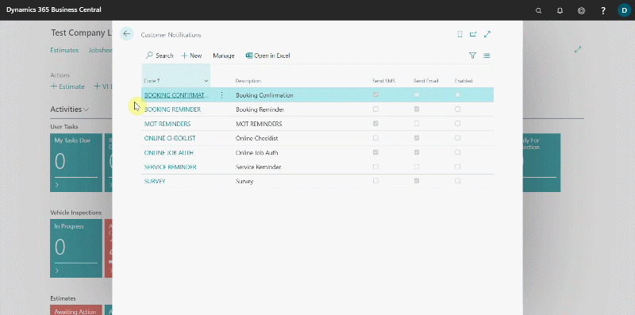

## In this article
1. [How to set up booking reminders](#how-to-set-up-booking-reminders)
2. [Writing a message template](#writing-a-message-template)
3. [Previewing and verifying message template](#previewing-and-verifying-message-template)
4. [Enabling notification and setting recurrence](#enabling-notification-and-setting-recurrence)
5. [Viewing sent notifications](#viewing-sent-notifications)

### How to set up booking reminders
To set up the booking reminder:
1. In the top right corner, choose the  icon, enter **Customer Notifications** and select the related link.
2. The window that appears displays a list of all the customer notifications that have been previously set up.

   

3. You can modify existing **Booking Reminder** or create a new one. We'll create a new one to help you understand booking reminders better.
4. To create a new notification, click **+New**.
5. From the **General** FastTab, begin by assigning a code to the customer notification in order to identify it in the system. In this case, we'll set up an **Booking Reminder**. So, we'll enter **BOOKINGREMINDER2** in the field **Code**.
6. Add the **Description** field as well, which also populates the **Display Description** field but can be changed. **Display Description** is what the customer sees when the notification is sent.

   

7. The next step is to add the **Type** of notification to the system; in this case, select **Booking Reminder** from the available options.
8. In the field **Date Formula**, enter the number of days (D), weeks(W), or months(M), preceded by a **negative sign**, for which the notification should be sent from the system before the due date. It is recommended that the notifications is sent 1 day before the booking date; so we'll add **-1D**.
9. Select the **Source Code** as **Booking Reminder**.
10. Add the **Scheduled Time**; this is the time at which the notification will be sent to the customer.

   

11. Select the **Service Type Filter**; this filters the **Service Types** for which the booking reminder will be sent if the services are allocated in the jobsheet(s). You can select all that are applicable.
    
   
    
12. To exclude a service and select all the others, use **<>** before the service. This will select all other services and leave out the one that has been added. You can add more services to exclude by adding **&<>** after the already excluded service, and then add another service. For example: **<>INTERNAL&<>VEHPREP&<>VEHSALES**, this means that all the other services, excluding **INTERNAL**, **VEHPREP** and **VEHSALES** are set to have the **Booking Reminder** sent if they are allocated in the jobsheet(s).

   

13. Add the **Location Filter**; this filters the locations for which the **Booking Reminder** will be sent if the jobsheet(s) are in that location. To exclude a location and select all other locations, use **<>** before the location, and you can exclude more locations by adding **&<>** after the already excluded location. For example: **<>NOTTINGHAM&<>BIRMINGHAM**, this means that all the other locations, excluding **NOTTINGHAM** and **BIRMINGHAM** will receive the **Booking Reminder** if the jobsheet(s) are in that location.

   

14. **Don't Show Booking Time** field, when enabled the booking reminder email doesn't include the time in the **Booking Date/Time** field and **Email Show Location Info** field, when enabled the booking reminder email uses company name, address, picture, contact details from **Location Info** and not from the **Company Info**.

   

[Go back to top](#top)

### Writing a message template
After setting up the details above, it's time to create the message that will be sent to the customer. To add a message template, follow the steps below:
1. You can either send a message via the email or the SMS or both. There are two sections to set up the messages for SMS and email.
1. In each section, there is a field called **Field Tags** that defines the specific tags to use in the message template, so that the tagged field is automatically added to the text based on the service document selected. Some examples are as follows:
   * **[CustName]** - When included in the message template, the **Customer's Name** from the service document is automatically added in the message.
   * **[VehReg]** - When included in the message template, the **Vehicle Registration No.** from the service document is automatically added in the message.
   * **[Make]** - When included in the message template, the **Vehicle Make** from the service document is automatically added in the message.
   * **[Model]** - When included in the message template, the **Vehicle Model** from the service document is automatically added in the message.
   * **[BookingDate]** - When included in the message template, the **Booking Date** from the service document is automatically added in the message.
1. Create a message in the field **SMS Text** and **Email Text**.

> **SMS Text Example:**
>
> Hi, this is a reminder that you have your vehicle [Make] - [VehReg] booked in on [BookingDate]. If there are any issues please call a member of our team. 

   

[Go back to top](#top)

### Previewing and verifying message template
To see a preview of the messages you've added:
1. Enable the **Send SMS** and **Send Email** sliders and choose a **Vehicle No.** and **Customer No.** from which you can use the information as a sample. If you are satisfied with the message, click **Yes** for SMS and **OK** for email.

   

[Go back to top](#top)

### Enabling notification and setting recurrence
Scroll down to the **Recurrence** FastTab and select the slider on the days when you want the notification to be sent.
Then, from the **General** FastTab, enable the notification to make it operational. After enabling the customer notification, it cannot be edited unless it is disabled.

   

[Go back to top](#top)

### Viewing sent notifications
To see a list of the customer notifications that have been sent, choose the  icon in the top-right corner, and enter **Customer Notifications Entries**; the window that appears lists all of the details for the customer notifications that have been sent. To see the status, view the **Status** column and the **Delivery Status** column.

[Go back to top](#top)

 

### **See Also**
[Customising Vehicle Reminder Dates Notification](garagehive-customising-vehicle-reminder-dates.html){:target="_blank"} \
[How to Setup Vehicle Date Reminders Notification in Garage Hive](garagehive-vehicle-date-reminders.html){:target="_blank"} \
[How to Setup Booking Confirmation Notification in Garage Hive](garagehive-booking-confirmation.html){:target="_blank"} \
[Setting Up Online Documents](garagehive-online-documents-setting-up-online-documents.html#customer-notification-set-up){:target="_blank"} \
[Setting Up NPS Customer Surveys](garagehive-surveys-setting-up-customer-surveys.html){:target="_blank"}