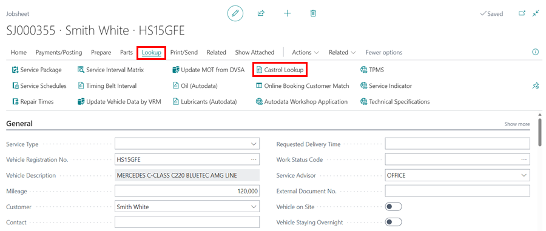
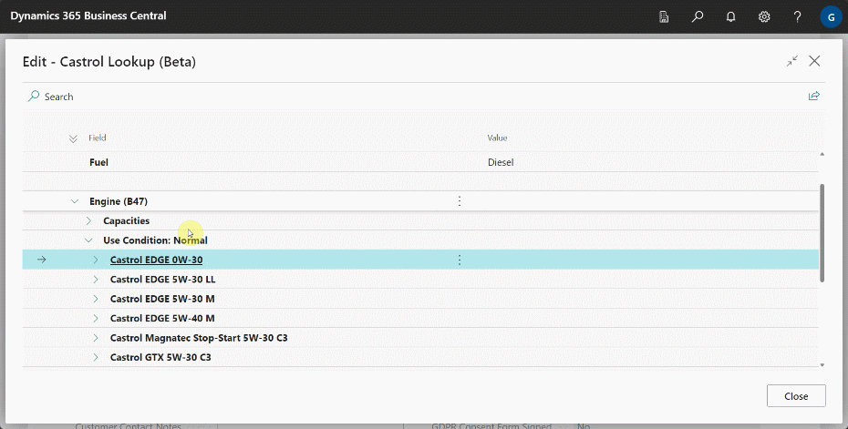
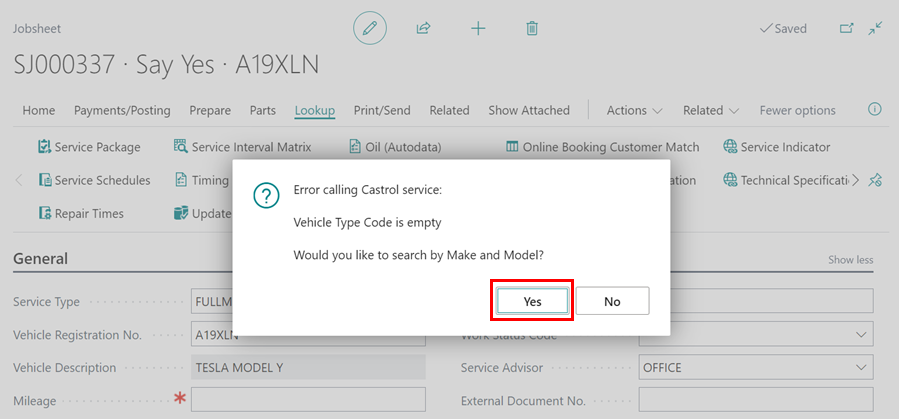
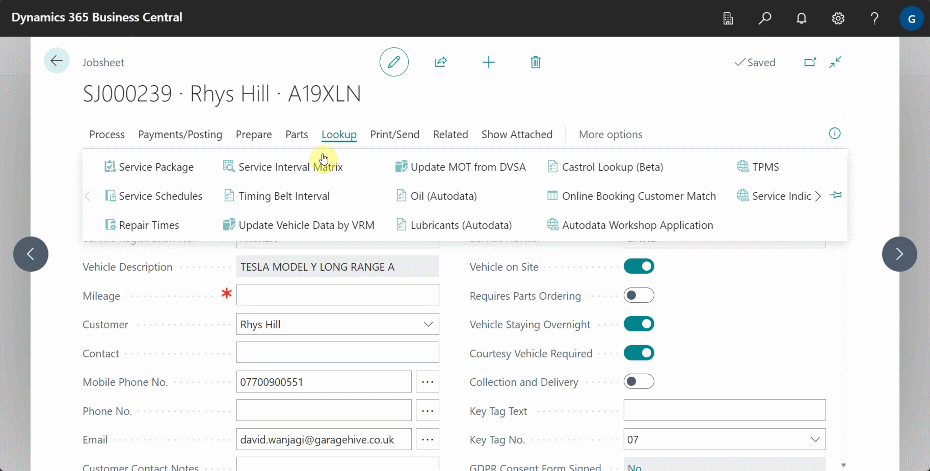

# We are still working on this article!
We are currently reviewing this article before it is published, check back later.

# How to Use Castrol Lookup in Garage Hive
Garage Hive users can now use Castrol Lookup to easily search for appropriate oil types and their capacities for various vehicles. The lookup function can be done either by using the vehicle registration number or by specifying the make and model of the vehicle.

1. Castrol Lookup is available for use in the Jobsheet, Estimate, VI Estimate, and the Technician Jobsheet.
2. Open the document that you want to use the **Castrol Lookup**, and in the menu bar select **Lookup** followed by **Castrol Lookup**. The system will automatically use the Vehicle Registration number for the lookup.

   

3. The **Castrol Lookup** page opens, and you can select the oil type that you are looking for to view the required capacity and details.

   

4. If the Castrol service cannot find your vehicle registration number, an error message will appear, giving you the option to select the **Make** and **Model** of the vehicle. Click **Yes** to proceed.

   

5. Follow the prompts to select the exact **Make** and **Model** of the vehicle that you want.

   

[Go back to top](#top)
