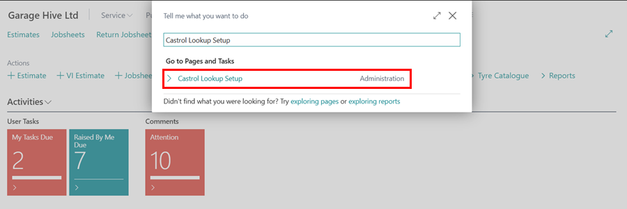
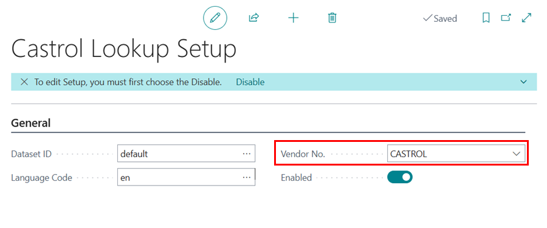

# How to Use Castrol Lookup in Garage Hive
Garage Hive users can use Castrol Lookup to easily search for appropriate oil types and their capacities for various vehicles and select the oil from Castrol database to add to the document. The lookup function can be done either by using the vehicle registration number or by specifying the make and model of the vehicle.

1. To use Castrol Lookup, choose the  icon in the top-right corner, enter **Castrol Lookup Setup** and choose the related link.

   

2. Specify the supplier to purchase the oil from by entering their number in the **Vendor No.** field.

   

3. Castrol Lookup is available for use in the Jobsheet, Estimate, VI Estimate, and the Technician Jobsheet.
4. Open the relevant document and select **Lookup** from the menu, followed by **Castrol Lookup**. The system will automatically pull the vehicle registration number to start the lookup.

   

5. If the system can’t find the vehicle registration, you’ll receive an error message with an option to manually input the vehicle’s **Make** and **Model**. Select **Yes** to proceed.

   

6. Follow the prompts to choose the correct **Make** and **Model** and click **OK**.

   

7. The **Castrol Lookup** page will appear, showing the different components that may require oil. Select the specific component you need oil for to view the available **Castrol Products**.

   

8. Choose the product you need and click **Add to Document Lines** from the menu. You can scroll left to view additional product details.

   

9.  If the selected Castrol product isn’t linked to an item, you’ll be prompted to link it now. Select **Yes**.

   

10. In the **Items** page, search for the item you want to link to the Castrol product and click **OK**.

   

11. If there is no vendor setup up in the system, you’ll get a prompt asking to add one. Choose **Yes** to link the item with a vendor.

   

12. In the **Vendors** page, search for the appropriate vendor and click **OK**.

   

13. In the **Line Group Update** page, select the item you want to update with the Castrol product in the document or choose **'< NEW LINE >'** to create a new line. Click **OK**.

   

14. The document will now reflect the selected Castrol product, ready for ordering from the linked vendor.

[Go back to top](#top)
