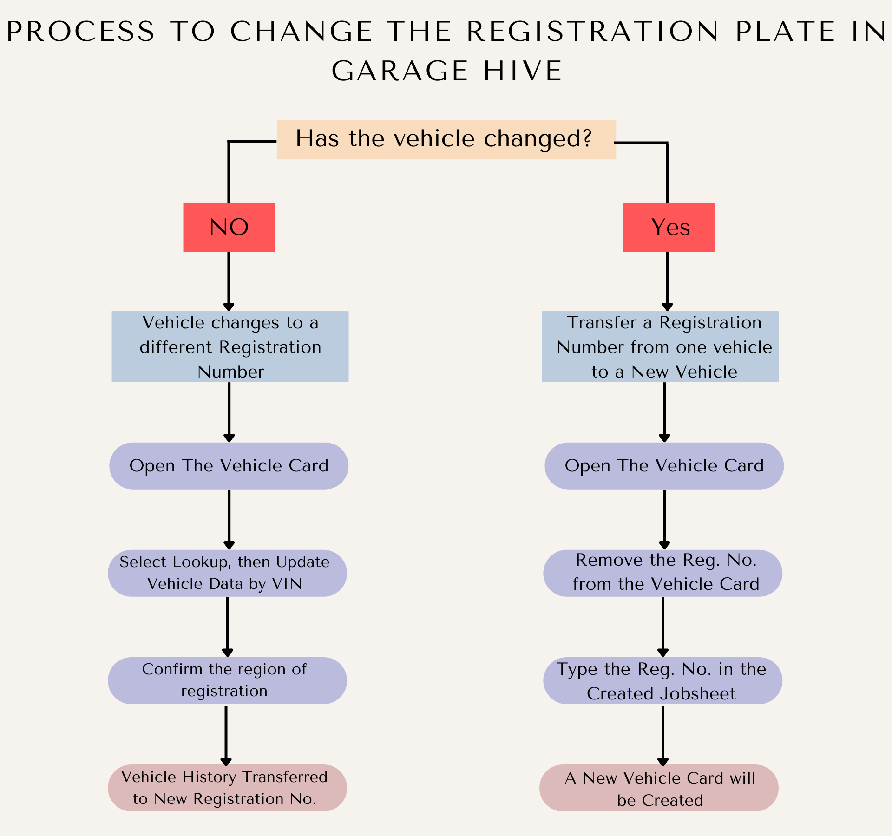
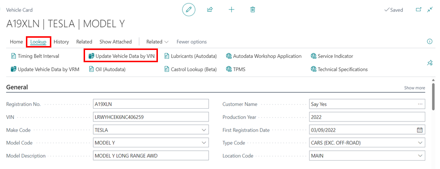
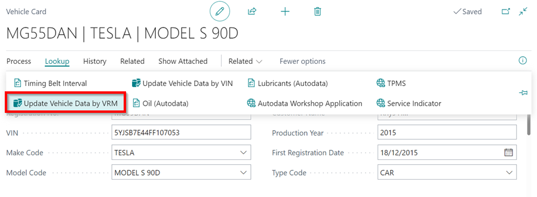
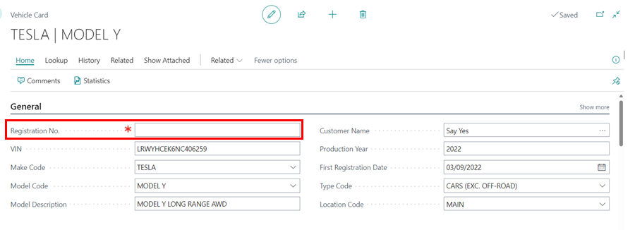
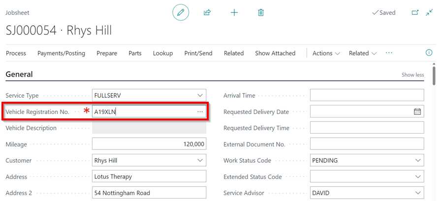

# We are still working on this article!
We are currently reviewing this article before it is published, check back later.

# How to Change a Customer's Vehicle Registration Number in Garage Hive
If a customer changes the original plate of the vehicle and there is history attached to it in Garage Hive, you may want to transfer this history to the new registration number plate, and on the other hand, you may have a customer who has a new vehicle with the original plate. In this article, we will look through both scenarios so that you can keep your records accurate.

In Summary:

   

## Vehicle Changes to a New Private Plate
When a vehicle changes to a new registration number:
1. Open the vehicle card of the original registration plate. Select **Lookup** from the menu bar, and then choose**Update Vehicle Data by VIN**.

   

2. If prompted to confirm the region of the vehicle registration, select from the list and click **OK**.

   

3. The new vehicle registration has been updated, and the vehicle history has been transferred to the new vehicle registration number.

## Private Plate Changes to a New Vehicle
When the private plate changes to a new vehicle:
1. Open the vehicle card of the original registration plate. Delete the **Registration No.** and close the vehicle card.

   

2. Open the Jobsheet with created for the vehicle and enter the registration number that you deleted in the vehicle card.

   

3. A new vehicle card will be created with the original registration plate.

[Go back to top](#top)