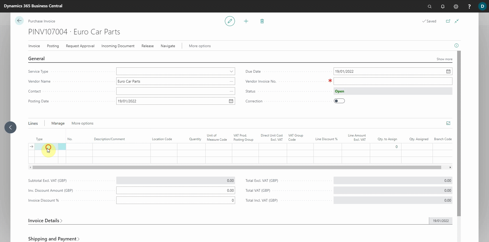

# Changing VAT Prod. Posting on Purchase Document Lines
When you have items with different VAT requirements, you can change the **VAT Prod. Posting Group** to apply the appropriate VAT requirement. Here's how:
1. When you create a **Purchase Invoice** for the items you received, scroll across to the column named **VAT Prod. Posting Group** in the **Lines** FastTab. If it isn't already there, use the [personalisation feature](garagehive-personalising-garage-hive.html) to add it.

   

2. Add the **Item** that has a different VAT requirement than the **Standard** one, as well as its **Qty** and **Price**.
3. Go to the column named **VAT Prod. Posting Group** and change the value to the required VAT obligation. In this case, we'll change it from **STANDARD** to **REDUCED**; these values depends on the VAT posting groups you've already added in your system.

   

4. You can now add the remaining items (if any) and post the **Purchase Invoice**.

> **Note:**
>
> The same procedure as above can be used to change the **VAT Prod. Posting Group** on an **Estimate**, a **Vehicle Inspection Estimate**, a **Jobsheet** and the **Sales** documents.