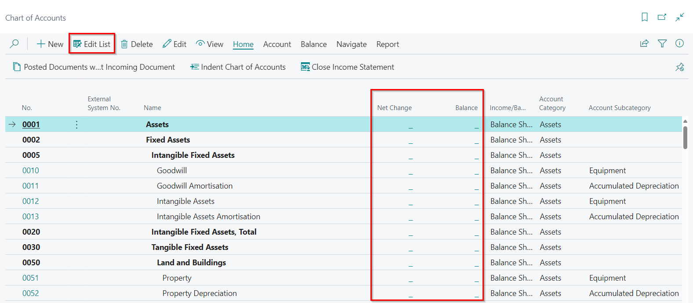
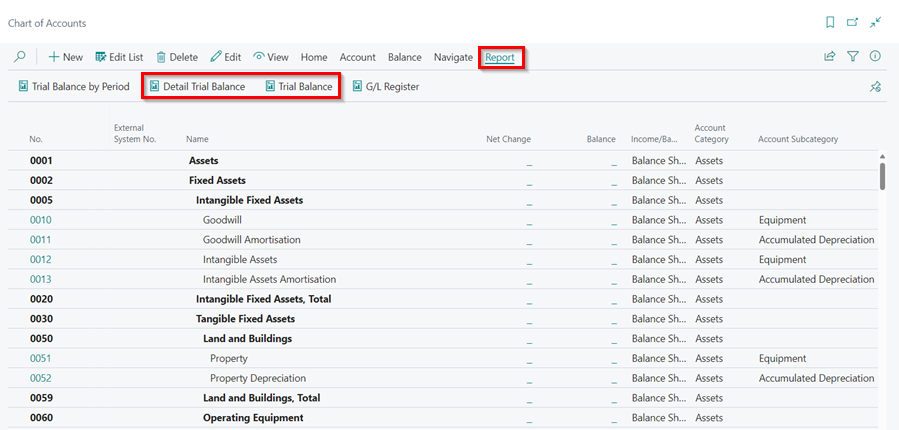
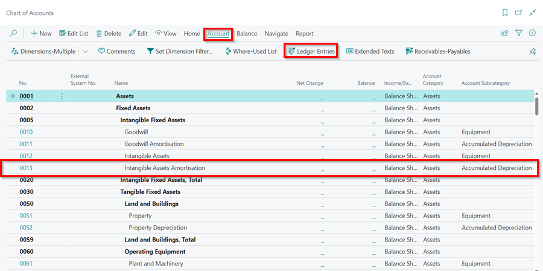
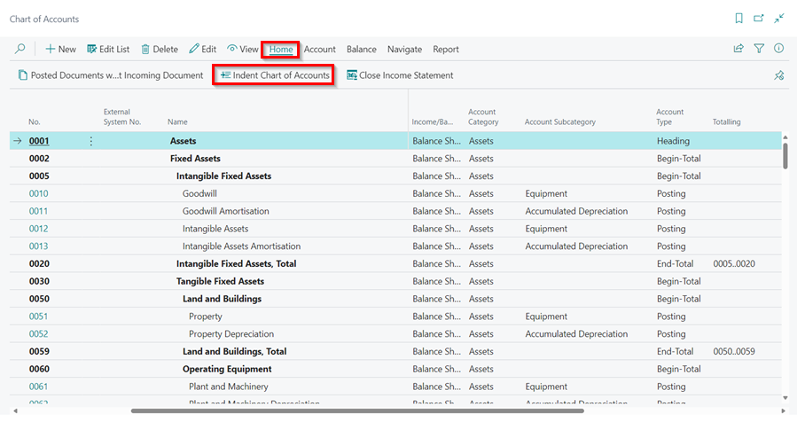

# Setting Up the Chart of Accounts in Garage Hive
The income statement and balance sheet are two important company financial reports. In Garage Hive, an account in the income statement and the balance sheet is called a **General Ledger (G/L) account**, and all the G/L accounts make up the **Chart of Accounts** list.

## In this article
1. [Setting Up G/L Accounts](#setting-up-gl-accounts)
2. [Using the Chart of Accounts](#using-the-chart-of-accounts)
3. [Setting Up Account Categories and Subcategories](#setting-up-account-categories-and-subcategories)

### Setting Up G/L Accounts
1. In the top-right corner, choose the  icon, enter **Chart of Accounts**, and select the related link.

   

2. Select **New** from the menu bar.

      

3. As an example, we will set up a **Fuel Expenses** account. In the **General** FastTab enter the details as follows.

   | Field                       | Description                                                                                                                                                                                                                                                                                                                                                                                                                                                                                    | Example Data     |
   | :-------------------------- | :--------------------------------------------------------------------------------------------------------------------------------------------------------------------------------------------------------------------------------------------------------------------------------------------------------------------------------------------------------------------------------------------------------------------------------------------------------------------------------------------- | :--------------- |
   | No.                         | The number of the G/L account.                                                                                                                                                                                                                                                                                                                                                                                                                                                                 | 6125             |
   | Name                        | The name or description.                                                                                                                                                                                                                                                                                                                                                                                                                                                                       | Fuel Expenses    |
   | Income/Balance              | Indicates whether the account is classified as an income statement of a balance sheet account.                                                                                                                                                                                                                                                                                                                                                                                                 | Income Statement |
   | Account Category            | Specifies the category of the G/L account used for creating financial statements.                                                                                                                                                                                                                                                                                                                                                                                                              | Expense          |
   | Account Subcategory         | Specifies the subcategory of the account category of the G/L account used for creating financial statements.                                                                                                                                                                                                                                                                                                                                                                                   | Vehicle Expenses |
   | Debit/Credit                | Indicates the type of entries that will be posted to this account.                                                                                                                                                                                                                                                                                                                                                                                                                             | Both             |
   | Account Type                | Indicates the purpose for the account in the different lists, journals, and reports. The available options are: **Posting** - The only account type where entries can be posted. **Heading** - Used for description and reporting purposes only. **Total** - Used to total the accounts that are nominated in the Totalling field. **Begin-Total** - Marks the beginning of an account range in the Totalling field. **End-Total** - Marks the end of an account range in the Totalling field. | Posting          |
   | Totalling                   | Specifies an account interval or a list of account numbers. Totaling formulas are possible for G/L accounts of the Total and End-Total account types.                                                                                                                                                                                                                                                                                                                                          | < blank >        |
   | No. of Blank Lines          | Specifies the number of blank lines that you want inserted before this account in the chart of accounts.                                                                                                                                                                                                                                                                                                                                                                                       | '0'              |
   | Reconcialition Account      | Determines whether the G/L account is included in the Reconciliation list in the general journals.                                                                                                                                                                                                                                                                                                                                                                                             | No               |
   | Automatic Ext. Texts        | If this field is selected, extended text that is set up on the accounts is automatically added to the sales and purchase documentation in the Description field. To create the extended texts, select **Account** from the menu bar, followed by **Extended Texts**.                                                                                                                                                                                                                           | No               |
   | Direct Posting              | Indicates whether posting can move directly into this account from a journal line. This field is automatically selected when new accounts are created.                                                                                                                                                                                                                                                                                                                                         | Yes              |
   | Blocked                     | If you select this field, it prevents entries from posting to this account. Accounts can be blocked and reopened as needed.                                                                                                                                                                                                                                                                                                                                                                    |                  |
   | Last Modified Dates         | System-generated field that displays the date that the G/L account was last changed.                                                                                                                                                                                                                                                                                                                                                                                                           | System-generated |
   | Omit Default Descr. in Jnl. | Specifies if the default description is automatically inserted in the Description field on journal lines that are created for this general ledger account.                                                                                                                                                                                                                                                                                                                                     |                  |

      

4. In the **Posting** FastTab enter the details as follows.

   | Field                          | Description                                                                                                                | Example Data |
   | :----------------------------- | :------------------------------------------------------------------------------------------------------------------------- | :----------- |
   | Gen. Posting Type              | Defines whether the account is used only for a Sale or Purchase transaction or with both types of transactions.            | Purchase     |
   | Gen. Bus. Posting Group        | Identifies the default general business posting group for the account.                                                     | DOMESTIC     |
   | Gen Prod. Posting Group        | Identifies the default general product posting group for the account.                                                      | MISC         |
   | VAT Bus. Posting Group         | Identifies the default VAT Business Posting Group for the account.                                                         | DOMESTIC     |
   | VAT Prod. Posting Group        | Identifies the default VAT Product Posting Group for the account.                                                          | STANDARD     |
   | VAT Group Code                 | Specifies the VAT group that is used to calculate and post VAT.                                                            | < blank >    |
   | Default IC Partner G/L Acc. No | Identifies the default Inter-company (IC) G/L account number for this G/L account.                                         | < blank >    |
   | Default Deferral Template      | Specifies the default deferral template that governs how to defer revenues and expenses to the periods when they occurred. | < blank >    |

      

5. Once this is completed, the G/L account is ready for use and entries can be posted into it.

[Go back to top](#top)

### Using the Chart of Accounts
Here are ways in which you can use Chart of Accounts:
1. From the chart of accounts, you can open each G/L account. However, by selecting **Edit List**, you can also update current or create new G/L accounts. You can drill down on the **Net Change** and **Balance** fields to display the ledger entries of a G/L account.

   

2. To view the **Trial Balance**, select **Process** from the menu bar followed by **Detailed Trial Balance** or **Trial Balance**.

   

3. You can also view an account ledger entries by selecting an account, and then from the menu bar select **Account**, followed by **Ledger Entries**.

   

4. To update the indentation of all the G/L accounts in the chart of accounts, select **Process** from the menu bar followed by **Indent Chart of Accounts**. All accounts between a **Begin-Total** and the matching **End-Total** are indented one level. The Totalling for each End-total is also updated.

   

[Go back to top](#top)

### Setting Up Account Categories and Subcategories
1. On a G/L account card, you can assign one of the following G/L account categories:
   - Assets
   - Liabilities
   - Equity
   - Income
   - Cost of Goods Sold
   - Expense

2. To further divide these G/L account categories into subcategories, In the top-right corner, choose the  icon, enter **G/L Account Categories**, and select the related link.

   

3. The **G/L Account Categories** page shows your categories and subcategories and the G/L accounts that are assigned to them.

   

4. To create a new subcategory, click on **Edit List**, and select **New**.

   

5. Enter the following details for the subcategory:
      - **Description:** This is the name or description of the new subcategory.
      - **Account Category:** This specifies the category of the G/L account(s).
      - **G/L Accounts in Category:** This is a list of the G/L accounts included in the category. To write multiple accounts, add the accounts and then separate them with a  vertical slash ( &#124; ), for example (**0010 &#124; 0012 &#124; 0051**), and to add accounts in a range, separate the first and last account with two dots (..), for example (**1000..1099**).
      - **Additional Reports Definition:** Specifies whether the accounts in each subcategory must be included in specific types of reports for example **Operating Activities**, **Investing Activities**, **Financing Activities** etc.

         

6. To create a category group, select **New** from the menu bar and enter the category name. After entering the name, select **Outdent** from the menu bar. This makes the category name bold, indicating that it is a category group.

   

7. Add the subcategories after the category group name. To add them to the category group, select **Indent** for the first subcategory in the group. Select **Move Up** or **Move Down** to rearrange the categories.

   

[Go back to top](#top)