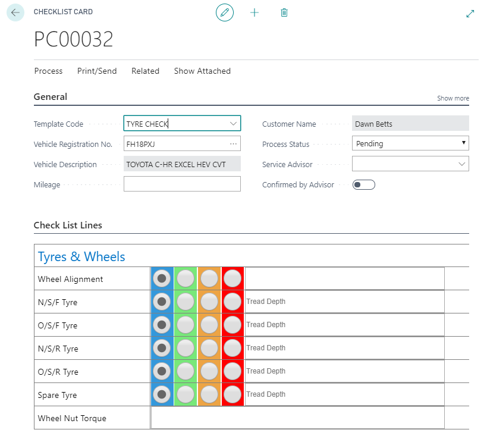
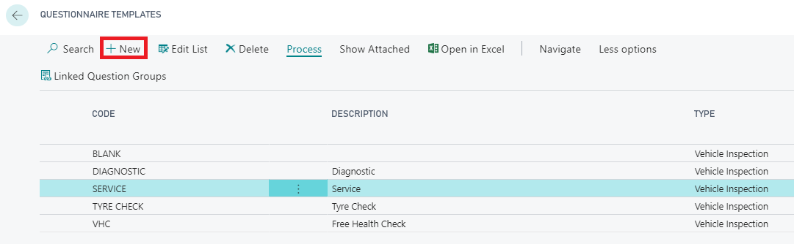
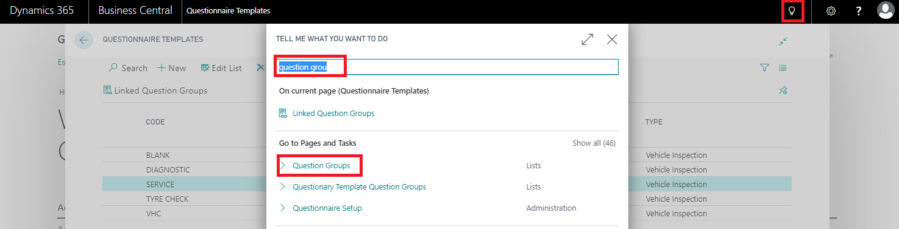
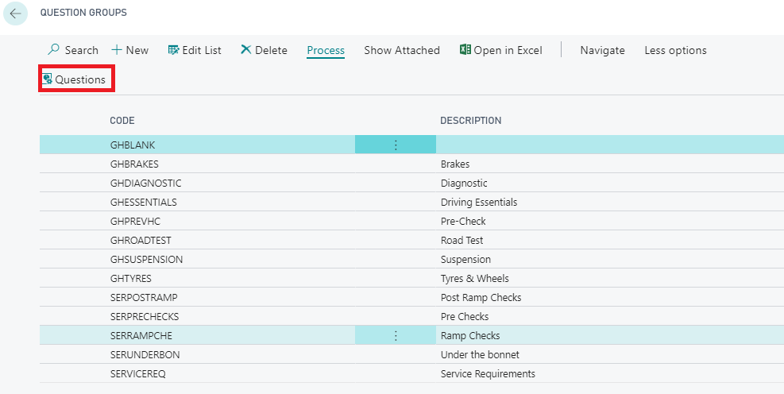
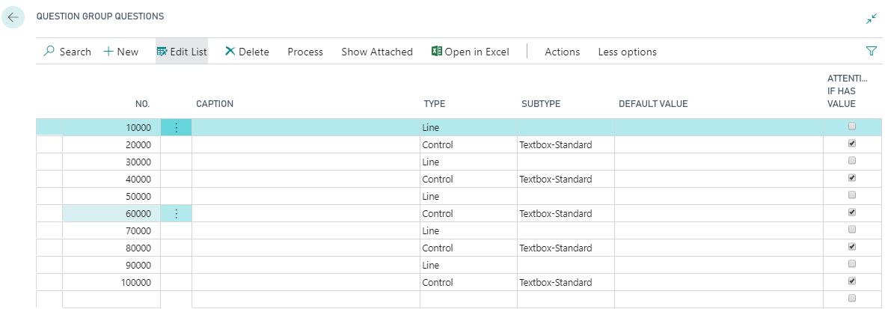
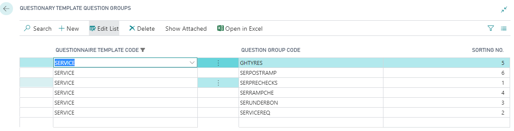

# How to setup and work with Checklists



Checklists offer the ability to create an inspection sheet/checklist for all areas of your business. For example, a vehicle inspection is a type of checklist. 

Checklists have the following structure 

* Checklist Templates
    * Checklist Template Item Groups
        * Checklist Items

## Checklist Templates

A Checklist Template is considered the header of the Checklist, each Checklist Template must have at least one **Checklist Template Item Group**

## Checklist Items

**Checklist Items** are where you enter your checklist questions, a checklist item for example could be about "tyres" and could consist of a traffic light system and check boxes like the example below. 

**Checklist Template Item Groups** can be linked to multiple **Checklist Template**, for example a **Tyre Checkist Item Group** could belong in the **Full Service Checklist Template** and the **Interim Service Checklist Template**. 

## How to create a checklist

From the home screen, click on the search icon in the top right hand corner

Type in the search box "Checklist Templates"

Start by creating a new Checklist Template, the Checklist Template will be the description of your checklist that you select from when deciding which checklist to complete as a technician. You will be linking Checklist Templates to your Checklist Template Item Groups using the "Linked Item Groups" action. Before you do this, you must create your Checklist Items

Now you need to create some Checklist Items to link with your Checklist Item Groups. 

There are several things you must do when creating a new Checklist Item. To do this select Question Groups from the menu and press "+New" 

* **No.** - Each line must have a number, this is the order in which the questions will appear. 
* **Caption** - The caption is what will appear on the line of the questions
* **Type** - Choose from either Line (a title) or Control (an entry)
* **SubType** - Select from what type of entry you want.
     * Radio Button
     * Textbox-Small
     * Textbox-Large
     * Checkbox
* **Default Value** You can populate a field with a default value to determine which radio button is pre-ticked
* **Attention If Has Value** Ticking this box will allow the Advisor to see from the list of checklists if any particular checklist requires attention. Any entry on a line with this ticked will flag a checklist. 

*   Then select Items

The above example of a **Checklist Item** setup will result in the checklist example below. Select the "New Line from Template" button within the Process button along the action bar to use some of the preset examples. 

In order to complete your setup, you need to link your **Checklist Items Groups** to your **Checklist Templates**. do to this, go to the **Checklist Templates** menu and select the **Checklist Template** and press "Linked Item Groups". 

Select the Checklist Template Code, then select a Checklist Template Item Group. Finally, add a Sorting No. to determine the order in which the Checklist Template Item Groups appear on the checklist. 

Once you have done this, your checklist is ready to preview. Simply create a checklist from the checklist menu and select the new checklist you have created to preview it. 

# See Also
[How to perform a Vehicle Inspection](https://docs.garagehive.co.uk/docs/garagehive-technicians-vehicle-inspections.html "How to perform a Vehicle Inspection")

[How to use VHCs](https://docs.garagehive.co.uk/docs/garagehive-VHC.html "How to use VHCs")