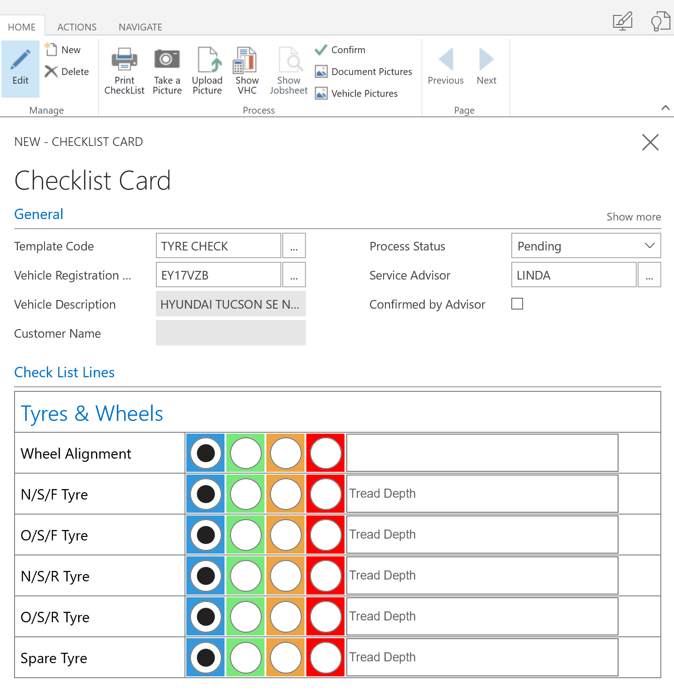
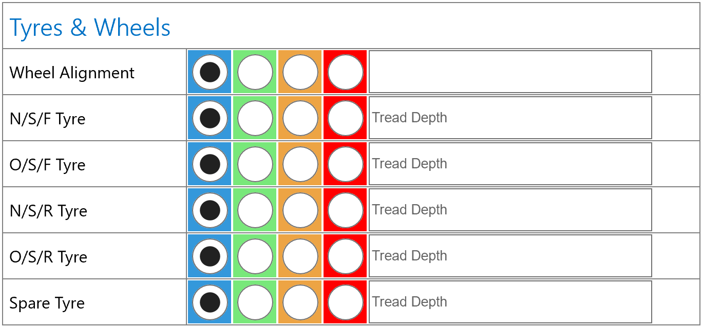
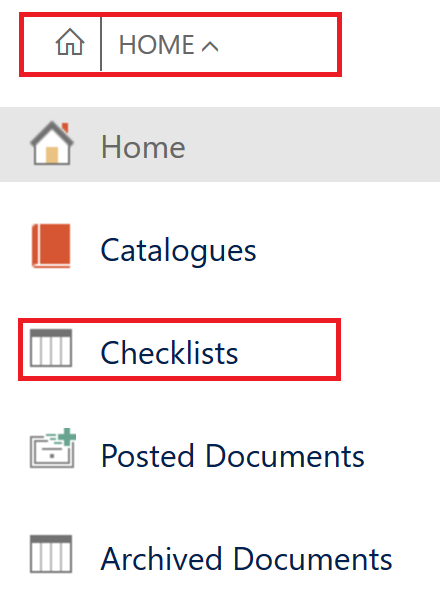
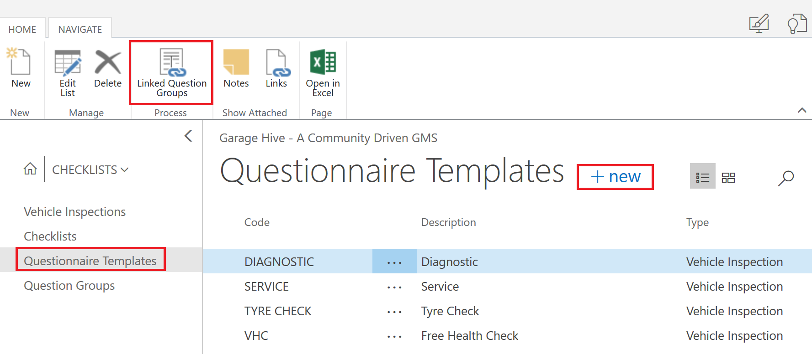
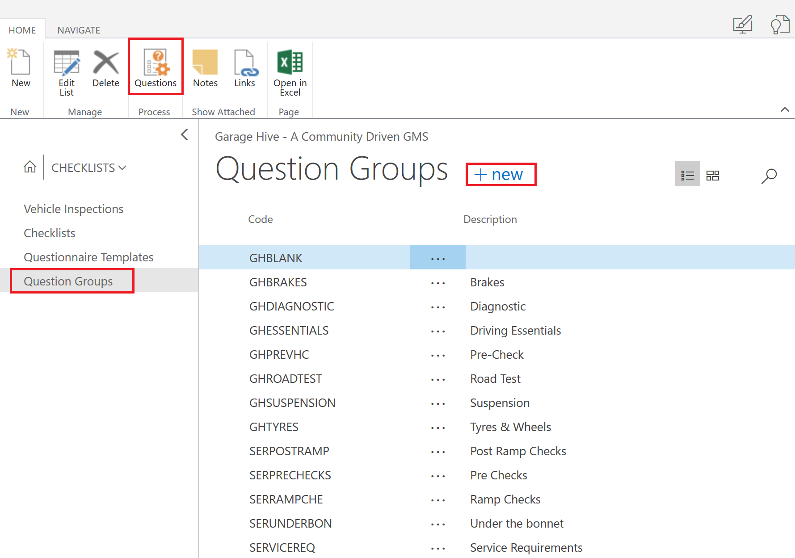
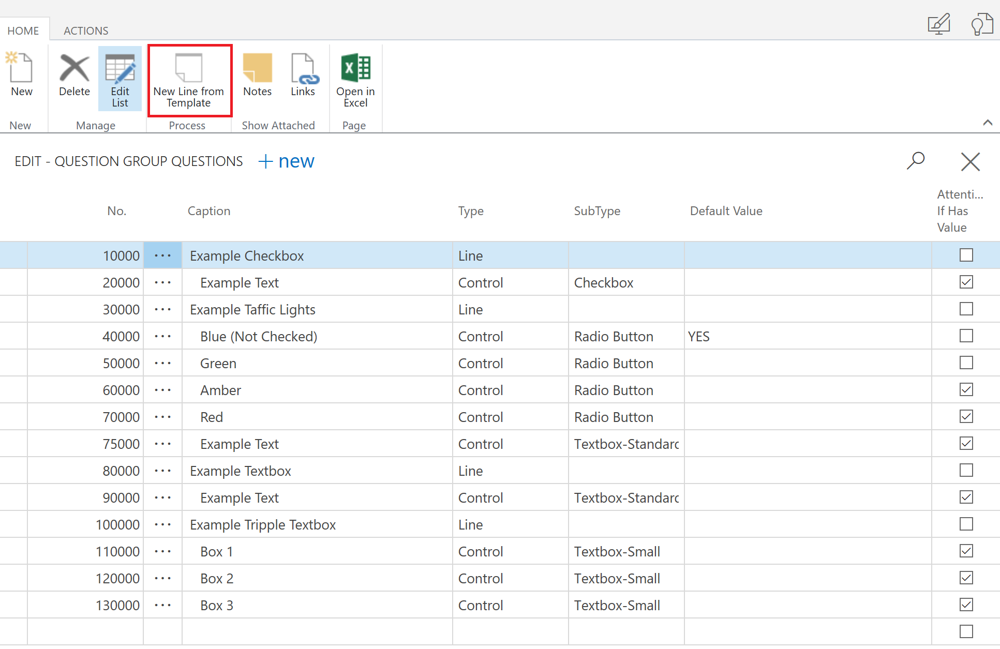
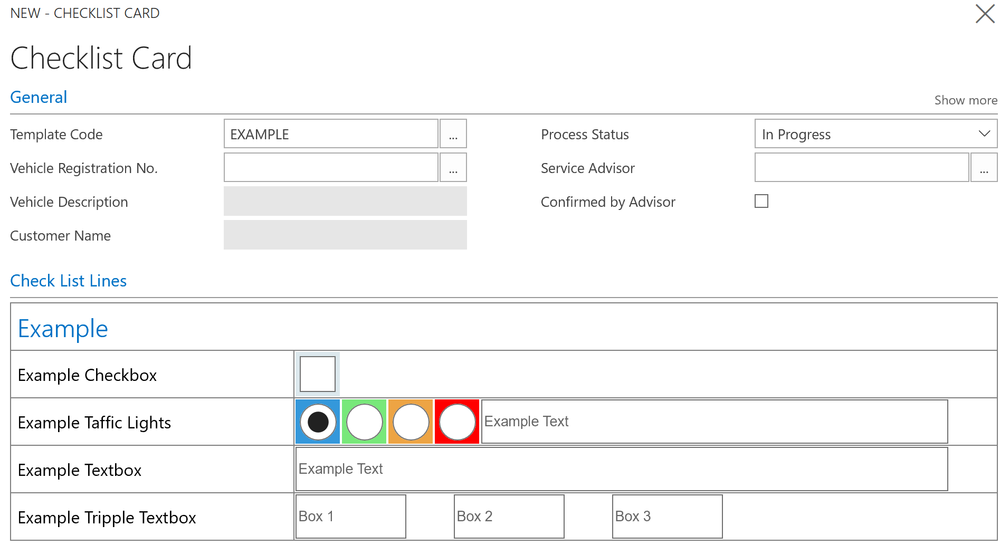
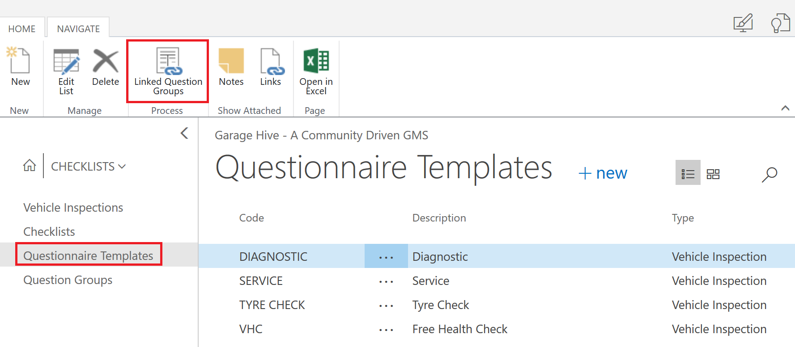
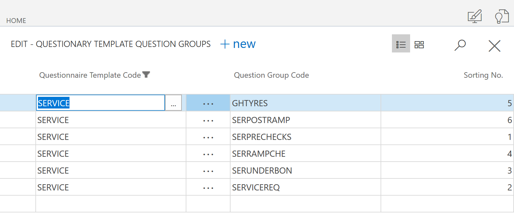

# What are Checklists?

Checklists offer the ability to create an inspection sheet/checklist for all areas of your business. For example, a vehicle insepction is a type of checklist. 

Checklists have the following structure 

* Checklist
    * Questionnaire Templates (Header)
        * Question Groups (Questions belonging to a Questionnaire Template)

## Questionnaire Templates

A questionnaire template is considered the header of the checklist, each questionnaire template must have at least one **Linked Question Group**

## Question Groups

**Question Groups** are where you enter your checklist questions, a question group for example could be about "tyres" and could consist of a traffic light system and check boxes like the example below. 

**Question groups** can be linked to multiple **Questionnaire Templates**, for example a **Tyre Question Group** could belong in the **Full Service Questionnaire Template** and the **Interim Service Questionnaire Template**. 

## How to create a checklist

* From the home screen, press the down arrow and select **Checklists**

* Start by creating a new questionnaire template, the questionnaire template will be the description of your checklist that you select from when deciding which checklist to complete as a technician. You will be linking Question Groups to your Questionnaire Templates using the "Linked Question Groups" in the action bar. Before you do this, you must create your Question Groups

* Now you need to create some Question Groups to link with your Questionnaire Template. 

There are several things you must do when creating a new Question Group. To do this select Question Groups from the menu and press "+New" 

* **No.** Each line must have a number, this is the order in which the questions will appear. 
* **Caption** The caption is what will appear on the line of the questions
* **Type** Choose from either Line (a title) or Control (an entry)
* **SubType** Select from what time of entry you want.
     * Radio Button
     * Textbox-Small
     * Textbox-Large
     * Checkbox
* **Default Value** You can populate a field with a default value to determine which radio button is pre-ticked
* **Attention If Has Value** Ticking this box will allow the Advisor to see from the list of checklists if any particular checklist requires attention. Any entry on a line with this ticked will flag a checklist. 

The above example of a **Question Group** setup will result in the checklist example below. 

> Select the "New Line from Template" button in the action bar to use some of the preset examples. 

In order to complete your setup, you need to link your **Question Group** to your **Questionnaire Templates**, do to this go to the **Questionnaire Templates** menu, selected the **Questionnaire Template** and press "Linked Question Groups" in the action bar. 

Select the Questionnaire Template Code, then select a Question Group Code. Finally add a Sorting No. to determine the order in which the Question Groups appear on the checklist. 

Once you have done this, your checklist is ready to preview. Simply create a new checklist from the menu and select the new checklist you have created to preview it. 
