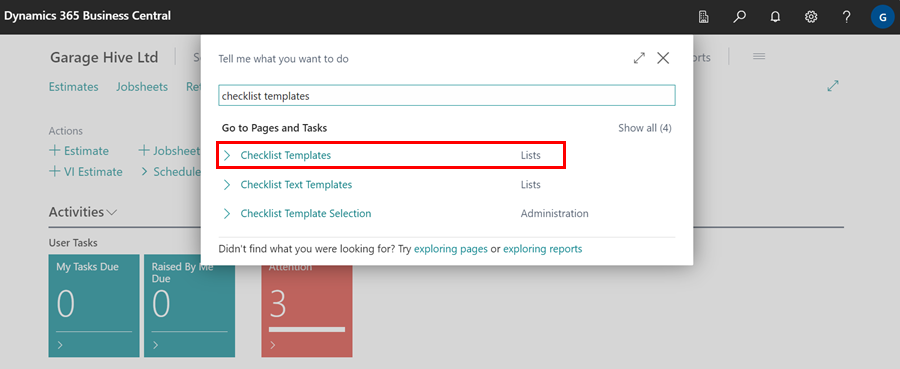

# How to Import & Export Checklists

You can share your created checklists with other users using the upload/download feature within checklist templates. 



User the search function to find "Checklist Templates"

Wtihin Checklist Tempaltes you can import or export selected checklists. 

The exported & imported files must be a file with the .cltx extension

When importing Checklist Tempaltes it is essential that you understand that you will lose any existing Checklist templates or Checklist item groups with the same names. For this reason **it is strongly recommended that you export all of your existings Checklist Tempaltes and save them incase you need to re-import them.** 

# See Also

[How to create a Checklist](https://docs.garagehive.co.uk/docs/garagehive-checklist-how-to-create.html "How to create a Checklist")

[How to perform a Vehicle Inspection](https://docs.garagehive.co.uk/docs/garagehive-technicians-vehicle-inspections.html "How to perform a Vehicle Inspection")

[How to use VHCs](https://docs.garagehive.co.uk/docs/garagehive-VHC.html "How to use VHCs")