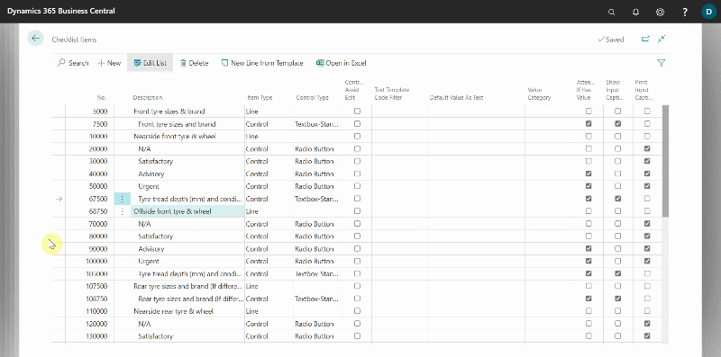

# How to Setup and Use Checklist Text Templates in Garage Hive

The **Checklist Text Templates** feature allows you to pre-assign templates in checklist Item lines, which technicians can use to ensure consistency in reporting and increased efficiency. To setup the **Checklist Text Templates**:
1. In the top-right corner, choose the search icon, enter **Checklist Text Templates** and choose the related link.
2. The page that opens contains a list of all the **Checklist Text Templates** that have been set up, or if none have been set up, this is where they will appear.
3. Select **New**, to create a new one.

   

4. When creating a **Checklist Text Template**, it is recommended that you always group them by function by prefixing them with the same code. For example, you can use the letters **TY** to prefix all tyre-related **Checklist Text Templates**; this helps in sorting, as we will see later. In the below example, we will add a **Tyre** related **Checklist Text Template**.

   

5. After you've added the **Checklist Text Templates**, you'll need to enable them in the **Checklist Template**; learn more about **Checklist Templates** [here](garagehive-checklist-how-to-create.html).
6. Enter **Checklist Templates** in the search icon and select the related link. Choose one of the **Checklist Templates** from the list to which you want to add the **Checklist Text Templates** that you have created. In this case we'll use the **VHC Checklist Template**. 
7. Select **Linked Item Groups** from the actions bar to open a list of **Checklist Template Item Groups** in the **Checklist Template**; learn more about **Checklist Template Item Groups** [here](garagehive-checklist-how-to-create.html).

   

8. Select a **Checklist Template Item Group**, and then, in the **Group Code** field, click the down arrow on the right and select **Select from full list**.
9. The page that appears contains all of the system's **Checklist Item Groups**, which are the groups that contain the questions found in a checklist. Select an **Checklist Item Group** and from the actions bar, click on the three dot and then **Items**.

   

10. Check that the **Control Assist Edit** and **Text Template Code Filter** columns are available; if not, learn how to add a column [here] (garagehive-personalising-garage-hive.html).
11. To enable the **Checklist Text Templates** in a **Checklist Item** line, select the checkbox under **Control Assist Edit** with the **Control Type** set to **Textbox-Standard**.
12. Then, under the **Text Template Code Filter** column, choose the **Text Template Code** to apply. This is where you use the prefix you created for the **Checklist Text Templates**. For example, to filter only the **Tyre Checklist Text Templates**, use the prefix **TY** followed by an asterisk (*) , **(TY*)**.
13. If you only want to select one **Checklist Text Template**, remove the asterisk and choose the single **Checklist Text Template** from the list. If you want to add more than one group of **Checklist Text Template**, write the prefix code, followed by an asterisk, and then a vertical bar to separate the groups, for example **(TY*\|SERV*)**.

      

14. To view the **Checklist Text Templates** in a checklist, open the checklist, click the three dots at the end of the **Checklist Item** line, and then click **Lookup Text Template** in the dialogue box. If you din't filter, the entire list of the **Checklist Text Template** will be displayed.

      

 

### **See Also**
[How to Setup and Work With Checklists](garagehive-checklist-how-to-create.html)