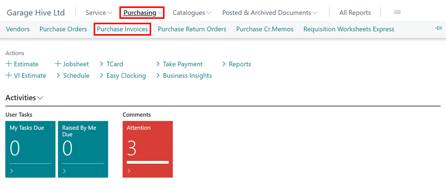
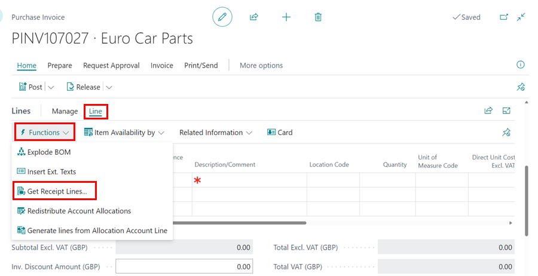

# How to Combine Receipts on a Single Invoice in Garage Hive
In Garage Hive, you have the option to combine received items into a single invoice. This means that if you have received items from the same vendor/supplier in multiple purchase orders, you can combine them into a single purchase invoice.

Before you can create a combined purchase receipt, you must have filled in two or more purchase orders and posted them as received, but not invoiced. Learn more about how to receive items in purchase orders without invoicing [here](garagehive-create-a-purchase-order.html#receive-items-without-an-invoice).

To combine received items into a single invoice:
1. From the Role Centre/Home Screen, select **Purchasing** followed by **Purchase Invoices**.

   

2. In the **Purchase Invoices** list, select **New** to create a new a **Purchase Invoice**.

   

3. Select the **Vendor Name**, and enter the **Vendor Invoice No.**.

   

4. On the **Lines** FastTab, click on **Lines** from the menu bar, followed by **Functions** and select **Get Receipt Lines**.

   

5. Select multiple receipt lines to include in the invoice by holding **Ctrl** and left-clicking on each line. Click **OK** when done.

   

6. To post the invoice, select **Posting** and then **Post** from the menu bar.

   

7. Delete open purchase orders after combined receipt posting.

[Go back to top](#top)