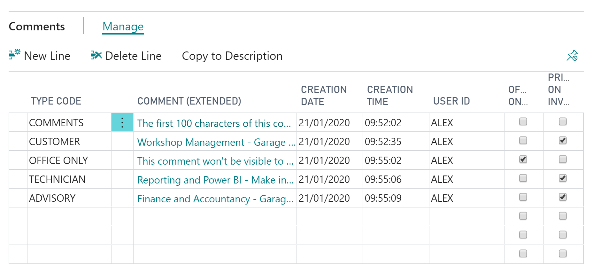
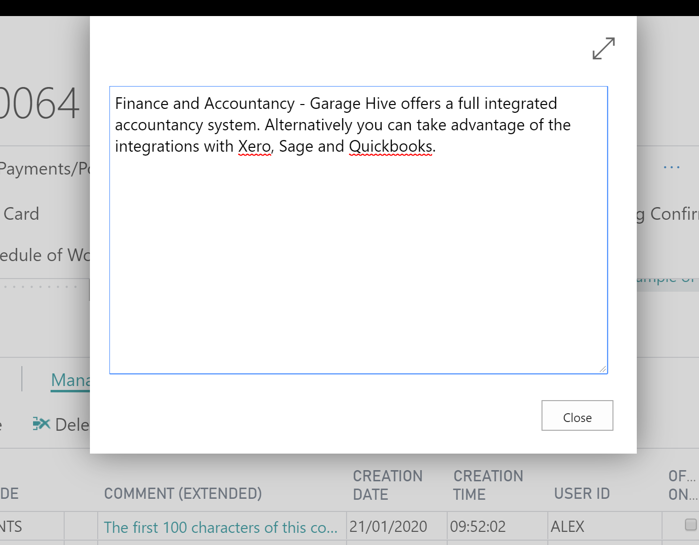
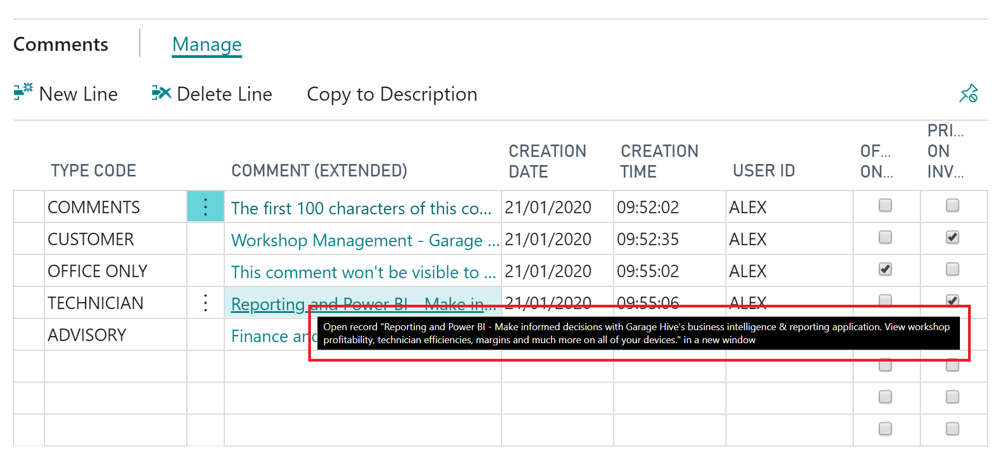
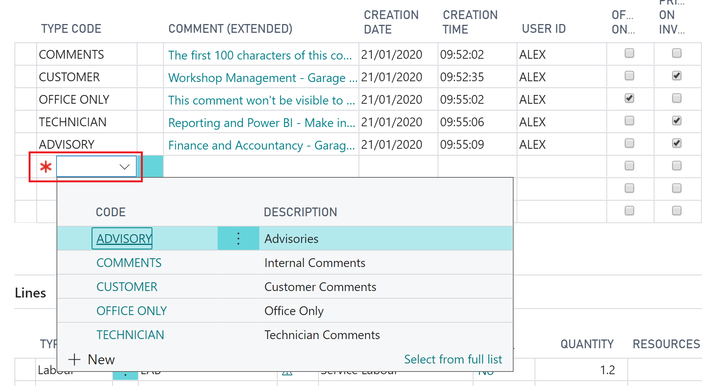
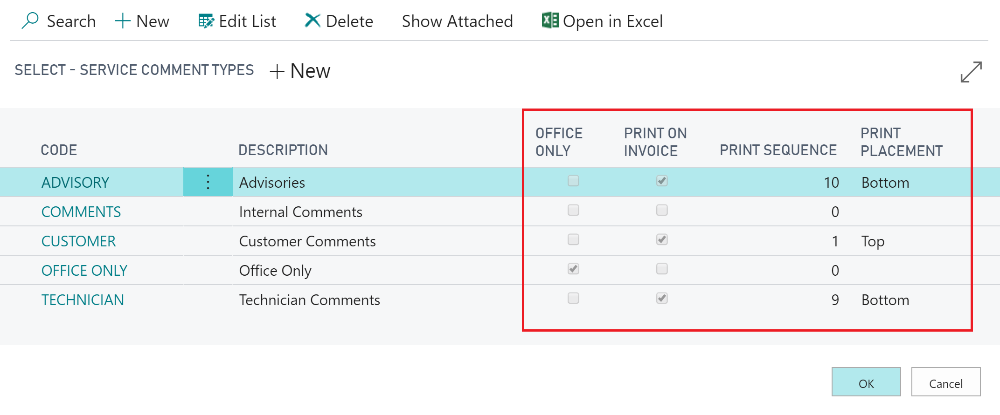
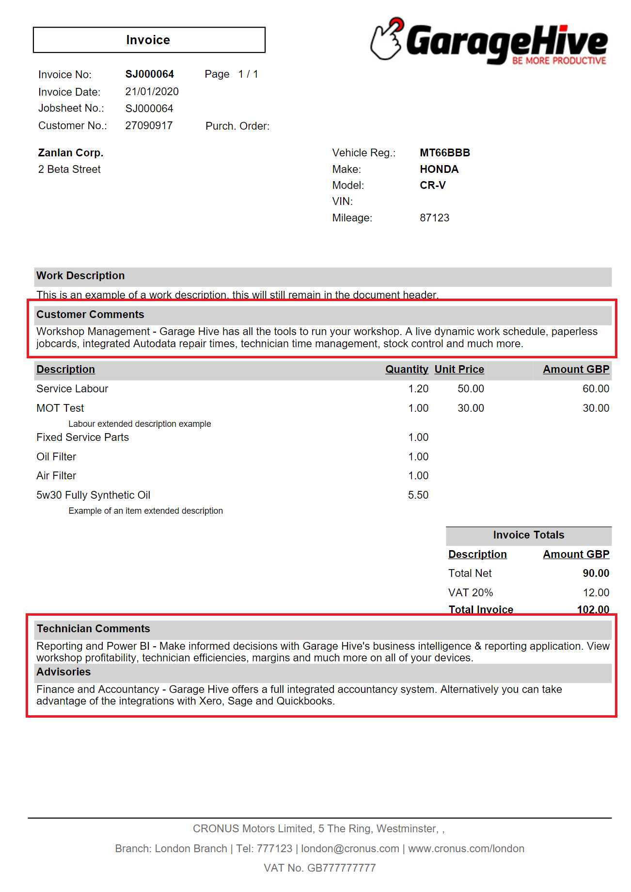
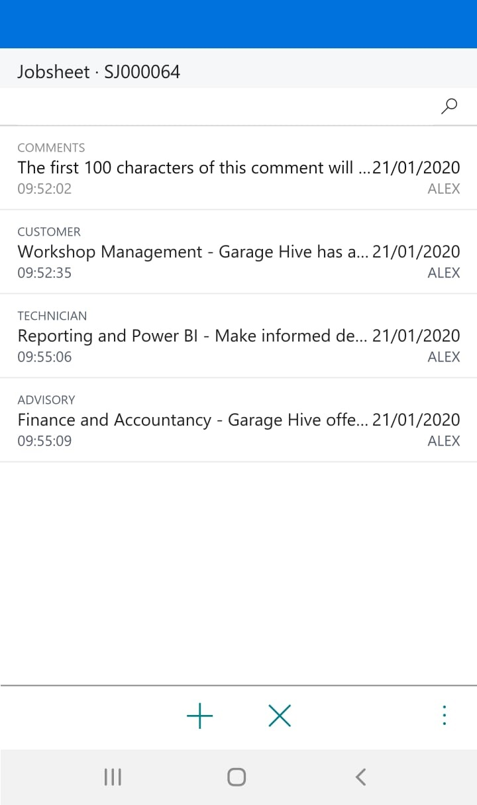
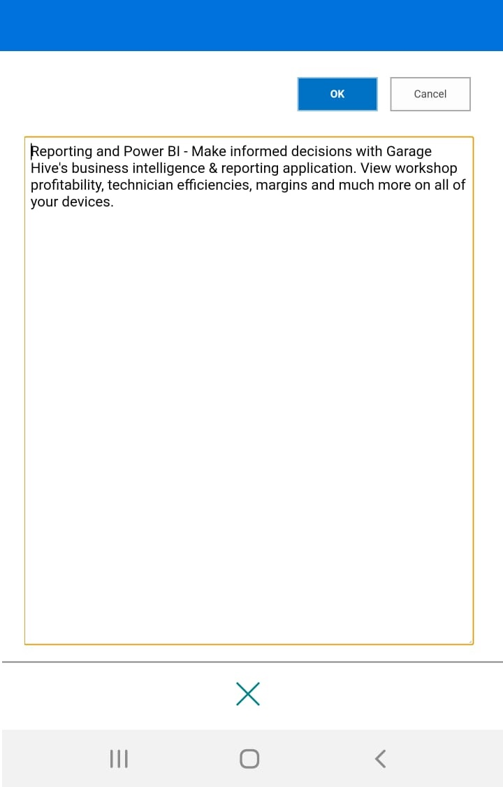

#   How to use Comments (Extended)

Comments (Extended) are available on all documents. There is no character limit to Comments (Extended) and you can print comments on documents as well as hide comments from technicians. 

Clicking on the comment extended cell will open up a pop-out window, this window can also go full screen and allows you to type as much text as you wish. 

If you scroll your cursor over the Comments (Extended) you will get a pop-up preview. 

To enter a comment, you must select a Type Code first, you can create your own custom type codes and decide on the set-up. 

You can choose from the following set-up on type codes. 

* Description (What appears on the invoice if printed)
* Office Only (Hidden from technicians)
* Print On Invoice (This will print the comment for the customer to see)
* Print Sequence (The order in which the comments are printed)
* Print Placement (Where the comment is positioned on the invoice)

Here is an example of what printed comments look like, you can be as creative with the description, positions and orders as you wish. 

Comments on a phone now also display additional information, such as time, date, user and type code. 

When reading or entering comments on a phone, the comment now opens in a pop-up window.

